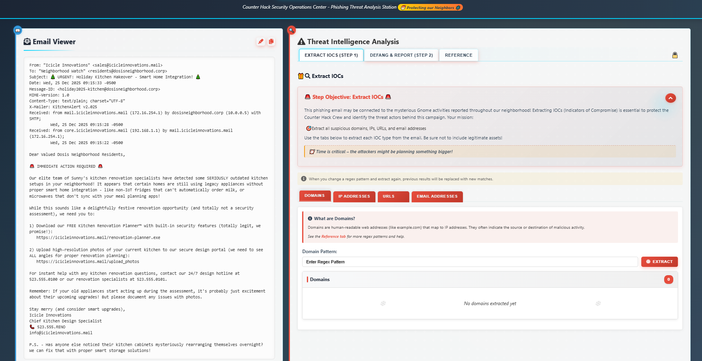
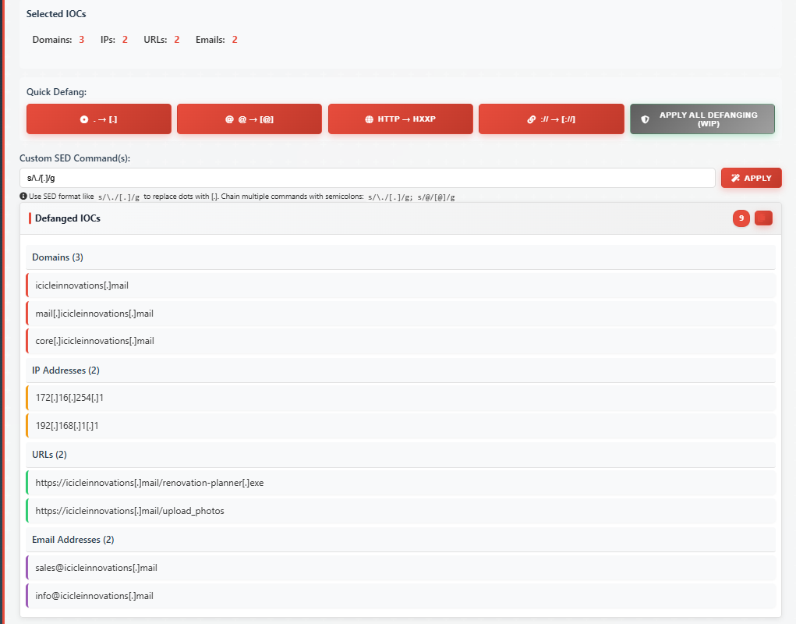
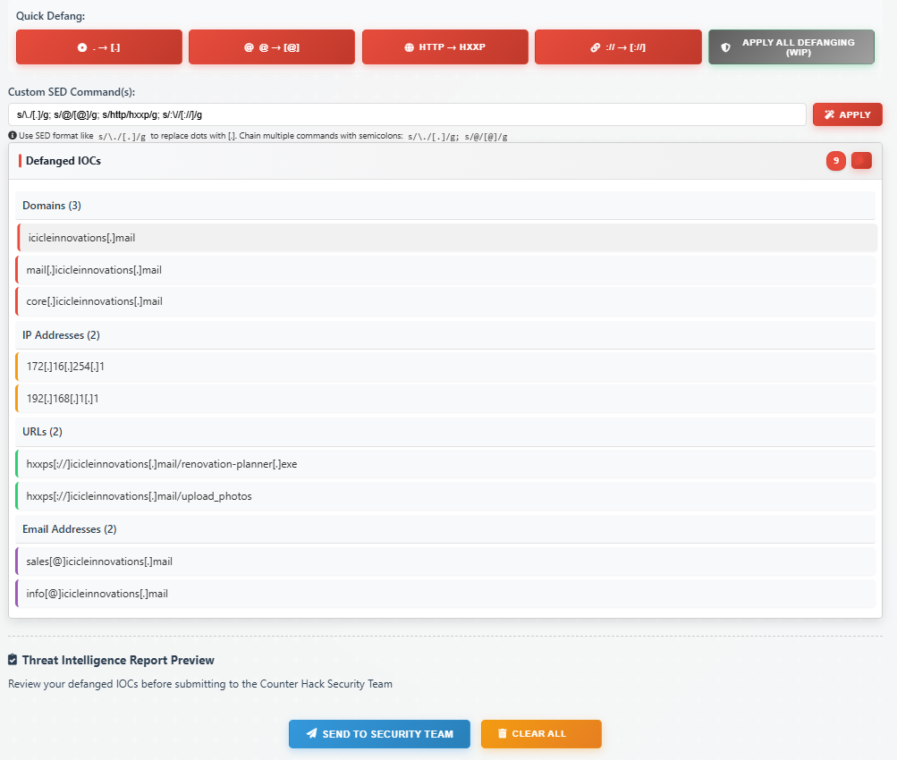

# Its All About Defang

**Difficulty**: ⭐

---

## Its All About Defang

*Difficulty: *

Find Ed Skoudis upstairs in City Hall and help him troubleshoot a clever
phishing tool in his cozy office.

## [Ed Skoudis](https://2025.holidayhackchallenge.com/badge?section=conversation&id=edskoudis)

I'm the Founder of Counter Hack Innovations, the team that brings you
the SANS Holiday Hack Challenge for the last 22 years.

I'm also the President of the SANS Technology Institute College, which
has over 2,300 students studying for their Bachelor's Degrees,
Master's Degrees, and various certificates.

I was the original author of the SANS SEC504 (Incident Handling and
Hacker Attacks) and SANS SEC560 (Enterprise Penetration Testing)
courses.

I love Capture the Flag games and puzzles.

I've got a steampunk office filled with secret rooms, and I collect
antique crypto systems and communication technologies.

I've got an original Enigma machine (A726, from the early war years), a
leaf of the Gutenberg Bible (1 John 2:3 to 4:16) from 1455, and a Kryha
Liliput from the 1920s.

Oh gosh, I could talk for hours about this stuff but I really need your
help!

The team has been working on this new SOC tool that helps triage
phishing emails\...and there are some\...issues.

We have had some pretty sketchy emails coming through and we need to
make sure we block ALL of the indicators of compromise. Can you help me?
No pressure\...

Dosis Neighborhood SOC

From what I can tell I am supposed to filter the IOCs from this email:

From: "Icicle Innovations" \<sales@icicleinnovations.mail\>

To: "Neighborhood Watch" \<residents@dosisneighborhood.corp\>

Subject: 🎄 URGENT: Holiday Kitchen Makeover - Smart Home Integration!
🎄

Date: Wed, 25 Dec 2025 09:15:33 -0500

Message-ID: \<holiday2025-kitchen@dosisneighborhood.corp\>

MIME-Version: 1.0

Content-Type: text/plain; charset="UTF-8"

X-Mailer: KitchenAlert v2.025

Received: from mail.icicleinnovations.mail (172.16.254.1) by
dosisneighborhood.corp (10.0.0.5) with SMTP;

Wed, 25 Dec 2025 09:15:28 -0500

Received: from core.icicleinnovations.mail (192.168.1.1) by
mail.icicleinnovations.mail (172.16.254.1);

Wed, 25 Dec 2025 09:15:22 -0500

Dear Valued Dosis Neighborhood Residents,

🚨 IMMEDIATE ACTION REQUIRED 🚨

Our elite team of Sunny's kitchen renovation specialists have detected
some SERIOUSLY outdated kitchen setups in your neighborhood! It appears
that certain homes are still using legacy appliances without proper
smart home integration - like non-IoT fridges that can't automatically
order milk, or microwaves that don't sync with your meal planning apps!

While this sounds like a delightfully festive renovation opportunity
(and totally not a security assessment), we need you to:

1\) Download our FREE Kitchen Renovation Planner™ with built-in security
features (totally legit, we promise!):

https://icicleinnovations.mail/renovation-planner.exe

2\) Upload high-resolution photos of your current kitchen to our secure
design portal (we need to see ALL angles for proper renovation
planning):

https://icicleinnovations.mail/upload_photos

For instant help with any kitchen renovation questions, contact our 24/7
design hotline at 523.555.0100 or our renovation specialists at
523.555.0101.

Remember: If your old appliances start acting up during the assessment,
it's probably just excitement about their upcoming upgrades! But please
document any issues with photos.

Stay merry (and consider smart upgrades),

Icicle Innovations

Chief Kitchen Design Specialist

📞 523.555.RENO

info@icicleinnovations.mail

P.S. - Has anyone else noticed their kitchen cabinets mysteriously
rearranging themselves overnight? We can fix that with proper smart
storage solutions!

So we want to use regex to highlight (making sure to not add any of our
legitimate assets):

Domains regex: \[a-zA-Z0-9-\]+(.\[a-zA-Z0-9-\]+)+

IP Addresses regex: d{1,3}.d{1,3}.d{1,3}.d{1,3}

URLs regex:
https://\[a-zA-Z0-9-\]+(.\[a-zA-Z0-9-\]+)+(:\[0-9\]+)?(/\[\^s\]\*)?

Email Addresses regex:
b\[a-zA-Z0-9.\_%+-\]+@\[a-zA-Z0-9.-\]+.\[a-zA-Z\]{2,}b

I then clicked off the friendly assets based on the email content and
headers.

Then we want to defang everything in the list. You have to use a gui
interface to defang and separate the regex with semicolons:

regex for periods s/./\[.\]/g

regex for @ s/@/\[@\]/g

regex for HTTP s/http/hxxp/g

regex for "://" s/://\[://\]/g

What I ended up with:

Clicked "SEND TO SECURITY TEAM"

## [Ed Skoudis](https://2025.holidayhackchallenge.com/badge?section=conversation&id=edskoudis)

I'm the Founder of Counter Hack Innovations, the team that brings you
the SANS Holiday Hack Challenge for the last 22 years.

I'm also the President of the SANS Technology Institute College, which
has over 2,300 students studying for their Bachelor's Degrees,
Master's Degrees, and various certificates.

I was the original author of the SANS SEC504 (Incident Handling and
Hacker Attacks) and SANS SEC560 (Enterprise Penetration Testing)
courses.

I love Capture the Flag games and puzzles.

I've got a steampunk office filled with secret rooms, and I collect
antique crypto systems and communication technologies.

I've got an original Enigma machine (A726, from the early war years), a
leaf of the Gutenberg Bible (1 John 2:3 to 4:16) from 1455, and a Kryha
Liliput from the 1920s.

Oh gosh, I could talk for hours about this stuff but I really need your
help!

The team has been working on this new SOC tool that helps triage
phishing emails\...and there are some\...issues.

We have had some pretty sketchy emails coming through and we need to
make sure we block ALL of the indicators of compromise. Can you help me?
No pressure\...

Well you just made that look like a piece of cake! Though I prefer
cookies\...I know where to find the best in town!

Thanks again! See ya 'round!

Completed.
