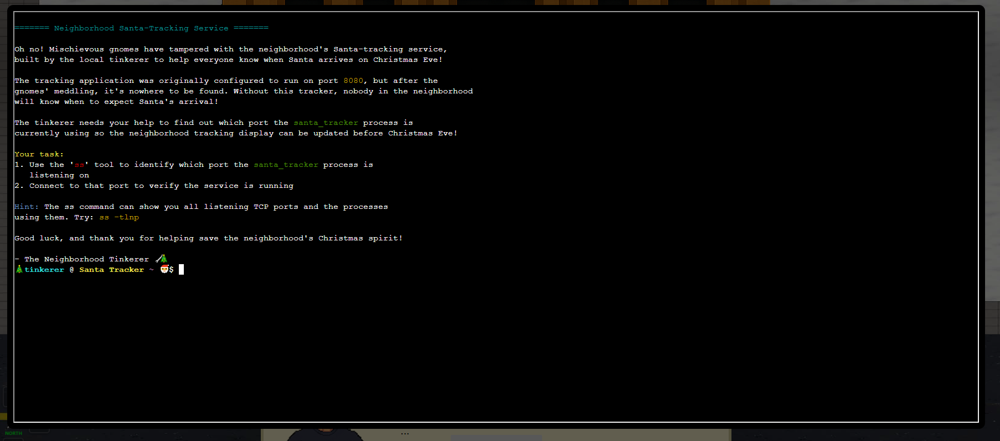
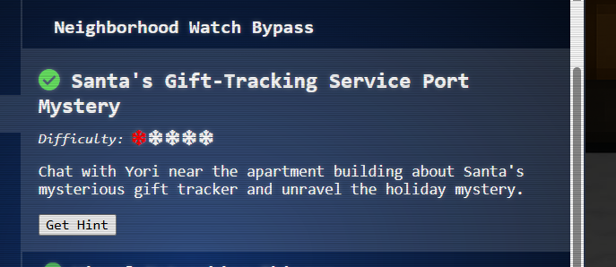

# Santa's Gift-Tracking Service Port Mystery

**Difficulty**: ⭐

---

## 

##  Santa's Gift-Tracking Service Port Mystery

*Difficulty: *

Chat with Yori near the apartment building about Santa's mysterious
gift tracker and unravel the holiday mystery.

## [Yori Kvitchko](https://2025.holidayhackchallenge.com/badge?section=conversation&id=yorikvitchko)

Hi! I'm Yori.

I was Ed's lost intern back in 2015, but I was found!

Think you can check out this terminal for me? I need to use cURL to
access the gift tracker system, but it has me stumped.

Please see what you can do!

======= Neighborhood Santa-Tracking Service =======

Oh no! Mischievous gnomes have tampered with the neighborhood's
Santa-tracking service,

built by the local tinkerer to help everyone know when Santa arrives on
Christmas Eve!

The tracking application was originally configured to run on port 8080,
but after the

gnomes' meddling, it's nowhere to be found. Without this tracker,
nobody in the neighborhood

will know when to expect Santa's arrival!

The tinkerer needs your help to find out which port the santa_tracker
process is

currently using so the neighborhood tracking display can be updated
before Christmas Eve!

Your task:

1\. Use the 'ss' tool to identify which port the santa_tracker process
is

listening on

2\. Connect to that port to verify the service is running

Hint: The ss command can show you all listening TCP ports and the
processes

using them. Try: ss -tlnp

Good luck, and thank you for helping save the neighborhood's Christmas
spirit!

\- The Neighborhood Tinkerer 🔧🎄

🎄 tinkerer @ Santa Tracker \~ 🎅 \$

(I'll try to collect snipping as I go)

🎄 tinkerer @ Santa Tracker \~ 🎅 \$ ss -tlnp

State Recv-Q Send-Q Local Address:Port Peer Address:Port Process

LISTEN 0 5 0.0.0.0:12321 0.0.0.0:\*

🎄 tinkerer @ Santa Tracker \~ 🎅 \$

gonna try "curl [http://localhost:12321](http://localhost:12321/)" since
Yori said curl command

result:

(just in case it's hard to read, I'll paste the text too)

🎄 tinkerer @ Santa Tracker \~ 🎅 \$ curl http://localhost:12321

{

"status": "success",

"message": "ud83cudf84 Ho Ho Ho! Santa Tracker Successfully
Connected! ud83cudf84",

"santa_tracking_data": {

"timestamp": "2025-12-07 09:49:52",

"location": {

"name": "Snowflake Valley",

"latitude": 36.064334,

"longitude": -113.771316

},

"movement": {

"speed": "1415 mph",

"altitude": "24706 feet",

"heading": "193u00b0 S"

},

"delivery_stats": {

"gifts_delivered": 6546128,

"cookies_eaten": 44165,

"milk_consumed": "3016 gallons",

"last_stop": "Candy Cane Court",

"next_stop": "Twinkle Star Terrace",

"time_to_next_stop": "11 minutes"

},

"reindeer_status": {

"rudolph_nose_brightness": "93%",

"favorite_reindeer_joke": "What do you call a reindeer with no eyes?
No-eye-deer!",

"reindeer_snack_preference": "festive hay bales"

},

"weather_conditions": {

"temperature": "-11u00b0F",

"condition": "Clear skies"

},

"special_note": "Thanks to your help finding the correct port, the
neighborhood can now track Santa's arrival! The mischievous gnomes will
be caught and will be put to work wrapping presents."

}

}🎄 tinkerer @ Santa Tracker \~ 🎅 \$

For some reason it just clicked over as objective completed. That was
kind of a letdown tbh\... haha

## [Yori Kvitchko](https://2025.holidayhackchallenge.com/badge?section=conversation&id=yorikvitchko)

Hi! I'm Yori.

I was Ed's lost intern back in 2015, but I was found!

Think you can check out this terminal for me? I need to use cURL to
access the gift tracker system, but it has me stumped.

Please see what you can do!

Great work - thank you!

Geez, maybe you can be my intern now!

Summary from Claude:

Santa's Gift-Tracking Service Port Mystery - Summary

## Challenge Overview

**Objective**: Find which port the *santa_tracker* process is listening
on and verify the service is running.

**Scenario**: Mischievous gnomes tampered with the neighborhood's
Santa-tracking service. The application was originally on port 8080, but
after the gnomes' meddling, it moved to an unknown port.

## Tools & Environment

-   **Shell**: Restricted bash (rbash)
-   **Available commands**: ss, curl, telnet, ls, cat, grep, clear
    (symlinked in *\~/tools/*)
-   **Target**: localhost/127.0.0.1

## Solution Steps

### Step 1: Identify the Listening Port

*ss -tlnp*

**Flag Breakdown**:

-   *-t* = TCP sockets only
-   *-l* = Listening ports only
-   *-n* = Numeric (don't resolve hostnames)
-   *-p* = Show process using the socket

**Output**:

*State Recv-Q Send-Q Local Address:Port Peer Address:Port Process*

*LISTEN 0 5 0.0.0.0:12321 0.0.0.0:\**

**Finding**: Port **12321** is listening on all interfaces (0.0.0.0)

### Step 2: Verify the Service with curl

*curl http://localhost:12321*

**Result**: Service responded successfully (challenge completed)

### Step 3: Alternative Verification with telnet

*telnet localhost 12321*

**Output**: Full HTTP response with Santa tracking data in JSON format

*{*

* "status": "success",*

* "message": "🎄 Ho Ho Ho! Santa Tracker Successfully Connected!
🎄",*

* "santa_tracking_data": {*

* "timestamp": "2025-12-07 10:01:35",*

* "location": {*

* "name": "Reindeer Ridge",*

* "latitude": 63.938961,*

* "longitude": -87.653934*

* },*

* "movement": {*

* "speed": "1641 mph",*

* "altitude": "27617 feet",*

* "heading": "43° SW"*

* },*

* "delivery_stats": {*

* "gifts_delivered": 6859331,*

* "cookies_eaten": 25163,*

* "milk_consumed": "4546 gallons",*

* "last_stop": "Mistletoe Lane",*

* "next_stop": "Twinkle Star Terrace",*

* "time_to_next_stop": "4 minutes"*

* },*

* "reindeer_status": {*

* "rudolph_nose_brightness": "91%",*

* "favorite_reindeer_joke": "What do you call a reindeer with no
eyes? No-eye-deer!",*

* "reindeer_snack_preference": "magical carrots"*

* },*

* "weather_conditions": {*

* "temperature": "22°F",*

* "condition": "Scattered cloud magic"*

* },*

* "special_note": "Thanks to your help finding the correct port, the
neighborhood can now track Santa's arrival! The mischievous gnomes will
be caught and will be put to work wrapping presents."*

* }*

*}*

## Additional Enumeration

### Hex Port Conversion Verification

*cat /proc/net/tcp*

Output showed *local_address: 00000000:3021*

-   *3021* (hex) = *12321* (decimal) ✓

### Environment Analysis

*ls -la tools/*

Revealed restricted shell environment using symlinks to whitelist
approved commands.

## Key Learnings

1.  **ss command**: Modern replacement for netstat, used to identify
    listening ports and associated processes
2.  **Service verification**: Multiple methods (curl, telnet) to confirm
    service availability
3.  **Restricted shell environments**: Understanding rbash and
    symlink-based command whitelisting
4.  **Hex to decimal conversion**: Reading raw */proc/net/tcp* output

## Answer

**Port**: 12321

**Challenge Status**: ✅ Completed
