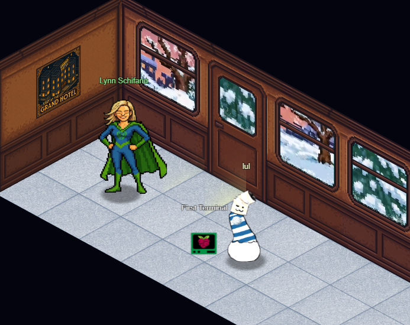
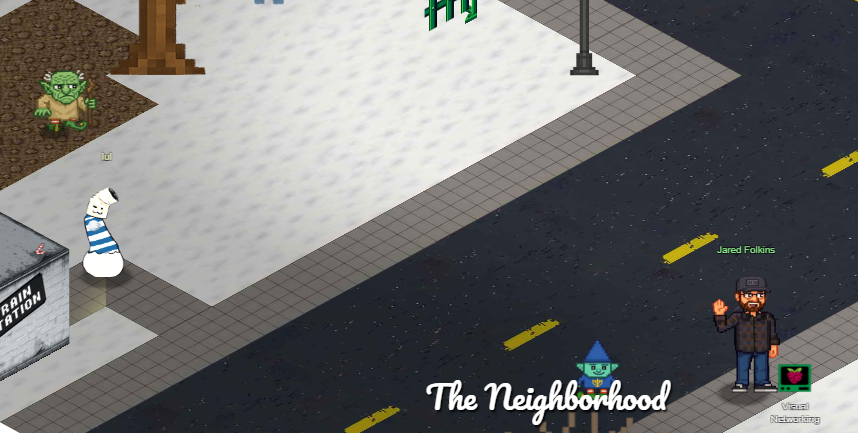
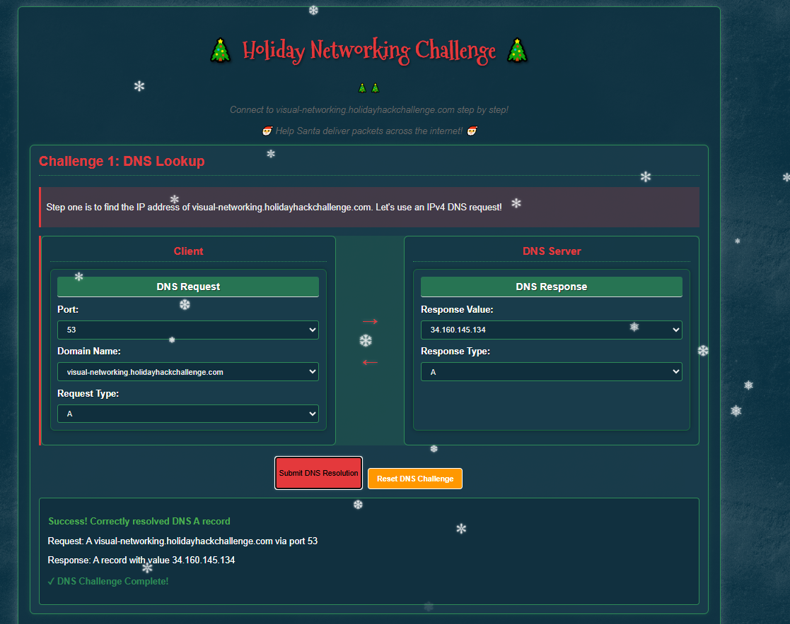
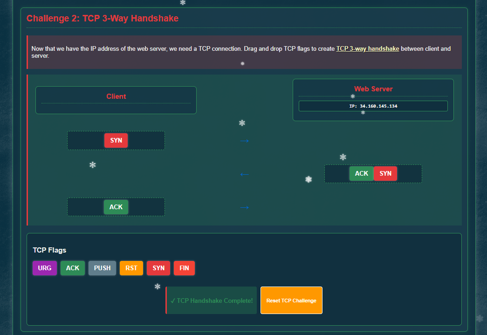
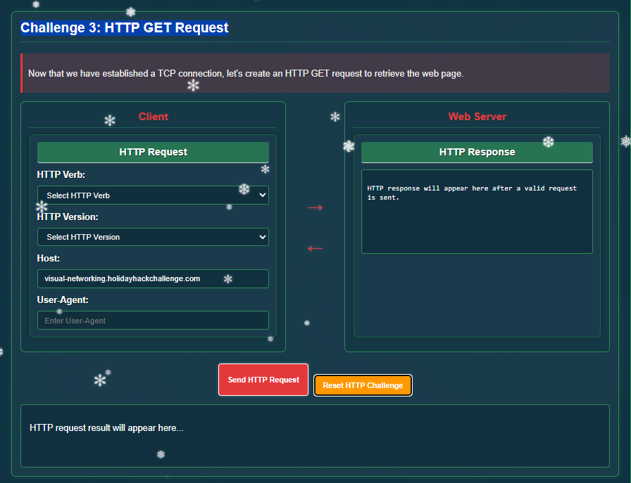
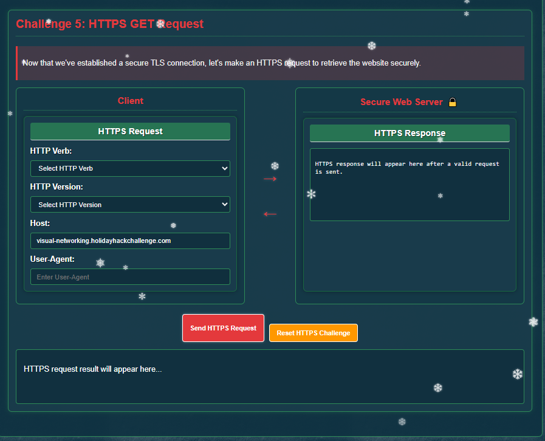
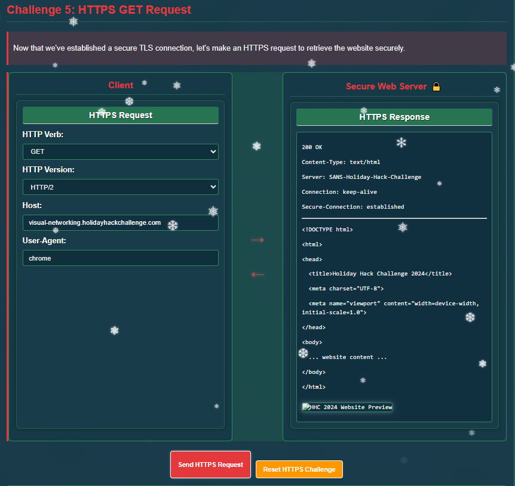

# Visual Networking Thinger

**Difficulty**: ⭐

---

**ACT I**

The Counter Hack crew is in the Neighborhood festively preparing for the
holidays when they are suddenly overrun by lively Gnomes in Your Home!
There must have been some magic in those Gnomes, because, due to some
unseen spark, some haunting hocus pocus, they have come to life and are
now scurrying around the Neighborhood.

First terminal; Answer: answer

then hop off train

## [Jared Folkins](https://2025.holidayhackchallenge.com/badge?section=conversation&id=jaredfolkins)

Jared Folkins here! My favorite Christmas movie is White Christmas. You
should find me on the socials and tell me what yours is.

You know, I think Santa is right! It truly is better to give than to
receive.

I love singing Carols with my family! 🎵O holy night, the stars are
brightly shining...🎵

Santa's got the right idea about giving, and I'm excited to give you a
fantastic way to learn networking fundamentals!

This interactive visualization I've created shows you exactly how
packets travel, how protocols work, and why networks behave the way they
do.

It's way better than staring at boring textbooks - you can actually see
what's happening!

Want to dive into some hands-on network exploration?

Click "Visual Networking Terminal"

Visual Networking Terminal

seems simple port 53

domain visual-networking.holidayhackchallenge.com

Request Type A

\--→ response value 34.160.145.134, response type A

shows success... I think its meant to teach how DNS is formed and
returned?

Next one:

looks like trying to show how a 3 way handshake works.

So Syn \--\> SynAck \--\> Ack

completed... easy

## Challenge 3: HTTP GET Request

Looks like building a basic HTTP request. I'll be as basic as I can:

looks like it worked... easy

## Challenge 4: TLS Handshake

Looks like TLS handshake buildnig

completed... easy

Success! You've correctly established a secure TLS connection.

The TLS handshake creates a secure encrypted tunnel for HTTP traffic:

1\. Client Hello: Client initiates secure connection with supported
cipher suites

2\. Server Hello: Server responds with selected cipher suite

3\. Certificate: Server sends its SSL/TLS certificate

4\. Client Key Exchange: Client sends parameters for shared secret
calculation

5\. Server Change Cipher Spec: Server indicates messages will be
encrypted

6\. Finished: Server confirms handshake completion

✓ TLS Challenge Complete!

## Challenge 5: HTTPS GET Request

Now its https get request, didn't we just do this? haha

Success! Valid HTTPS GET request sent.

Request: GET / HTTP/2

Host: visual-networking.holidayhackchallenge.com

User-Agent: chrome

✓ HTTPS Challenge Complete!

## [Jared Folkins](https://2025.holidayhackchallenge.com/badge?section=conversation&id=jaredfolkins)

Wonderful! You've mastered those networking basics beautifully.

Now you can see how all the pieces of the network puzzle fit together -
it's truly better to give knowledge than to keep it to yourself!
