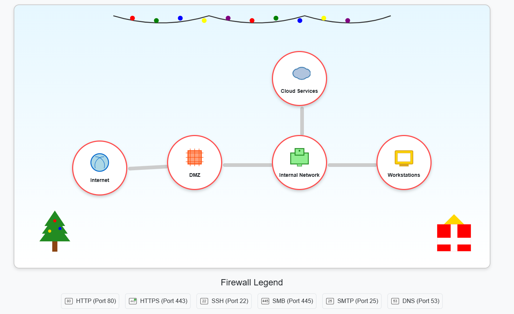

# Visual Firewall Thinger

**Difficulty**: ⭐

---

## ** Visual Firewall Thinger**

*Difficulty: *\***

Find Elgee in the big hotel for a firewall frolic and some techy fun.

## [Chris Elgee](https://2025.holidayhackchallenge.com/badge?section=conversation&id=chriselgee)

Oh hi! Am I on the road again? I should buy souvenirs for the family.

Loud shirts? Love them. Because - hey, if you aren't having fun, what
are you even doing??

And yes, finger guns are 100% appropriate for military portraits.

\... We should get dessert soon!

Welcome to my little corner of network security! *finger guns*

I've whipped up something sweeter than my favorite whoopie pie - an
interactive firewall simulator that'll teach you more in ten minutes
than most textbooks do in ten chapters.

Don't worry about breaking anything; that's half the fun of learning!

Ready to dig in?

#### Welcome to the Holiday Firewall Simulator!

This interactive simulator helps you understand how firewalls protect
different network zones. Click on any connection between zones to
configure firewall rules.

The network consists of:

-   **Internet**: The external world
-   **DMZ (Demilitarized Zone)**: Public-facing servers like web and
    email
-   **Internal Network**: Protected corporate network
-   **Workstations**: Employee computers
-   **Cloud Services**: External cloud resources

#### Firewall Configuration Goals

Configure your firewall to meet these security requirements:

**Internet to DMZ:** Allow only HTTP and HTTPS traffic

Incomplete

**DMZ to Internal:** Allow HTTP, HTTPS, and SSH traffic

Incomplete

**Internal to DMZ:** Allow HTTP, HTTPS, and SSH traffic

Incomplete

**Internal to Cloud:** Allow HTTP, HTTPS, SSH, and SMTP traffic

Incomplete

**Internal to Workstations:** Allow all traffic types

Incomplete

**Security Best Practice:** Block direct Internet to Internal access

Completed

Looks like you just follow the instructions and add each type of
connection to each device:

not sure if it was supposed to be this easy?

Apparently yes? Objective completed.

## [Chris Elgee](https://2025.holidayhackchallenge.com/badge?section=conversation&id=chriselgee)

*finger guns* Nice work! You've mastered those firewall fundamentals
like a true network security pro.

Now that was way more fun than sitting through another boring lecture,
wasn't it?
