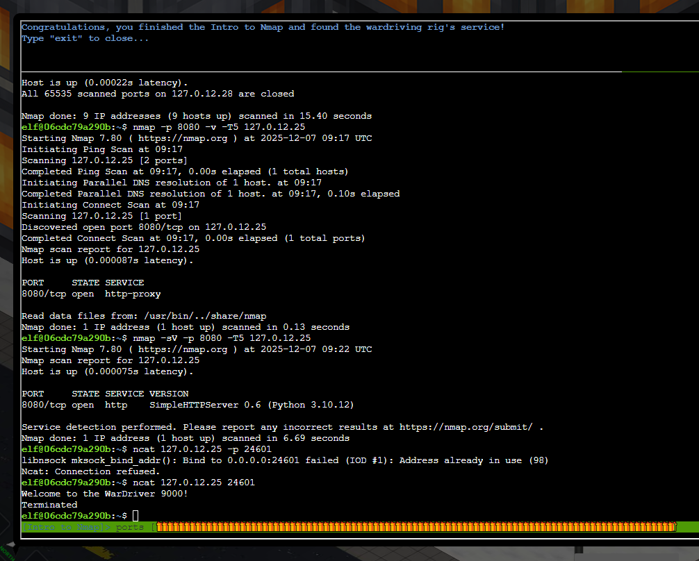

# Intro to Nmap

**Difficulty**: ⭐

---

## 

##  Intro to Nmap

*Difficulty: *

Meet Eric in the hotel parking lot for Nmap know-how and scanning
secrets. Help him connect to the wardriving rig on his motorcycle!

## [**Eric Pursley**](https://2025.holidayhackchallenge.com/badge?section=conversation&id=ericpursley)

Hey, I'm Eric. As you can see, I'm an avid motorcyclist. And I love
traveling the world with my wife.

I enjoy being creative and making things. For example, a cybersecurity
tool called [Zero-E](https://github.com/sl3yE/Zero-E) that I'm quite
proud of, and the Baldur's Gate 3 mod
called [Manaflare](https://www.nexusmods.com/baldursgate3/mods/7755?tab=description).
I'm even in the BG3 credits!

I also make tools, ranges, and HHC worlds for Counter Hack. Yup,
including the one you're in right now.

But most of the time, I'm helping organizations in the real world be
more secure. I do a bunch of different kinds of pentesting, but
speciailize in network and physical.

Some advice: stay laser-focused on your goals and don't let the
distractions life throws at you lead you astray. That's how I ended up
at Counter Hack!

Speaking of tools, let me introduce you to one of the most essential
weapons in any pentester's arsenal: Nmap.

It's like having X-ray vision for networks, and I've set up a perfect
environment for you to learn the fundamentals.

Help me find and connect to the wardriving rig's service on my
motorcycle!

(trying to zoom in to see better for display)

Prompt:

Welcome to the Intro to Nmap terminal! We will learn some Nmap basics by
running commands to answer the questions asked, which will guide us in
finding and connecting to the wardriving rig's service.

Run the command "hint" to receive a hint.

─────────────────────────────────────────────────────────────────────────────────────────────────────────────────────────────────────────────────────────────────────────────────────────────────────────────────────────────────────────────────────────────────────────────────────────────────

Type \[y\]es to begin: "y"

1\) When run without any options, nmap performs a TCP port scan of the
top 1000 ports. Run a default nmap scan of 127.0.12.25 and see which
port is open.

Result:

elf@06cdc79a290b:\~\$ nmap 127.0.12.25

Starting Nmap 7.80 ( https://nmap.org ) at 2025-12-07 09:02 UTC

Nmap scan report for 127.0.12.25

Host is up (0.000069s latency).

Not shown: 999 closed ports

PORT STATE SERVICE

8080/tcp open http-proxy

Nmap done: 1 IP address (1 host up) scanned in 0.09 seconds

prompt:

2\) Sometimes the top 1000 ports are not enough. Run an nmap scan of all
TCP ports on 127.0.12.25 and see which port is open.

───────────────────────────────────────────────────────────────────────────────────────────────────────────────────────────────────────────────────────────────────────────────────────────────────────────────────────

gonna try "nmap -p- -T5 127.0.12.25" see what happens

result:

elf@06cdc79a290b:\~\$ nmap -p- -T5 127.0.12.25

Starting Nmap 7.80 ( https://nmap.org ) at 2025-12-07 09:06 UTC

Nmap scan report for 127.0.12.25

Host is up (0.000078s latency).

Not shown: 65534 closed ports

PORT STATE SERVICE

24601/tcp open unknown

Nmap done: 1 IP address (1 host up) scanned in 1.67 seconds

elf@06cdc79a290b:\~\$

prompt:

3) Nmap can also scan a range of IP addresses. Scan the range
127.0.12.20 - 127.0.12.28 and see which has a port open.

Gonna try: "nmap -p- -T5 127.0.12.20-28"

result:

Nmap scan report for 127.0.12.20

Host is up (0.00023s latency).

All 65535 scanned ports on 127.0.12.20 are closed

Nmap scan report for 127.0.12.21

Host is up (0.00022s latency).

All 65535 scanned ports on 127.0.12.21 are closed

Nmap scan report for 127.0.12.22

Host is up (0.00022s latency).

All 65535 scanned ports on 127.0.12.22 are closed

Nmap scan report for 127.0.12.23

Host is up (0.00023s latency).

Not shown: 65534 closed ports

PORT STATE SERVICE

8080/tcp open http-proxy

Nmap scan report for 127.0.12.24

Host is up (0.00019s latency).

All 65535 scanned ports on 127.0.12.24 are closed

Nmap scan report for 127.0.12.25

Host is up (0.00017s latency).

All 65535 scanned ports on 127.0.12.25 are closed

Nmap scan report for 127.0.12.26

Host is up (0.00016s latency).

All 65535 scanned ports on 127.0.12.26 are closed

Nmap scan report for 127.0.12.27

Host is up (0.00014s latency).

All 65535 scanned ports on 127.0.12.27 are closed

Nmap scan report for 127.0.12.28

Host is up (0.00022s latency).

All 65535 scanned ports on 127.0.12.28 are closed

Nmap done: 9 IP addresses (9 hosts up) scanned in 15.40 seconds

prompt:

4\) Nmap has a version detection engine, to help determine what services
are running on a given port. What service is running on 127.0.12.25 TCP
port 8080?

"nmap -sV -p 8080 -T5 127.0.12.25" should work -sV will try **Version
detection** (probes to determine service/version info)

result:

elf@06cdc79a290b:\~\$ nmap -sV -p 8080 -T5 127.0.12.25

Starting Nmap 7.80 ( https://nmap.org ) at 2025-12-07 09:22 UTC

Nmap scan report for 127.0.12.25

Host is up (0.000075s latency).

PORT STATE SERVICE VERSION

8080/tcp open http SimpleHTTPServer 0.6 (Python 3.10.12)

Service detection performed. Please report any incorrect results at
https://nmap.org/submit/ .

Nmap done: 1 IP address (1 host up) scanned in 6.69 seconds

elf@06cdc79a290b:\~\$

prompt:

5) Sometimes you just want to interact with a port, which is a perfect
job for Ncat! Use the ncat tool to connect to TCP port 24601 on
127.0.12.25 and view the banner returned.

Simple: ncat 127.0.12.25 24601

result:

got an achievement so I assume completed.

Yup!

## [Eric Pursley](https://2025.holidayhackchallenge.com/badge?section=conversation&id=ericpursley)

Hey, I'm Eric. As you can see, I'm an avid motorcyclist. And I love
traveling the world with my wife.

I enjoy being creative and making things. For example, a cybersecurity
tool called [Zero-E](https://github.com/sl3yE/Zero-E) that I'm quite
proud of, and the Baldur's Gate 3 mod
called [Manaflare](https://www.nexusmods.com/baldursgate3/mods/7755?tab=description).
I'm even in the BG3 credits!

I also make tools, ranges, and HHC worlds for Counter Hack. Yup,
including the one you're in right now.

But most of the time, I'm helping organizations in the real world be
more secure. I do a bunch of different kinds of pentesting, but
speciailize in network and physical.

Some advice: stay laser-focused on your goals and don't let the
distractions life throws at you lead you astray. That's how I ended up
at Counter Hack!

Speaking of tools, let me introduce you to one of the most essential
weapons in any pentester's arsenal: Nmap.

It's like having X-ray vision for networks, and I've set up a perfect
environment for you to learn the fundamentals.

Help me find and connect to the wardriving rig's service on my
motorcycle!

Excellent work! You've got the Nmap fundamentals down - that X-ray
vision is going to serve you well in future challenges.

Now you're ready to scan networks like a seasoned pentester!

Completed!
