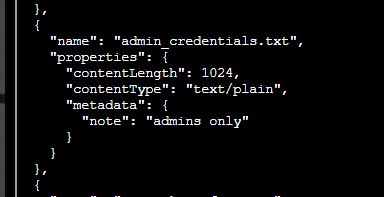

# Blob Storage Challenge in the Neighborhood

**Difficulty**: ⭐

---

##  Blob Storage Challenge in the Neighborhood

*Difficulty: *

Help the Goose Grace near the pond find which Azure Storage account has
been misconfigured to allow public blob access by analyzing the export
file.

## [Grace](https://2025.holidayhackchallenge.com/badge?section=conversation&id=goosemisfit)

HONK!!! HONK!!!!

The Neighborhood HOA uses Azure storage accounts for various IT
operations.

You've been asked to audit their storage security configuration to
ensure no sensitive data is publicly accessible.

Recent security reports suggest some storage accounts might have public
blob access enabled, creating potential data exposure risks.

Prompt:

You may not know this but the Azure cli help messages are very easy to
access. First, try typing:

\$ az help \| less

looks super simple so I will forgo some of the documentation...

When we run: az storage account list \| less

Prompt:

hmm\... one of these looks suspicious 🚨, i think there may be a
misconfiguration here somewhere.

Try showing the account that has a common misconfiguration: az storage
account show \--name xxxxxxxxxx \| less

This one has public:

****Perfect! You found it!**** 🚨

## The Misconfigured Storage Account: *neighborhood2*

### Security Issues Found:

1.  *****"allowBlobPublicAccess": true***** ⚠️

    -   This is the **main misconfiguration**!
    -   Allows containers to be configured with public blob access
    -   Should be set to *false* for sensitive data

2.  *****"minimumTlsVersion": "TLS1_0"***** 🚨

    -   Using ancient TLS 1.0 (from 1999!)
    -   Should be at least TLS 1.2 or TLS 1.3
    -   TLS 1.0 has known vulnerabilities

3.  **Blob encryption disabled** ⚠️

json

* "blob": {*

* "enabled": false*

* }*

-   Blob storage encryption is turned OFF
-   Data stored without encryption at rest

Gonna try: az storage account show \--name neighborhood2 \| less

This will give you the full details of the misconfigured account. The
challenge is probably looking for you to identify this specific storage
account name: *****neighborhood2*****

Result:

Prompt:

Now we need to list containers in neighborhood2. After running the
command what's interesting in the list?

For more information:

https://learn.microsoft.com/en-us/cli/azure/storage/container?view=azure-cli-latest#az-storage-container-list

Gonna try: az storage container list \--account-name neighborhood2
\--auth-mode login -o table

This will show you:

-   **Container names**
-   **Public access levels** (None, Blob, Container)
-   **Last modified dates**

### What to look for:

Look for containers with:

-   **Public Access = "Blob"** or **"Container"** (means publicly
    accessible!)
-   Suspicious or sensitive-sounding names (like "backups",
    "private", "confidential", etc.)
-   Containers that shouldn't be public

Result:

Prompt:

Let's take a look at the blob list in the public container for
neighborhood2.

For more information:

https://learn.microsoft.com/en-us/cli/azure/storage/blob?view=azure-cli-latest#az-storage-blob-list

Gonna try: az storage blob list \--account-name neighborhood2
\--container-name public \--auth-mode login -o table

to see what files exist in the public container-name

Result:

Interesting. haha

prompt:

Try downloading and viewing the blob file named admin_credentials.txt
from the public container.

💡 hint: \--file /dev/stdout should print in the terminal. Dont forget
to use \| less!

Gonna try: az storage blob download \--account-name neighborhood2
\--container-name public \--name admin_credentials.txt \--file
/dev/stdout \--auth-mode login \| less

Download the file and have a look

Grabbing all the text for future notes:

\# You have discovered an Azure Storage account with
"allowBlobPublicAccess": true.

\# This misconfiguration allows ANYONE on the internet to view and
download files

\# from the blob container without authentication.

\# Public blob access is highly insecure when sensitive data (like admin
credentials)

\# is stored in these containers. Always disable public access unless
absolutely required.

Azure Portal Credentials

User: azureadmin

Pass: AzUR3!P@ssw0rd#2025

Windows Server Credentials

User: administrator

Pass: W1nD0ws\$Srv!@42

SQL Server Credentials

User: sa

Pass: SqL!P@55#2025\$

Active Directory Domain Admin

User: corpadministrator

Pass: D0m@in#Adm!n\$765

Exchange Admin Credentials

User: exchangeadmin

Pass: Exch@ng3!M@il#432

VMware vSphere Credentials

User: vsphereadmin

Pass: VMW@r3#Clu\$ter!99

Network Switch Credentials

User: netadmin

Pass: N3t!Sw!tch\$C0nfig#

Firewall Admin Credentials

User: fwadmin

Pass: F1r3W@ll#S3cur3!77

Backup Server Credentials

User: backupadmin

Pass: B@ckUp!Srv#2025\$

Monitoring System Admin

User: monitoradmin

Pass: M0n!t0r#Sys\$P@ss!

SharePoint Admin Credentials

User: spadmin

Pass: Sh@r3P0!nt#Adm!n2025

Git Server Admin

User: gitadmin

Pass: G1t#Srv!Rep0\$C0de

(END)

Prompt:

🎊 Great, you found the misconfiguration allowing public access to
sensitive information!

✅ Challenge Complete! To finish, type: finish

## [Grace](https://2025.holidayhackchallenge.com/badge?section=conversation&id=goosemisfit)

HONK!!! HONK!!!!

The Neighborhood HOA uses Azure storage accounts for various IT
operations.

You've been asked to audit their storage security configuration to
ensure no sensitive data is publicly accessible.

Recent security reports suggest some storage accounts might have public
blob access enabled, creating potential data exposure risks.

HONK HONK HONK! 'No sensitive data publicly accessible' they claimed.
Meanwhile, literally everything was public! Good save, security expert!

Completed.
