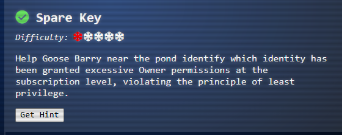

# Spare Key

**Difficulty**: ⭐⭐

---

##  Spare Key

*Difficulty: *\***

Help Goose Barry near the pond identify which identity has been granted
excessive Owner permissions at the subscription level, violating the
principle of least privilege.

## [Barry](https://2025.holidayhackchallenge.com/badge?section=conversation&id=goosenoir)

You want me to say what exactly? Do I really look like someone who says
MOOO?

The Neighborhood HOA hosts a static website on Azure Storage.

An admin accidentally uploaded an infrastructure config file that
contains a long-lived SAS token.

Use Azure CLI to find the leak and report exactly where it lives.

Prompt:

Let's start by listing all resource groups

\$ az group list -o table

This will show all resource groups in a readable table format.

Result:

neighbor@8d28f9a5650a:\~\$ az group list -o table

Name Location ProvisioningState

\-\-\-\-\-\-\-\-\-\-\-\-\-\-\-\-\-\-- \-\-\-\-\-\-\-\-\--
\-\-\-\-\-\-\-\-\-\-\-\-\-\-\-\-\-\--

rg-the-neighborhood eastus Succeeded

rg-hoa-maintenance eastus Succeeded

rg-hoa-clubhouse eastus Succeeded

rg-hoa-security eastus Succeeded

rg-hoa-landscaping eastus Succeeded

neighbor@8d28f9a5650a:\~\$

Prompt:

Now let's find storage accounts in the neighborhood resource group 📦

\$ az storage account list \--resource-group rg-the-neighborhood -o
table

This shows what storage accounts exist and their types.

Result:

neighbor@8d28f9a5650a:\~\$ az storage account list \--resource-group
rg-the-neighborhood -o table

Name Kind Location ResourceGroup ProvisioningState

\-\-\-\-\-\-\-\-\-\-\-\-\-\-- \-\-\-\-\-\-\-\-\-\-- \-\-\-\-\-\-\-\-\--
\-\-\-\-\-\-\-\-\-\-\-\-\-\-\-\-\-\--
\-\-\-\-\-\-\-\-\-\-\-\-\-\-\-\-\-\--

neighborhoodhoa StorageV2 eastus rg-the-neighborhood Succeeded

hoamaintenance StorageV2 eastus rg-hoa-maintenance Succeeded

hoaclubhouse StorageV2 eastus rg-hoa-clubhouse Succeeded

hoasecurity BlobStorage eastus rg-hoa-security Succeeded

hoalandscaping StorageV2 eastus rg-hoa-landscaping Succeeded

neighbor@8d28f9a5650a:\~\$

Prompt:

Someone mentioned there was a website in here.

maybe a static website?

try:\$ az storage blob service-properties show \--account-name
\<insert_account_name\> \--auth-mode login

gonna try: az storage blob service-properties show \--account-name
neighborhoodhoa \--auth-mode login

## Why this storage account?

-   The challenge mentions "Neighborhood HOA hosts a static website"
-   The storage account is literally named *neighborhoodhoa*
-   It's in the *rg-the-neighborhood* resource group
-   It's StorageV2 (supports static websites)

Result:

neighbor@8d28f9a5650a:\~\$ az storage blob service-properties show
\--account-name neighborhoodhoa \--auth-mode login

{

"enabled": true,

"errorDocument404Path": "404.html",

"indexDocument": "index.html"

}

neighbor@8d28f9a5650a:\~\$

## What This Means:

**Static website hosting is ENABLED** on the *neighborhoodhoa* storage
account! ✅

### Key Properties:

-   *"enabled": true* - Static website feature is turned on
-   *"indexDocument": "index.html"* - The homepage file
-   *"errorDocument404Path": "404.html"* - Custom error page

## Why This Matters:

When static website hosting is enabled in Azure Storage, it creates a
special container called *****\$web***** that serves web content
publicly.

Prompt:

Let's see what 📦 containers exist in the storage account

💡 Hint: You will need to use az storage container list

We want to list the container and its public access levels.

Result:

neighbor@8d28f9a5650a:\~\$ az storage container list \--account-name
neighborhoodhoa \--auth-mode login -o table

Name Public

\-\-\-\-\-- \-\-\-\-\-\-\--

\$web None

public Blob

neighbor@8d28f9a5650a:\~\$

## What This Means:

### Container 1: *\$web*

-   **Name**: *\$web* - This is the special container for static website
    hosting
-   **Public Access**: *None* - Files are NOT publicly accessible
    (requires authentication or SAS token)
-   This is actually **secure** ✅

### Container 2: *public* 🚨

-   **Name**: *public* - Generic container name
-   **Public Access**: *Blob* - **Anyone on the internet can read
    individual blobs if they know the URL!**
-   This is **INSECURE** for sensitive files ⚠️

## Public Access Levels Explained:

-   **None/Private** - No anonymous access (secure)
-   **Blob** - Anonymous read access to individual blobs (risky if URLs
    are known)
-   **Container** - Anonymous read access to entire container + list all
    blobs (very risky)

## The Security Issue:

The *public* container has **Blob-level public access**, which means if
someone knows the file path/URL, they can download it without
authentication!

Prompt:

Examine what files are in the static website container

💡 hint: when using \--container-name you might need '\<name\>'

Look 👀 for any files that shouldn't be publicly accessible!

Gonna try: az storage blob list \--account-name neighborhoodhoa
\--container-name 'public' \--auth-mode login -o table

To list the files in the *public* container to find the leaked config
file.

Result:

neighbor@8d28f9a5650a:\~\$ az storage blob list \--account-name
neighborhoodhoa \--container-name 'public' \--auth-mode login -o table

Name ContentLength ContentType

\-\-\-\-\-\-\-\-\-\-\-\-\-\-\-\-\-\-\-\-\-\-\-\-\-\-\--
\-\-\-\-\-\-\-\-\-\-\-\-\-\-- \-\-\-\-\-\-\-\-\-\-\-\-\-\-\--

hoa-calendar.json 256 application/json

forms/request-guidelines.txt 128 text/plain

neighbor@8d28f9a5650a:\~\$

also, Gonna try: az storage blob list \--account-name neighborhoodhoa
\--container-name '\$web' \--auth-mode login -o table

Result:

neighbor@8d28f9a5650a:\~\$ az storage blob list \--account-name
neighborhoodhoa \--container-name '\$web' \--auth-mode login -o table

Name ContentLength ContentType

\-\-\-\-\-\-\-\-\-\-\-\-\-\-\-\-\-\-\-- \-\-\-\-\-\-\-\-\-\-\-\-\-\--
\-\-\-\-\-\-\-\-\-\-\-\--

index.html 512 text/html

about.html 384 text/html

iac/terraform.tfvars 1024 text/plain

neighbor@8d28f9a5650a:\~\$

What is *iac/terraform.tfvars*?

**IAC** = **Infrastructure as Code** **Terraform** = Tool for
provisioning cloud infrastructure *****.tfvars***** = Terraform
variables file

### Why This is BAD:

A *terraform.tfvars* file typically contains **sensitive configuration
values** like:

-   API keys
-   Passwords
-   **SAS tokens** (Shared Access Signatures)
-   Connection strings
-   Access keys
-   Secrets

This is **EXACTLY** what the challenge described:

> "An admin accidentally uploaded an infrastructure config file that
> contains a long-lived SAS token."

### The Security Issue:

This file is in the *****\$web***** container, which means it's being
served as part of the static website! Even though the *\$web* container
has *Public Access: None*, if static website hosting is enabled, files
in *\$web* are **publicly accessible via the website URL**!

Prompt:

Take a look at the files here, what stands out?

Try examining a suspect file 🕵️:

💡 hint: \--file /dev/stdout \| less will print to your terminal 💻.

Gonna try: az storage blob download \--account-name neighborhoodhoa
\--container-name '\$web' \--name 'iac/terraform.tfvars' \--file
/dev/stdout \--auth-mode login \| less

Result:

\# Terraform Variables for HOA Website Deployment

\# Application: Neighborhood HOA Service Request Portal

\# Environment: Production

\# Last Updated: 2025-09-20

\# DO NOT COMMIT TO PUBLIC REPOS

\# === Application Configuration ===

app_name = "hoa-service-portal"

app_version = "2.1.4"

environment = "production"

\# === Database Configuration ===

database_server = "sql-neighborhoodhoa.database.windows.net"

database_name = "hoa_requests"

database_username = "hoa_app_user"

\# Using Key Vault reference for security

database_password_vault_ref =
"@Microsoft.KeyVault(SecretUri=https://kv-neighborhoodhoa-prod.vault.azure.net/secrets/db-password/)"

\# === Storage Configuration for File Uploads ===

storage_account = "neighborhoodhoa"

uploads_container = "resident-uploads"

documents_container = "hoa-documents"

\# TEMPORARY: Direct storage access for migration script

\# WARNING: Remove after data migration to new storage account

\# This SAS token provides full access - HIGHLY SENSITIVE!

migration_sas_token =
"sv=2023-11-03&ss=b&srt=co&sp=rlacwdx&se=2100-01-01T00:00:00Z&spr=https&sig=1djO1Q%2Bv0wIh7mYi3n%2F7r1d%2F9u9H%2F5%2BQxw8o2i9QMQc%3D"

\# === Email Service Configuration ===

\# Using Key Vault for sensitive email credentials

sendgrid_api_key_vault_ref =
"@Microsoft.KeyVault(SecretUri=https://kv-neighborhoodhoa-prod.vault.azure.net/secrets/sendgrid-key/)"

from_email = "noreply@theneighborhood.com"

admin_email = "admin@theneighborhood.com"

\# === Application Settings ===

session_timeout_minutes = 60

max_file_upload_mb = 10

allowed_file_types = \["pdf", "jpg", "jpeg", "png", "doc",
"docx"\]

\# === Feature Flags ===

enable_online_payments = true

enable_maintenance_requests = true

enable_document_portal = false

enable_resident_directory = true

\# === API Keys (Key Vault References) ===

maps_api_key_vault_ref =
"@Microsoft.KeyVault(SecretUri=https://kv-neighborhoodhoa-prod.vault.azure.net/secrets/maps-api-key/)"

weather_api_key_vault_ref =
"@Microsoft.KeyVault(SecretUri=https://kv-neighborhoodhoa-prod.vault.azure.net/secrets/weather-api-key/)"

\# === Notification Settings (Key Vault References) ===

sms_service_vault_ref =
"@Microsoft.KeyVault(SecretUri=https://kv-neighborhoodhoa-prod.vault.azure.net/secrets/sms-credentials/)"

notification_webhook_vault_ref =
"@Microsoft.KeyVault(SecretUri=https://kv-neighborhoodhoa-prod.vault.azure.net/secrets/slack-webhook/)"

\# === Deployment Configuration ===

deploy_static_files_to_cdn = true

cdn_profile = "hoa-cdn-prod"

cache_duration_hours = 24

\# Backup schedule

backup_frequency = "daily"

backup_retention_days = 30

{

"downloaded": true,

"file": "/dev/stdout"

}

(END)

**JACKPOT! 🚨🔑** You found the leaked credentials! Let me break down
what you discovered:

## The Critical Security Vulnerability:

### The Leaked SAS Token (Lines 23-25):

terraform

*\# TEMPORARY: Direct storage access for migration script*

*\# WARNING: Remove after data migration to new storage account*

*\# This SAS token provides full access - HIGHLY SENSITIVE!*

*migration_sas_token =
"sv=2023-11-03&ss=b&srt=co&sp=rlacwdx&se=2100-01-01T00:00:00Z&spr=https&sig=1djO1Q%2Bv0wIh7mYi3n%2F7r1d%2F9u9H%2F5%2BQxw8o2i9QMQc%3D"*

### What This SAS Token Grants:

Let me decode the parameters:

-   *sv=2023-11-03* - Storage service version
-   *ss=b* - Services: **Blob** storage
-   *srt=co* - Resource types: **Container** and **Object** (blobs)
-   *sp=rlacwdx* - **Permissions**: Read, List, Add, Create, Write,
    Delete, Execute (FULL ACCESS!)
-   *se=2100-01-01* - **Expiration**: Year **2100** (75 years from now!)
    😱
-   *spr=https* - HTTPS only
-   *sig=\...* - The signature/token

## Why This Is TERRIBLE:

1.  **Full permissions** (rlacwdx) - Can read, write, delete everything
2.  **Expires in 2100** - Essentially permanent
3.  **Publicly accessible** - In a static website that anyone can access
4.  **Labeled as "TEMPORARY"** - But never removed (classic developer
    mistake!)
5.  **Comment says "DO NOT COMMIT TO PUBLIC REPOS"** at the top - but
    they uploaded it to a public website instead! 🤦

## Other Good Security Practices (ironically):

Notice most other secrets use **Azure Key Vault references**:

terraform

*database_password_vault_ref = "@Microsoft.KeyVault(\...)"*

*sendgrid_api_key_vault_ref = "@Microsoft.KeyVault(\...)"*

This is the **correct** way! But they made an exception for the
"temporary" migration token and forgot about it.

## The Answer:

**Location of the leak**:

-   **Storage Account**: *neighborhoodhoa*
-   **Container**: *\$web*
-   **File**: *iac/terraform.tfvars*
-   **Leaked Secret**: Long-lived SAS token with full permissions

You successfully identified the security misconfiguration! 🎉

prompt:

You found the leak! A migration_sas_token within /iac/terraform.tfvars
exposed a long-lived SAS token (expires 2100-01-01) 🔑

⚠️ Accidentally uploading config files to \$web can leak secrets. 🔐

Challenge Complete! To finish, type: finish

## [Barry](https://2025.holidayhackchallenge.com/badge?section=conversation&id=goosenoir)

There it is. A SAS token with read-write-delete permissions, publicly
accessible. At least someone around here knows how to do a proper
security audit.

Completed.
