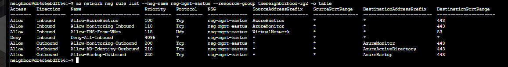
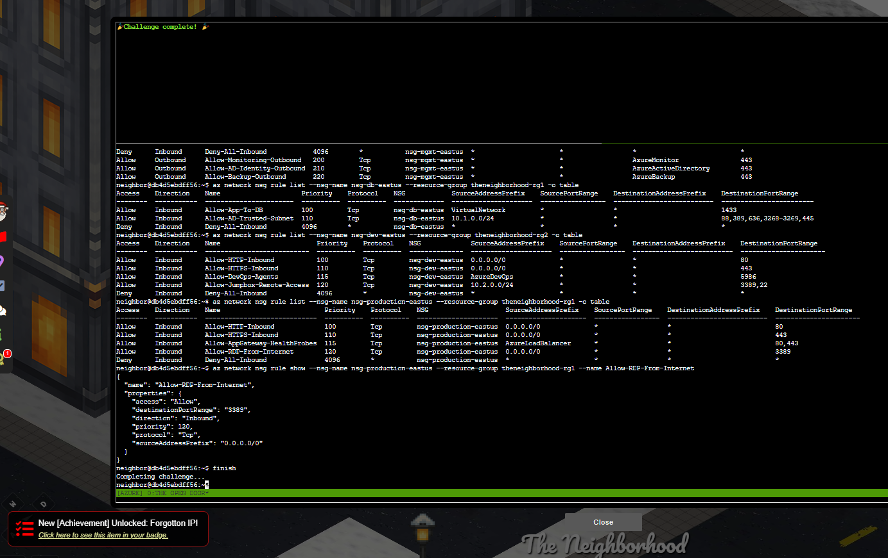

# The Open Door

**Difficulty**: ⭐

---

## ** The Open Door**

*Difficulty: *

Help Goose Lucas in the hotel parking lot find the dangerously
misconfigured Network Security Group rule that's allowing unrestricted
internet access to sensitive ports like RDP or SSH.

## [Lucas](https://2025.holidayhackchallenge.com/badge?section=conversation&id=goosepixel)

(Spanish mode) Hi\... welcome to the Dosis Neighborhood! Nice to meet
you!

Please make sure the towns Azure network is secured properly.

The Neighborhood HOA uses Azure for their IT infrastructure.

Audit their network security configuration to ensure production systems
aren't exposed to internet attacks.

They claim all systems are properly protected, but you need to verify
there are no overly permissive NSG rules.

Click the terminal:

🎄 Welcome to The Open Door Challenge! 🎄

You're connected to a read-only Azure CLI session in "The
Neighborhood" tenant.

Your mission: Review their network configurations and find what doesn't
belong.

Connecting you now\... ❄️

Welcome back! Let's start by exploring output formats.

First, let's see resource groups in JSON format (the default):

\$ az group list

JSON format shows detailed structured data.

Ran help command:

neighbor@32ca29105109:\~\$ help

GNU bash, version 5.0.17(1)-release (x86_64-pc-linux-gnu)

These shell commands are defined internally. Type \`help' to see this
list.

Type \`help name' to find out more about the function \`name'.

Use \`info bash' to find out more about the shell in general.

Use \`man -k' or \`info' to find out more about commands not in this
list.

A star (\*) next to a name means that the command is disabled.

job_spec \[&\] history \[-c\] \[-d offset\] \[n\] or history -anrw
\[filename\] or history -ps arg \[arg\...\]

(( expression )) if COMMANDS; then COMMANDS; \[ elif COMMANDS; then
COMMANDS; \]\... \[ else COMMANDS; \] fi

. filename \[arguments\] jobs \[-lnprs\] \[jobspec \...\] or jobs -x
command \[args\]

: kill \[-s sigspec \| -n signum \| -sigspec\] pid \| jobspec \... or
kill -l \[sigspec\]

\[ arg\... \] let arg \[arg \...\]

\[\[ expression \]\] local \[option\] name\[=value\] \...

alias \[-p\] \[name\[=value\] \... \] logout \[n\]

bg \[job_spec \...\] mapfile \[-d delim\] \[-n count\] \[-O origin\]
\[-s count\] \[-t\] \[-u fd\] \[-C callback\] \[-c quantum\] \[array\]

bind \[-lpsvPSVX\] \[-m keymap\] \[-f filename\] \[-q name\] \[-u name\]
\[-r keyseq\] \[-x keyseq:shell-command\] \[keyseq:readline-func\> popd
\[-n\] \[+N \| -N\]

break \[n\] printf \[-v var\] format \[arguments\]

builtin \[shell-builtin \[arg \...\]\] pushd \[-n\] \[+N \| -N \| dir\]

caller \[expr\] pwd \[-LP\]

case WORD in \[PATTERN \[\| PATTERN\]\...) COMMANDS ;;\]\... esac read
\[-ers\] \[-a array\] \[-d delim\] \[-i text\] \[-n nchars\] \[-N
nchars\] \[-p prompt\] \[-t timeout\] \[-u fd\] \[name \...\]

cd \[-L\|\[-P \[-e\]\] \[-@\]\] \[dir\] readarray \[-d delim\] \[-n
count\] \[-O origin\] \[-s count\] \[-t\] \[-u fd\] \[-C callback\] \[-c
quantum\] \[array\]

command \[-pVv\] command \[arg \...\] readonly \[-aAf\] \[name\[=value\]
\...\] or readonly -p

compgen \[-abcdefgjksuv\] \[-o option\] \[-A action\] \[-G globpat\]
\[-W wordlist\] \[-F function\] \[-C command\] \[-X filterpat\] \[-P \>
return \[n\]

complete \[-abcdefgjksuv\] \[-pr\] \[-DEI\] \[-o option\] \[-A action\]
\[-G globpat\] \[-W wordlist\] \[-F function\] \[-C command\] \[-X f\>
select NAME \[in WORDS \... ;\] do COMMANDS; done

compopt \[-o\|+o option\] \[-DEI\] \[name \...\] set
\[-abefhkmnptuvxBCHP\] \[-o option-name\] \[\--\] \[arg \...\]

continue \[n\] shift \[n\]

coproc \[NAME\] command \[redirections\] shopt \[-pqsu\] \[-o\]
\[optname \...\]

declare \[-aAfFgilnrtux\] \[-p\] \[name\[=value\] \...\] source filename
\[arguments\]

dirs \[-clpv\] \[+N\] \[-N\] suspend \[-f\]

disown \[-h\] \[-ar\] \[jobspec \... \| pid \...\] test \[expr\]

echo \[-neE\] \[arg \...\] time \[-p\] pipeline

enable \[-a\] \[-dnps\] \[-f filename\] \[name \...\] times

eval \[arg \...\] trap \[-lp\] \[\[arg\] signal_spec \...\]

exec \[-cl\] \[-a name\] \[command \[arguments \...\]\] \[redirection
\...\] true

exit \[n\] type \[-afptP\] name \[name \...\]

export \[-fn\] \[name\[=value\] \...\] or export -p typeset
\[-aAfFgilnrtux\] \[-p\] name\[=value\] \...

false ulimit \[-SHabcdefiklmnpqrstuvxPT\] \[limit\]

fc \[-e ename\] \[-lnr\] \[first\] \[last\] or fc -s \[pat=rep\]
\[command\] umask \[-p\] \[-S\] \[mode\]

fg \[job_spec\] unalias \[-a\] name \[name \...\]

for NAME \[in WORDS \... \] ; do COMMANDS; done unset \[-f\] \[-v\]
\[-n\] \[name \...\]

for (( exp1; exp2; exp3 )); do COMMANDS; done until COMMANDS; do
COMMANDS; done

function name { COMMANDS ; } or name () { COMMANDS ; } variables - Names
and meanings of some shell variables

getopts optstring name \[arg\] wait \[-fn\] \[id \...\]

hash \[-lr\] \[-p pathname\] \[-dt\] \[name \...\] while COMMANDS; do
COMMANDS; done

help \[-dms\] \[pattern \...\] { COMMANDS ; }

neighbor@32ca29105109:\~\$

first command given is "az group list"

so I guess there's 2 groups rg1, rg2 (i'm guess how this works)

it is prompting me to use specific commands, id assume to teach the
commands and whatnot:

I will try to paste instead of screenshot:

neighbor@db4d5ebdff56:\~\$ az group list -o table

Name Location ProvisioningState

\-\-\-\-\-\-\-\-\-\-\-\-\-\-\-\-\-\-- \-\-\-\-\-\-\-\-\--
\-\-\-\-\-\-\-\-\-\-\-\-\-\-\-\-\-\--

theneighborhood-rg1 eastus Succeeded

theneighborhood-rg2 westus Succeeded

neighbor@db4d5ebdff56:\~\$ az network nsg list -o table

Location Name ResourceGroup

\-\-\-\-\-\-\-\-\-- \-\-\-\-\-\-\-\-\-\-\-\-\-\-\-\-\-\-\-\--
\-\-\-\-\-\-\-\-\-\-\-\-\-\-\-\-\-\--

eastus nsg-web-eastus theneighborhood-rg1

eastus nsg-db-eastus theneighborhood-rg1

eastus nsg-dev-eastus theneighborhood-rg2

eastus nsg-mgmt-eastus theneighborhood-rg2

eastus nsg-production-eastus theneighborhood-rg1

from this looks like rg1 has web security group

I will include the prompts from here on as well

Inspect the Network Security Group (web) 🕵️

Here is the NSG and its resource group:\--name nsg-web-eastus
\--resource-group theneighborhood-rg1

Hint: We want to show the NSG details. Use \| less to page through the
output.

Documentation:
https://learn.microsoft.com/en-us/cli/azure/network/nsg?view=azure-cli-latest#az-network-nsg-show

from the instructions, looks like I need to run: az network nsg show
\--name nsg-web-eastus \--resource-group theneighborhood-rg1 \| less

output:

{

"id":
"/subscriptions/2b0942f3-9bca-484b-a508-abdae2db5e64/resourceGroups/theneighborhood-rg1/providers/Microsoft.Network/networkSecurityGroups/nsg-web-eastus",

"location": "eastus",

"name": "nsg-web-eastus",

"properties": {

"securityRules": \[

{

"name": "Allow-HTTP-Inbound",

"properties": {

"access": "Allow",

"destinationPortRange": "80",

"direction": "Inbound",

"priority": 100,

"protocol": "Tcp",

"sourceAddressPrefix": "0.0.0.0/0"

}

},

{

"name": "Allow-HTTPS-Inbound",

"properties": {

"access": "Allow",

"destinationPortRange": "443",

"direction": "Inbound",

"priority": 110,

"protocol": "Tcp",

"sourceAddressPrefix": "0.0.0.0/0"

}

},

{

"name": "Allow-AppGateway-HealthProbes",

"properties": {

"access": "Allow",

"destinationPortRange": "80,443",

"direction": "Inbound",

"priority": 130,

"protocol": "Tcp",

"sourceAddressPrefix": "AzureLoadBalancer"

}

},

{

"name": "Allow-Web-To-App",

"properties": {

"access": "Allow",

"destinationPortRange": "8080,8443",

"direction": "Inbound",

"priority": 200,

"protocol": "Tcp",

"sourceAddressPrefix": "VirtualNetwork"

}

},

{

"name": "Deny-All-Inbound",

"properties": {

"access": "Deny",

"destinationPortRange": "\*",

"direction": "Inbound",

"priority": 4096,

"protocol": "\*",

"sourceAddressPrefix": "\*"

}

}

\]

},

"resourceGroup": "theneighborhood-rg1",

"tags": {

"env": "web"

:

prompt:

Inspect the Network Security Group (mgmt) 🕵️

Here is the NSG and its resource group:\--nsg-name nsg-mgmt-eastus
\--resource-group theneighborhood-rg2

Hint: We want to list the NSG rules

Documentation:
https://learn.microsoft.com/en-us/cli/azure/network/nsg/rule?view=azure-cli-latest#az-network-nsg-rule-list

going to try running:

az network nsg rule list \--nsg-name nsg-mgmt-eastus \--resource-group
theneighborhood-rg2 -o table

this will follow the prompt they give and put in a table.

Result:

(switching to image so it scales better)

Prompt:

Take a look at the rest of the NSG rules and examine their properties.

After enumerating the NSG rules, enter the command string to view the
suspect rule and inspect its properties.

Hint: Review fields such as direction, access, protocol, source,
destination and port settings.

Documentation:
<https://learn.microsoft.com/en-us/cli/azure/network/nsg/rule?view=azure-cli-latest#az-network-nsg-rule-show>

## What to Look For in NSG Rules:

### 🚨 **RED FLAGS** (Common Misconfigurations):

1.  **SSH (22) or RDP (3389) open to the internet** (0.0.0.0/0 or \*)
2.  **Management ports open from anywhere** (like port 22, 3389, 3306
    for MySQL, 5432 for PostgreSQL)
3.  **Overly broad source addresses** on sensitive services
4.  **Missing deny rules** or rules that are too permissive

### ✅ **GOOD SIGNS** (What you're seeing here):

The *nsg-mgmt-eastus* actually looks **pretty well secured**:

-   **AzureBastion** (priority 100) - This is good! Azure Bastion is a
    secure way to access VMs without exposing RDP/SSH to the internet
-   **AzureMonitor** - Allows Azure monitoring services
-   **DNS from VirtualNetwork** - Only allows DNS from within the VNet
    (not the internet)
-   **Deny-All-Inbound** at the end - Good default deny posture
-   Outbound rules are restrictive (only to specific Azure services)

### 🔍 **What's NOTABLY MISSING** (and this is good):

-   No SSH (port 22) rule
-   No RDP (port 3389) rule
-   No database ports exposed
-   No source of *0.0.0.0/0* or *\** allowing internet access

so, looks like we need to look at the other NSG rules

these commands should do it:

az network nsg rule list \--nsg-name nsg-db-eastus \--resource-group
theneighborhood-rg1 -o table

az network nsg rule list \--nsg-name nsg-dev-eastus \--resource-group
theneighborhood-rg2 -o table

az network nsg rule list \--nsg-name nsg-production-eastus
\--resource-group theneighborhood-rg1 -o table

result:

this immediately stands out in dev:

Allow Inbound Allow-Jumpbox-Remote-Access 120 Tcp nsg-dev-eastus
10.2.0.0/24 \* \* 3389,22

port 3389 remote desktop and port 22 SSH

also this one in production:

Allow Inbound Allow-RDP-From-Internet 120 Tcp nsg-production-eastus
0.0.0.0/0 \* \* 3389

that's bad ... haha

**BINGO! 🎯** You found them! Great eye!

Let's break down what you discovered:

## **nsg-dev-eastus** - Jumpbox rule:

*Allow-Jumpbox-Remote-Access: 3389,22 from 10.2.0.0/24*

This is actually **OKAY** ✅ because:

-   Source is *10.2.0.0/24* (a private subnet, not the internet)
-   This is likely a jumpbox/bastion pattern where you connect to a jump
    server first, then to dev resources
-   It's restricted to internal network only

## **nsg-production-eastus** - RDP rule:

*Allow-RDP-From-Internet: 3389 from 0.0.0.0/0*

This is **TERRIBLE!** 🚨🚨🚨 because:

-   **Port 3389 (RDP) is wide open to THE ENTIRE INTERNET**
-   Source is *0.0.0.0/0* = anyone, anywhere can try to RDP in
-   This is a **PRODUCTION** environment!
-   Classic attack vector - attackers scan for open RDP and brute force
    passwords

## **Why this is a critical security issue:**

1.  RDP should NEVER be exposed to the internet
2.  Should use Azure Bastion (like the mgmt NSG) or VPN
3.  Attackers constantly scan for open RDP/SSH
4.  Common entry point for ransomware and data breaches

prompt still says:

Take a look at the rest of the NSG rules and examine their properties.

After enumerating the NSG rules, enter the command string to view the
suspect rule and inspect its properties.

Hint: Review fields such as direction, access, protocol, source,
destination and port settings.

Documentation:
https://learn.microsoft.com/en-us/cli/azure/network/nsg/rule?view=azure-cli-latest#az-network-nsg-rule-show

I will try: az network nsg rule show \--nsg-name nsg-production-eastus
\--resource-group theneighborhood-rg1 \--name Allow-RDP-From-Internet

see if it changes when I look at the exact rule

Yeah, that did it:

Great, you found the NSG misconfiguration allowing RDP (port 3389) from
the public internet!

Port 3389 is used by Remote Desktop Protocol --- exposing it broadly
allows attackers to brute-force credentials, exploit RDP
vulnerabilities, and pivot within the network.

✨ To finish, type: finish

neighbor@db4d5ebdff56:\~\$ az network nsg rule show \--nsg-name
nsg-production-eastus \--resource-group theneighborhood-rg1 \--name
Allow-RDP-From-Internet

{

"name": "Allow-RDP-From-Internet",

"properties": {

"access": "Allow",

"destinationPortRange": "3389",

"direction": "Inbound",

"priority": 120,

"protocol": "Tcp",

"sourceAddressPrefix": "0.0.0.0/0"

}

}

neighbor@db4d5ebdff56:\~\$

completed!

## [Lucas](https://2025.holidayhackchallenge.com/badge?section=conversation&id=goosepixel)

(Spanish mode) Hi\... welcome to the Dosis Neighborhood! Nice to meet
you!

Please make sure the towns Azure network is secured properly.

The Neighborhood HOA uses Azure for their IT infrastructure.

Audit their network security configuration to ensure production systems
aren't exposed to internet attacks.

They claim all systems are properly protected, but you need to verify
there are no overly permissive NSG rules.

Ha! 'Properly protected' they said. More like 'properly exposed to
the entire internet'! Good catch, amigo.
