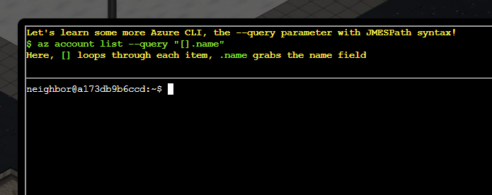
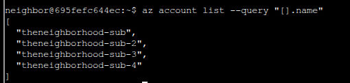
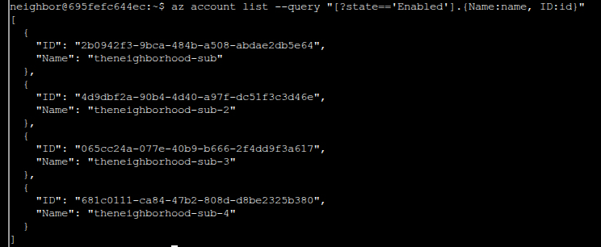
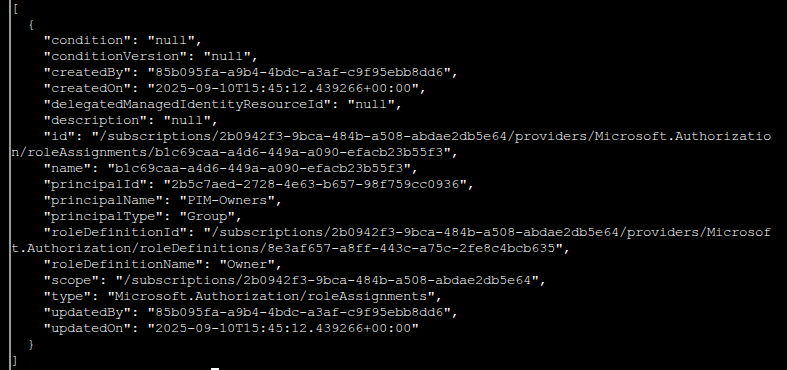
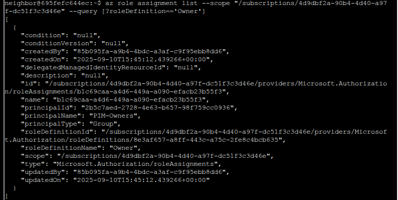

# Owner

**Difficulty**: ⭐⭐

---

## \*Quick System Change"

Around the **"Owner"** challenge, I had to switch things up:

**What happened**: My Windows machine died, so I reinstalled everything
on Linux Mint.

**Interface change**: From this point forward, you'll see the **Classic
CTF mode** instead of the fancy graphical interface.

**Why Classic mode?**

-   Cleaner terminal output for screenshots
-   Works on my work computer (the graphical version doesn't)
-   Honestly just looks better for documentation

Everything else stays the same - same commands, same solutions, just a
different looking terminal window.

## Owner

*Difficulty: *

Help Goose James near the park discover the accidentally leaked SAS
token in a public JavaScript file and determine what Azure Storage
resource it exposes and what permissions it grants.

Skip Objective (Story Mode)Get Hint

## [James](https://2025.holidayhackchallenge.com/badge?section=conversation&id=goosesteampunk)

CLUCK CLU\... I think I might be losing my mind. All the elves are gone
and I'm still hearing voices.

The Neighborhood HOA uses Azure for their IT infrastructure.

The Neighborhood network admins use RBAC fo access control.

Your task is to audit their RBAC configuration to ensure they're
following security best practices.

They claim all elevated access uses PIM, but you need to verify there
are no permanently assigned Owner roles.

Prompt:

Let's learn some more Azure CLI, the \--query parameter with JMESPath
syntax!

\$ az account list \--query "\[\].name"

Here, \[\] loops through each item, .name grabs the name field

Result from Command:

There are 4 Azure subscriptions in this tenant.

Cleaned up output to show subscription IDs:

Pasting the text here so I have notes:

\[

{

"ID": "2b0942f3-9bca-484b-a508-abdae2db5e64",

"Name": "theneighborhood-sub"

},

{

"ID": "4d9dbf2a-90b4-4d40-a97f-dc51f3c3d46e",

"Name": "theneighborhood-sub-2"

},

{

"ID": "065cc24a-077e-40b9-b666-2f4dd9f3a617",

"Name": "theneighborhood-sub-3"

},

{

"ID": "681c0111-ca84-47b2-808d-d8be2325b380",

"Name": "theneighborhood-sub-4"

}

\]

Next we will try to list the owners of the subscriptions:
az role assignment list \--scope "/subscriptions/{ID of first
Subscription}" \--query \[?roleDefinition=='Owner'\]

when adding the subscription ID you don't need the curly braces {} so we
try:

az role assignment list \--scope
"/subscriptions/2b0942f3-9bca-484b-a508-abdae2db5e64" \--query
\[?roleDefinition=='Owner'\]

Result:

So, what we're seeing is:

Role Assignment Details:

roleDefinitionName: "Owner" ← Full control over the subscription

principalName: "PIM-Owners" ← A Group has Owner permissions

principalType: "Group" ← It's a group, not an individual user

all of this looks fine tbh.

Try the other subscriptions IDs? We are looking for obvious security
concerns like a user that has too much permissions.

List of Commands:

az role assignment list \--scope
"/subscriptions/2b0942f3-9bca-484b-a508-abdae2db5e64" \--query
\[?roleDefinition=='Owner'\] (previous query)

az role assignment list \--scope
"/subscriptions/4d9dbf2a-90b4-4d40-a97f-dc51f3c3d46e" \--query
\[?roleDefinition=='Owner'\]

az role assignment list \--scope
"/subscriptions/065cc24a-077e-40b9-b666-2f4dd9f3a617" \--query
\[?roleDefinition=='Owner'\]

az role assignment list \--scope
"/subscriptions/681c0111-ca84-47b2-808d-d8be2325b380" \--query
\[?roleDefinition=='Owner'\]

When looking at sub-3 it looks like there is an outlying group with
excessive permissions:

A group called "IT Admins" has been granted Owner permissions at the
subscription level.

### Why This Violates Least Privilege:

1.  **Owner role** = Full control over everything in the subscription
    (too broad!)
2.  **Subscription scope** = Affects ALL resources in the entire
    subscription (too wide!)
3.  **Group assignment** = Every member of "IT Admins" gets Owner
    access
4.  **Not PIM-protected** = Unlike "PIM-Owners", this is permanent,
    always-on access

I tried to do a member list by running: az ad group member list \--group
6b982f2f-78a0-44a8-b915-79240b2b4796 \| less

But it looks like we have a nested group:

This means a group within a group

Owner Permission on Subscription

↓

"IT Admins" Group (6b982f2f-78a0-44a8-b915-79240b2b4796)

↓ (contains)

"Subscription Admins" Group (631ebd3f-39f9-4492-a780-aef2aec8c94e)

↓ (contains)

??? (actual users - need to find)

Instead of finding **users** directly in "IT Admins", we found
**another group** called "Subscription Admins"!

### Why This Matters:

Because "Subscription Admins" is a member of "IT Admins", and "IT
Admins" has Owner permissions, **everyone in "Subscription Admins"
also gets Owner permissions** (inherited through group membership).

So, to get a list of users we need to run the command again using the
**new group ID**: az ad group member list \--group
631ebd3f-39f9-4492-a780-aef2aec8c94e

## The Problem:

**Frank has Owner permissions on an entire Azure subscription** just
because he's:

1.  Member of "Subscription Admins" group
2.  Which is nested in "IT Admins" group
3.  Which has Owner role at subscription scope

### Why This Violates Least Privilege:

Frank is an **"HOA IT Administrator"** - he probably needs to:

-   Manage firewalls ✅
-   Configure network security ✅
-   Maybe manage VMs or storage ✅

He does **NOT** need to:

-   Delete entire subscriptions ❌
-   Modify billing ❌
-   Grant permissions to others ❌
-   Access ALL resources in the subscription ❌

**Challenge Status**: ✅ Completed
