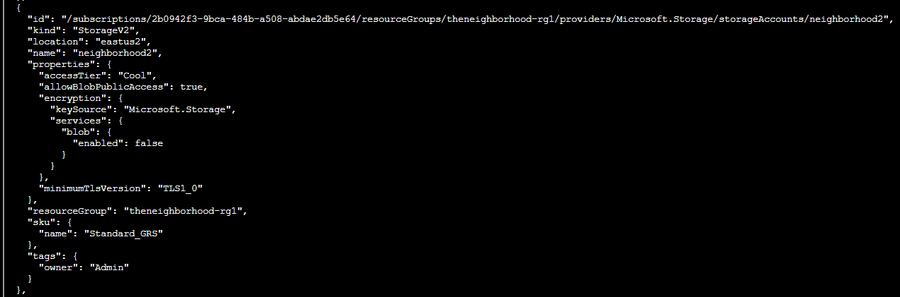
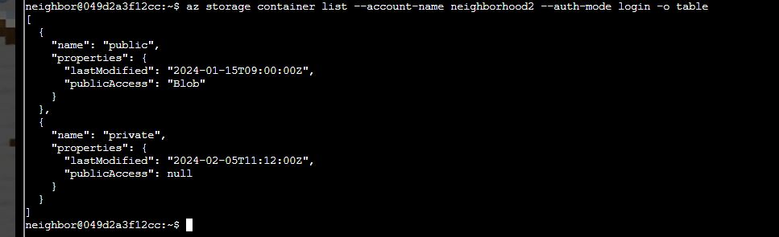
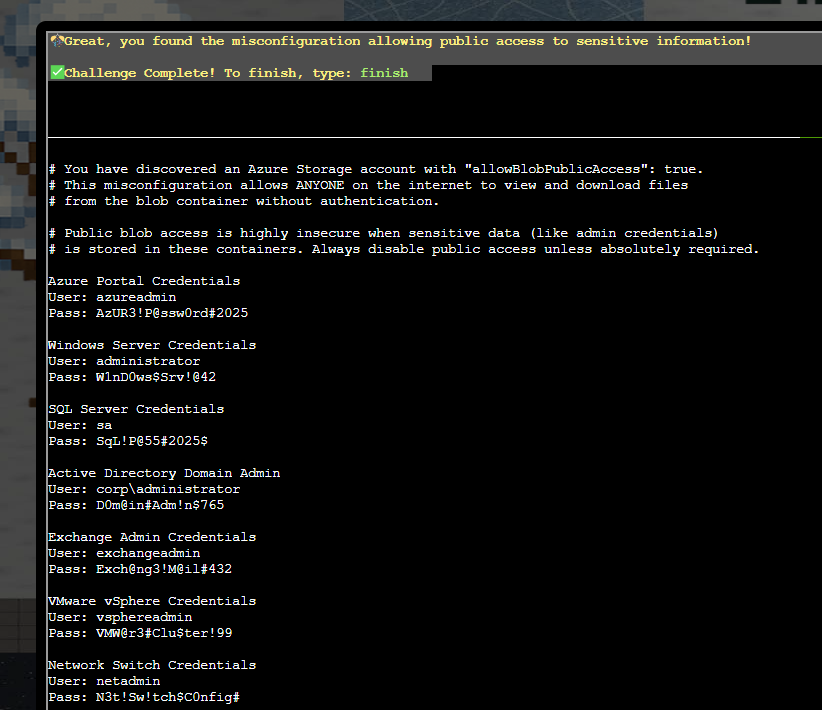
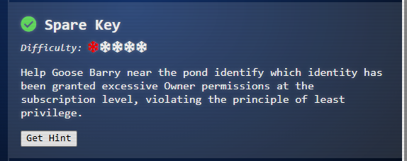

# Blob Storage Challenge in the Neighborhood

**Difficulty:** ⭐⭐

---

## Challenge Overview

Help Grace the Goose audit the Neighborhood HOA's Azure storage accounts to identify dangerous security misconfigurations. Recent reports suggest that sensitive data might be publicly accessible due to improper blob storage settings - a critical cloud security vulnerability that could expose the entire organization's credentials!

### Grace (Goose)


*Grace the Goose needs help auditing Azure storage security configurations*

> **HONK!!! HONK!!!!**
>
> *The Neighborhood HOA uses Azure storage accounts for various IT operations. You've been asked to audit their storage security configuration to ensure no sensitive data is publicly accessible. Recent security reports suggest some storage accounts might have public blob access enabled, creating potential data exposure risks.*

## Objective

Audit Azure Storage accounts to identify and exploit a misconfigured account that:
- Has public blob access enabled
- Exposes sensitive containers
- Contains leaked credentials
- Violates cloud security best practices

---

## What is Azure Blob Storage?

**Azure Blob Storage** is Microsoft's object storage solution for the cloud, designed to store massive amounts of unstructured data like text files, images, videos, backups, and logs.

### Key Blob Storage Concepts

**Storage Account:**
- Top-level container for all Azure Storage services
- Has unique namespace: `accountname.blob.core.windows.net`
- Contains settings that apply to all data stored within it

**Containers:**
- Similar to folders or directories
- Organize blobs within a storage account
- Have their own access control settings

**Blobs:**
- Individual files stored in containers
- Three types: Block blobs, Append blobs, Page blobs
- Each blob has its own URL

**Access Levels:**
- **Private (None):** No anonymous access (secure default)
- **Blob:** Anonymous read access to individual blobs
- **Container:** Anonymous read access to entire container and blob list

### Why This Matters

**Common Use Cases:**
- 📁 Document storage and sharing
- 📸 Image and media hosting
- 💾 Database backups
- 📊 Log file storage
- 🌐 Static website hosting

**Security Risks:**
- Misconfigured public access can expose sensitive data
- Leaked credentials provide full infrastructure access
- TLS 1.0 vulnerabilities allow MITM attacks
- Disabled encryption exposes data at rest

---

## Solution Walkthrough

### Step 1: List Storage Accounts

The Azure CLI provides help documentation for every command:

```bash
az help | less
```

List all storage accounts in the subscription:

```bash
az storage account list | less
```

**What we're looking for:**
- Multiple storage accounts
- Suspicious configurations
- Public access settings



*Examining storage account configurations reveals "neighborhood2" has suspicious settings*

### Step 2: Identify the Misconfigured Account

Examine specific storage account details:

```bash
az storage account show --name neighborhood2 | less
```


*The "neighborhood2" account shows three critical security misconfigurations*

---

## The Misconfigured Storage Account: `neighborhood2`

### 🚨 Security Issue #1: Public Blob Access Enabled

```json
{
  "allowBlobPublicAccess": true
}
```

**What this means:**
- Account ALLOWS containers to be made public
- Individual containers can expose data to the internet
- No authentication required to access public blobs

**Why it's dangerous:**
- Should be `false` for sensitive data
- Creates pathway for data exposure
- Violates principle of least privilege

**Proper configuration:**
```json
{
  "allowBlobPublicAccess": false  // ✅ Correct
}
```

### 🚨 Security Issue #2: Ancient TLS Version

```json
{
  "minimumTlsVersion": "TLS1_0"
}
```

**What this means:**
- Using TLS 1.0 from 1999 (26 years old!)
- Has known cryptographic vulnerabilities
- Susceptible to downgrade attacks

**Timeline of TLS:**
- **TLS 1.0** (1999) - Deprecated, vulnerable
- **TLS 1.1** (2006) - Also deprecated
- **TLS 1.2** (2008) - Current minimum standard ✅
- **TLS 1.3** (2018) - Current best practice ✅

**Known TLS 1.0 Vulnerabilities:**
- **BEAST attack** - Browser Exploit Against SSL/TLS
- **POODLE** - Padding Oracle On Downgraded Legacy Encryption
- **CRIME** - Compression Ratio Info-leak Made Easy
- **Weak ciphers** - RC4, 3DES susceptible to attacks

**Proper configuration:**
```json
{
  "minimumTlsVersion": "TLS1_2"  // ✅ Correct (or TLS1_3)
}
```

### 🚨 Security Issue #3: Blob Encryption Disabled

```json
{
  "encryption": {
    "services": {
      "blob": {
        "enabled": false
      }
    }
  }
}
```

**What this means:**
- Data stored without encryption at rest
- Physical disk access reveals data in plaintext
- Fails compliance requirements (GDPR, HIPAA, PCI-DSS)

**Why encryption at rest matters:**
- Protects against physical theft of storage media
- Meets regulatory compliance requirements
- Defense in depth security practice
- No performance penalty with modern Azure

**Proper configuration:**
```json
{
  "encryption": {
    "services": {
      "blob": {
        "enabled": true  // ✅ Correct (Azure default)
      }
    }
  }
}
```

---

## Step 3: List Containers

Check what containers exist in the misconfigured account:

```bash
az storage container list --account-name neighborhood2 --auth-mode login -o table
```

**Output fields:**
- **Name** - Container identifier
- **Public Access** - Access level (None, Blob, Container)
- **Last Modified** - When container was updated



*Two containers found: "public" and "private" - the naming is ironic!*

### Container Analysis

| Container | Public Access | Security Risk |
|-----------|---------------|---------------|
| **public** | Blob | 🚨 CRITICAL - Anyone can download files if they know the URL |
| **private** | None | ✅ Secure - But account setting allows it to be changed! |

**The "private" Container Irony:**
- Named "private" but account allows public access
- Currently secure but could be misconfigured at any time
- False sense of security from naming

**Public Access Level "Blob" Explained:**
- Anonymous users can download individual blobs
- Requires knowing the exact blob URL
- Cannot list what blobs exist (that requires "Container" level)
- Still dangerous if URLs are discovered or guessed

---

## Step 4: List Blobs in Public Container

See what files are exposed in the public container:

```bash
az storage blob list --account-name neighborhood2 --container-name public --auth-mode login -o table
```


*Files discovered in the public container - one looks very suspicious!*

### Exposed Files

| File Name | Content Type | Size | Risk Level |
|-----------|--------------|------|------------|
| `refrigerator_inventory.pdf` | application/pdf | 45,678 bytes | Low (benign) |
| **`admin_credentials.txt`** | text/plain | 1,024 bytes | 🚨 **CRITICAL** |
| `network_config.json` | application/json | 2,048 bytes | 🚨 High (production config) |

**File Metadata Analysis:**

**admin_credentials.txt** metadata:
```json
{
  "metadata": {
    "note": "admins only"  // ⚠️ Should NOT be public!
  }
}
```

**network_config.json** metadata:
```json
{
  "metadata": {
    "encrypted": "false",  // ⚠️ Unencrypted production config!
    "environment": "prod"
  }
}
```

---

## Step 5: Download and Examine Credentials

Download the exposed credentials file:

```bash
az storage blob download \
  --account-name neighborhood2 \
  --container-name public \
  --name admin_credentials.txt \
  --file /dev/stdout \
  --auth-mode login | less
```

**Command Breakdown:**
- `--account-name neighborhood2` - Target storage account
- `--container-name public` - Target container
- `--name admin_credentials.txt` - Specific file to download
- `--file /dev/stdout` - Print to terminal instead of saving to disk
- `--auth-mode login` - Authenticate using Azure CLI credentials
- `| less` - Page through output



*Complete credential dump revealing access to 12 critical systems!*

---

## 🔥 The Leaked Credentials

### Complete Credential Exposure

The file contains administrative credentials for **12 critical systems**:

#### 1. Azure Portal (Cloud Infrastructure)
```
User: azureadmin
Pass: AzUR3!P@ssw0rd#2025
```
**Access:** Full Azure subscription control, create/delete resources, manage billing

#### 2. Windows Server (Domain Controller)
```
User: administrator
Pass: W1nD0ws$Srv!@42
```
**Access:** Local admin on all Windows servers, full system control

#### 3. SQL Server (Database)
```
User: sa
Pass: SqL!P@55#2025$
```
**Access:** System Administrator - full database access, backup/restore, user management

#### 4. Active Directory Domain Admin
```
User: corp\administrator
Pass: D0m@in#Adm!n$765
```
**Access:** Domain-level control, user management, Group Policy, replication

#### 5. Exchange Admin (Email)
```
User: exchangeadmin
Pass: Exch@ng3!M@il#432
```
**Access:** Email server management, mailbox access, read all emails

#### 6. VMware vSphere (Virtualization)
```
User: vsphereadmin
Pass: VMW@r3#Clu$ter!99
```
**Access:** Virtual infrastructure control, create/delete VMs, resource allocation

#### 7. Network Switch
```
User: netadmin
Pass: N3t!Sw!tch$C0nfig#
```
**Access:** Network device configuration, VLAN management, traffic monitoring

#### 8. Firewall Admin
```
User: fwadmin
Pass: F1r3W@ll#S3cur3!77
```
**Access:** Security policy management, traffic filtering, VPN configuration

#### 9. Backup Server
```
User: backupadmin
Pass: B@ckUp!Srv#2025$
```
**Access:** Backup/restore operations, data recovery, backup policy management

#### 10. Monitoring System
```
User: monitoradmin
Pass: M0n!t0r#Sys$P@ss!
```
**Access:** System monitoring, alert configuration, performance metrics

#### 11. SharePoint Admin
```
User: spadmin
Pass: Sh@r3P0!nt#Adm!n2025
```
**Access:** Document management, site collection administration, permissions

#### 12. Git Server (Source Code)
```
User: gitadmin
Pass: G1t#Srv!Rep0$C0de
```
**Access:** Source code repositories, commit history, project management

---

## Real-World Impact Analysis

### Attack Scenarios Enabled

With these credentials, an attacker could:

**Phase 1: Initial Access**
- ✅ Log into Azure Portal with `azureadmin`
- ✅ Authenticate to domain with `corp\administrator`
- ✅ Access all databases with `sa` account

**Phase 2: Lateral Movement**
- ✅ Deploy new VMs using vSphere credentials
- ✅ Reconfigure network switches and VLANs
- ✅ Modify firewall rules to allow malicious traffic
- ✅ Access all email via Exchange admin

**Phase 3: Data Exfiltration**
- ✅ Download entire source code from Git server
- ✅ Extract customer data from SQL databases
- ✅ Access confidential documents from SharePoint
- ✅ Retrieve all backup archives

**Phase 4: Persistence & Destruction**
- ✅ Create backdoor admin accounts in AD
- ✅ Disable monitoring systems
- ✅ Delete or encrypt backups (ransomware preparation)
- ✅ Modify network configs to maintain access

### Compliance Violations

This exposure violates:

**GDPR (General Data Protection Regulation):**
- Article 32: Security of processing
- Article 33: Breach notification (72 hours)
- Potential fines: Up to €20 million or 4% of annual revenue

**HIPAA (Healthcare):**
- §164.308: Administrative safeguards
- §164.312: Technical safeguards
- Penalties: $100 to $50,000 per violation

**PCI-DSS (Payment Cards):**
- Requirement 3: Protect stored cardholder data
- Requirement 8: Identify and authenticate access
- Consequences: Loss of payment processing ability

**SOX (Financial):**
- Section 404: Internal controls
- Section 802: Record retention
- Penalties: Criminal charges for executives

---

## Challenge Complete!



*Successfully identified the misconfigured storage account and exposed credentials!*

### Grace's Response

> **HONK HONK HONK!**
>
> *'No sensitive data publicly accessible' they claimed. Meanwhile, literally everything was public! Good save, security expert!*

**Challenge Status:** ✅ Completed

---

## Azure Storage Security Best Practices

### Configuration Hardening

**1. Disable Public Blob Access (Account Level)**
```bash
az storage account update \
  --name myaccount \
  --resource-group mygroup \
  --allow-blob-public-access false
```

**2. Enforce Modern TLS**
```bash
az storage account update \
  --name myaccount \
  --resource-group mygroup \
  --min-tls-version TLS1_2
```

**3. Enable Encryption (Should be default)**
```bash
az storage account update \
  --name myaccount \
  --resource-group mygroup \
  --encryption-services blob file
```

**4. Set Container Access to Private**
```bash
az storage container set-permission \
  --name mycontainer \
  --account-name myaccount \
  --public-access off
```

### Access Control Best Practices

**Use Managed Identities:**
- No credentials in code
- Automatic credential rotation
- Azure AD integration

**Implement Shared Access Signatures (SAS):**
- Time-limited access tokens
- Granular permissions (read, write, delete)
- IP address restrictions
- Expiration dates

**Enable Azure AD Authentication:**
- User-based access control
- Multi-factor authentication support
- Conditional access policies
- Audit logging

**Network Security:**
- Use Private Endpoints
- Configure firewall rules
- Implement Virtual Network service endpoints
- Restrict access to specific subnets

### Monitoring and Auditing

**Enable Storage Analytics:**
```bash
az storage logging update \
  --account-name myaccount \
  --services blob \
  --log rwd \
  --retention 90
```

**Configure Alerts:**
- Public access changes
- Unusual download patterns
- Authentication failures
- Configuration modifications

**Regular Security Audits:**
- Review container access levels monthly
- Check for public containers
- Audit shared access signatures
- Verify encryption settings

---

## Azure CLI Commands Reference

### Storage Account Operations

**List all storage accounts:**
```bash
az storage account list
az storage account list -o table  # Table format
az storage account list | jq '.[] | {name, location}'  # JSON parsing
```

**Show specific account:**
```bash
az storage account show --name accountname
az storage account show --name accountname -o yaml
az storage account show --name accountname --query "primaryEndpoints"
```

**Check public access setting:**
```bash
az storage account show \
  --name accountname \
  --query "allowBlobPublicAccess"
```

### Container Operations

**List containers:**
```bash
az storage container list --account-name accountname --auth-mode login
az storage container list --account-name accountname --auth-mode login -o table
```

**Check container access level:**
```bash
az storage container show \
  --name containername \
  --account-name accountname \
  --query "properties.publicAccess"
```

**Change container access:**
```bash
# Make private
az storage container set-permission \
  --name containername \
  --account-name accountname \
  --public-access off

# Make public (blob level)
az storage container set-permission \
  --name containername \
  --account-name accountname \
  --public-access blob
```

### Blob Operations

**List blobs:**
```bash
az storage blob list \
  --account-name accountname \
  --container-name containername \
  --auth-mode login

az storage blob list \
  --account-name accountname \
  --container-name containername \
  --auth-mode login \
  -o table
```

**Download blob:**
```bash
# To file
az storage blob download \
  --account-name accountname \
  --container-name containername \
  --name filename.txt \
  --file local_file.txt \
  --auth-mode login

# To stdout (terminal)
az storage blob download \
  --account-name accountname \
  --container-name containername \
  --name filename.txt \
  --file /dev/stdout \
  --auth-mode login
```

**Upload blob:**
```bash
az storage blob upload \
  --account-name accountname \
  --container-name containername \
  --name filename.txt \
  --file local_file.txt \
  --auth-mode login
```

### Security Auditing Commands

**Check all accounts for public access:**
```bash
az storage account list --query "[?allowBlobPublicAccess==\`true\`].name"
```

**Find public containers:**
```bash
for account in $(az storage account list --query "[].name" -o tsv); do
  echo "Checking $account..."
  az storage container list \
    --account-name $account \
    --auth-mode login \
    --query "[?properties.publicAccess!=null]"
done
```

---

## Security Implications

### The Misconfiguration Chain

This challenge demonstrates a **defense-in-depth failure** where multiple security layers broke down:

**Layer 1: Account Configuration**
- ❌ `allowBlobPublicAccess: true` enabled
- Should be disabled by default for sensitive data

**Layer 2: Container Access**
- ❌ "public" container set to Blob-level access
- Should be private (None) for all containers

**Layer 3: Sensitive Data Placement**
- ❌ Credentials stored in publicly accessible container
- Should use Azure Key Vault for secrets

**Layer 4: Encryption**
- ❌ Blob encryption disabled
- Should always be enabled (Azure default)

**Layer 5: Transport Security**
- ❌ TLS 1.0 allowed
- Should enforce TLS 1.2 or higher

### Real-World Examples

**Capital One Breach (2019):**
- Misconfigured AWS S3 bucket
- Exposed 100 million customer records
- $80 million fine from regulators

**Uber Breach (2016):**
- AWS S3 bucket with public access
- 57 million rider/driver records exposed
- $148 million settlement

**GoDaddy Breach (2020):**
- AWS S3 bucket misconfiguration
- 28,000 customer records exposed
- Credentials stored in plaintext

### Why This Happens

**Common Causes:**
1. **Convenience over security** - "Just make it work"
2. **Lack of training** - Developers unfamiliar with cloud security
3. **Default configurations** - Not hardening after initial setup
4. **Poor documentation** - Unclear security requirements
5. **No security review** - Missing approval process
6. **Shadow IT** - Unauthorized cloud resource creation
7. **Testing artifacts** - Temporary public access never reverted

---

## Defense Strategies

### Preventative Controls

**1. Infrastructure as Code (IaC)**
```terraform
resource "azurerm_storage_account" "example" {
  name                     = "securestorage"
  resource_group_name      = azurerm_resource_group.example.name
  location                 = azurerm_resource_group.example.location
  account_tier             = "Standard"
  account_replication_type = "LRS"
  
  # Security hardening
  allow_blob_public_access    = false  # ✅
  min_tls_version            = "TLS1_2"  # ✅
  enable_https_traffic_only  = true      # ✅
  
  blob_properties {
    versioning_enabled = true
    delete_retention_policy {
      days = 30
    }
  }
}
```

**2. Azure Policy Enforcement**
```json
{
  "if": {
    "allOf": [
      {
        "field": "type",
        "equals": "Microsoft.Storage/storageAccounts"
      },
      {
        "field": "Microsoft.Storage/storageAccounts/allowBlobPublicAccess",
        "equals": "true"
      }
    ]
  },
  "then": {
    "effect": "deny"
  }
}
```

**3. Automated Security Scanning**
- Azure Security Center
- Microsoft Defender for Cloud
- Third-party tools (Prisma Cloud, Wiz)

### Detective Controls

**1. Azure Monitor Alerts**
```bash
# Alert on public access changes
az monitor metrics alert create \
  --name "Public-Access-Alert" \
  --resource-group mygroup \
  --scopes /subscriptions/.../storageAccounts/myaccount \
  --condition "count > 0" \
  --description "Alert when public access is enabled"
```

**2. Log Analytics Queries**
```kusto
AzureActivity
| where OperationName == "Create or Update Storage Account"
| where Properties contains "allowBlobPublicAccess"
| where Properties contains "true"
| project TimeGenerated, Caller, OperationName, ResourceId
```

**3. Regular Security Audits**
- Weekly: Review container access levels
- Monthly: Audit all storage accounts
- Quarterly: Review and rotate access keys
- Annually: Full security assessment

---

## Key Takeaways

### What We Learned

✅ **Azure Storage Architecture** - Accounts, containers, blobs hierarchy  
✅ **Public Access Misconfigurations** - How they occur and why they're dangerous  
✅ **Azure CLI Proficiency** - Enumerating and auditing cloud resources  
✅ **Security Impact** - Complete infrastructure compromise from one mistake  
✅ **Best Practices** - Proper hardening and monitoring techniques  

### Critical Security Principles

**1. Defense in Depth**
- Multiple security layers prevent single-point failures
- This challenge showed what happens when all layers fail

**2. Least Privilege**
- Default to most restrictive settings
- Grant access only when needed
- Use time-limited credentials (SAS tokens)

**3. Principle of Least Surprise**
- Container named "private" should be private
- Settings should match intent
- Clear security boundaries

**4. Secure by Default**
- Public access should be disabled
- Modern TLS required
- Encryption always enabled

---

## Challenge Summary

| Aspect | Details |
|--------|---------|
| **Character** | Grace the Goose (HONK HONK!) |
| **Difficulty** | ⭐⭐ (Medium) |
| **Cloud Platform** | Microsoft Azure |
| **Focus Area** | Storage account security |
| **Vulnerability** | Public blob access misconfiguration |
| **Impact** | Complete credential exposure (12 systems) |
| **Skills Demonstrated** | Azure CLI, cloud auditing, security analysis |

---

**SANS Holiday Hack Challenge 2025**  
*Act 1: Blob Storage Challenge in the Neighborhood*

**Status:** ✅ Challenge Completed  
**Skills Mastered:** Azure Storage security, cloud misconfiguration detection, credential exposure analysis  
**Tools:** Azure CLI, Azure Storage Explorer  
**HONK:** Maximum Security Achieved! 🦆🔒
