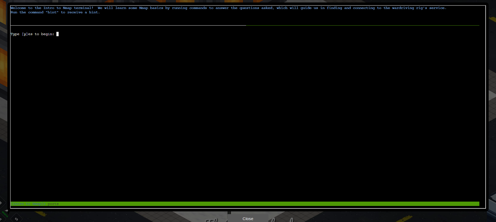
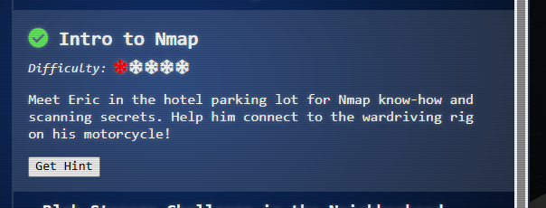

# Intro to Nmap

**Difficulty:** ⭐

---

## Challenge Overview

Learn the fundamentals of network reconnaissance with Nmap, one of the most essential tools in any pentester's arsenal! Eric Pursley has set up a perfect training environment where you'll master port scanning, service detection, and network enumeration through hands-on exercises.

### Eric Pursley

> *"Hey, I'm Eric. As you can see, I'm an avid motorcyclist. And I love traveling the world with my wife. Speaking of tools, let me introduce you to one of the most essential weapons in any pentester's arsenal: Nmap. It's like having X-ray vision for networks, and I've set up a perfect environment for you to learn the fundamentals."*



*Eric's wardriving rig challenge - learning Nmap basics in the hotel parking lot*

**Eric Pursley Facts:**
- 🏍️ Avid motorcyclist who travels the world
- 🛠️ Creator of [Zero-E](https://github.com/sl3yE/Zero-E) cybersecurity tool
- 🎮 Created [Manaflare](https://www.nexusmods.com/baldursgate3/mods/7755) mod for Baldur's Gate 3 (in the game credits!)
- 🎯 Builds tools, ranges, and HHC worlds for Counter Hack
- 💼 Pentester specializing in network and physical security
- 💡 Advice: *"Stay laser-focused on your goals and don't let distractions lead you astray."*

## Objective

Help Eric connect to his wardriving rig's service by learning and using Nmap to:
1. Perform default port scans
2. Scan all 65,535 TCP ports
3. Scan ranges of IP addresses
4. Detect service versions
5. Connect to discovered services with Ncat

---

## What is Nmap?

**Nmap (Network Mapper)** is a free, open-source utility for network discovery and security auditing. Created by Gordon Lyon (Fyodor), it's been the standard for network reconnaissance since 1997.

### Why Nmap is Essential

**Network Discovery:**
- Identify active hosts on a network
- Discover which ports are open
- Determine what services are running
- Map network topology

**Security Auditing:**
- Find vulnerable services
- Detect unauthorized devices
- Verify firewall rules
- Compliance scanning

**Penetration Testing:**
- First step in most penetration tests
- Identifies attack surface
- Discovers potential entry points
- Essential for ethical hacking

### Nmap in Action

Nmap is used by:
- 🔒 Security professionals worldwide
- 🎬 Featured in The Matrix Reloaded, Die Hard 4, and other movies
- 🏢 Fortune 500 companies for security audits
- 🎓 Universities for network administration courses
- 🛡️ Government agencies for infrastructure security

---

## Challenge Walkthrough

The training consists of 5 progressive exercises, each teaching a fundamental Nmap concept.

### Exercise 1: Default Nmap Scan

**Question:** When run without options, nmap performs a TCP port scan of the top 1000 ports. Run a default scan of 127.0.12.25 and see which port is open.

**Command:**
```bash
nmap 127.0.12.25
```

**Result:**
```
elf@06cdc79a290b:~$ nmap 127.0.12.25

Starting Nmap 7.80 ( https://nmap.org ) at 2025-12-07 09:02 UTC
Nmap scan report for 127.0.12.25
Host is up (0.000069s latency).
Not shown: 999 closed ports
PORT      STATE SERVICE
8080/tcp  open  http-proxy

Nmap done: 1 IP address (1 host up) scanned in 0.09 seconds
```

**Analysis:**
- ✅ **Host is up:** Target is reachable and responding
- ✅ **999 closed ports:** Most ports are not accepting connections
- ✅ **Port 8080 open:** HTTP proxy service is accessible
- ✅ **Scan time:** 0.09 seconds (very fast for local scan)

**What Happened:**
- Nmap scanned the 1,000 most common ports
- Only port 8080 responded as open
- Service identified as "http-proxy" based on port number

---

### Exercise 2: Full Port Scan

**Question:** Sometimes the top 1000 ports are not enough. Run a scan of ALL TCP ports on 127.0.12.25 and see which port is open.

**Command:**
```bash
nmap -p- -T5 127.0.12.25
```

**Flag Breakdown:**
- **`-p-`** - Scan ALL 65,535 ports (not just top 1000)
- **`-T5`** - Aggressive timing (fastest scan speed)

**Result:**
```
elf@06cdc79a290b:~$ nmap -p- -T5 127.0.12.25

Starting Nmap 7.80 ( https://nmap.org ) at 2025-12-07 09:06 UTC
Nmap scan report for 127.0.12.25
Host is up (0.000078s latency).
Not shown: 65534 closed ports
PORT      STATE SERVICE
24601/tcp open  unknown

Nmap done: 1 IP address (1 host up) scanned in 1.67 seconds
```

**Analysis:**
- ✅ **Port 24601 discovered:** This was NOT in the top 1000 ports!
- ✅ **Scan time:** 1.67 seconds for all 65,535 ports
- ✅ **Service:** Listed as "unknown" (not a standard service port)
- 🎭 **Easter Egg:** Port 24601 is Jean Valjean's prisoner number from *Les Misérables*!

**Key Learning:**
- Default scans miss uncommon ports
- Full port scans (-p-) are essential for thorough enumeration
- Services can run on ANY port, not just standard ones
- Hidden services often use non-standard ports

---

### Exercise 3: IP Range Scanning

**Question:** Nmap can scan a range of IP addresses. Scan the range 127.0.12.20-28 and see which has a port open.

**Command:**
```bash
nmap -p- -T5 127.0.12.20-28
```

**Syntax Explanation:**
- **`127.0.12.20-28`** - Scans IPs from 127.0.12.20 through 127.0.12.28
- Range is specified in the last octet only
- Scans 9 IP addresses total

**Result:**
```
Nmap scan report for 127.0.12.20
Host is up (0.00023s latency).
All 65535 scanned ports on 127.0.12.20 are closed

[... hosts 21-22 similar ...]

Nmap scan report for 127.0.12.23
Host is up (0.00023s latency).
Not shown: 65534 closed ports
PORT     STATE SERVICE
8080/tcp open  http-proxy

[... remaining hosts all closed ...]

Nmap done: 9 IP addresses (9 hosts up) scanned in 15.40 seconds
```

**Analysis:**
- ✅ **9 hosts scanned:** All IPs from .20 to .28
- ✅ **127.0.12.23 has open port:** Port 8080 (http-proxy)
- ✅ **All other hosts:** No open ports found
- ✅ **Scan efficiency:** 15.40 seconds for 9 hosts × 65,535 ports

**IP Range Syntax Options:**

| Syntax | Description | Example |
|--------|-------------|---------|
| `192.168.1.1-50` | Range in last octet | Scans .1 through .50 |
| `192.168.1-2.1` | Range in third octet | Scans 192.168.1.1 and 192.168.2.1 |
| `192.168.1.0/24` | CIDR notation | Scans entire subnet (1-254) |
| `192.168.1.*` | Wildcard | Same as /24 subnet |
| `192.168.1.1,5,10` | Specific IPs | Scans only .1, .5, and .10 |

---

### Exercise 4: Service Version Detection

**Question:** Nmap has a version detection engine to help determine what services are running on a given port. What service is running on 127.0.12.25 TCP port 8080?

**Command:**
```bash
nmap -sV -p 8080 -T5 127.0.12.25
```

**Flag Breakdown:**
- **`-sV`** - Version detection (probes services for version info)
- **`-p 8080`** - Scan only port 8080
- **`-T5`** - Aggressive timing

**⚠️ Common Mistake:**
Many beginners use `-v` thinking it's version detection, but:
- **`-v`** = Verbose output (more information during scan)
- **`-sV`** = Service/Version detection (identifies service versions)

**Result:**
```
elf@06cdc79a290b:~$ nmap -sV -p 8080 -T5 127.0.12.25

Starting Nmap 7.80 ( https://nmap.org ) at 2025-12-07 09:22 UTC
Nmap scan report for 127.0.12.25
Host is up (0.000075s latency).

PORT     STATE SERVICE VERSION
8080/tcp open  http    SimpleHTTPServer 0.6 (Python 3.10.12)

Service detection performed. Please report any incorrect results at https://nmap.org/submit/
Nmap done: 1 IP address (1 host up) scanned in 6.69 seconds
```

**Analysis:**
- ✅ **Service:** SimpleHTTPServer (Python's built-in web server)
- ✅ **Version:** 0.6
- ✅ **Python Version:** 3.10.12
- ✅ **Scan time:** 6.69 seconds (version detection takes longer)

**How Version Detection Works:**
1. Nmap connects to the open port
2. Sends various probes to elicit responses
3. Compares responses against database of known signatures
4. Matches service type and version
5. Reports findings with confidence levels

---

### Exercise 5: Banner Grabbing with Ncat

**Question:** Sometimes you just want to interact with a port, which is a perfect job for Ncat! Use the ncat tool to connect to TCP port 24601 on 127.0.12.25 and view the banner returned.

**Command:**
```bash
ncat 127.0.12.25 24601
```

**Result:**


*Successfully connected to Eric's wardriving rig service on port 24601*

**What is Ncat?**
- Part of the Nmap suite
- Netcat reimplemented with SSL, IPv6, proxy support
- Used for banner grabbing, port listening, file transfers, network debugging

---

## Challenge Complete!



*Successfully learned Nmap fundamentals and connected to the wardriving rig!*

### Eric's Response

> *"Excellent work! You've got the Nmap fundamentals down - that X-ray vision is going to serve you well in future challenges. Now you're ready to scan networks like a seasoned pentester!"*

---

## Key Takeaways

### Nmap Fundamentals Mastered

1. ✅ **Default scanning** - Top 1000 ports
2. ✅ **Full port scanning** - All 65,535 ports with `-p-`
3. ✅ **Range scanning** - Multiple hosts efficiently
4. ✅ **Version detection** - Identify services with `-sV`
5. ✅ **Banner grabbing** - Interact with services using Ncat

### Essential Nmap Concepts

**Port States:**
- **Open:** Service accepting connections
- **Closed:** Port accessible but no service listening
- **Filtered:** Firewall blocking probes

**Scan Types:**
- **TCP Connect (-sT):** Full three-way handshake
- **SYN Scan (-sS):** Half-open, stealthier
- **UDP Scan (-sU):** For connectionless services

**Timing:**
- **T0/T1:** Stealth (very slow)
- **T2:** Polite (slow)
- **T3:** Normal (default)
- **T4:** Aggressive (fast)
- **T5:** Insane (very fast)

---

**SANS Holiday Hack Challenge 2025**  
*Act 1: Intro to Nmap*

**Status:** ✅ Challenge Completed  
**Skills Mastered:** Port scanning, service detection, network reconnaissance  
**X-Ray Vision:** Activated! 🔍🎯
