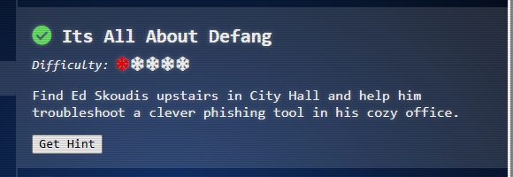

# Its All About Defang

**Difficulty:** ⭐

---

## Challenge Overview

Find Ed Skoudis upstairs in City Hall and help him troubleshoot a clever phishing tool in his cozy office.

### Ed Skoudis

Ed Skoudis is the Founder of Counter Hack Innovations, the team that brings you the SANS Holiday Hack Challenge. He's also the President of the SANS Technology Institute College. Ed has an incredible collection of antique crypto systems and communication technologies, including an original Enigma machine, a leaf of the Gutenberg Bible from 1455, and a Kryha Liliput from the 1920s.

> **Challenge Quote:** "The team has been working on this new SOC tool that helps triage phishing emails...and there are some...issues. We have had some pretty sketchy emails coming through and we need to make sure we block ALL of the indicators of compromise."

## Objective

Help the SOC team triage a phishing email by:

1. Identifying all Indicators of Compromise (IOCs) using regex patterns
2. Excluding legitimate neighborhood assets from the IOC list
3. Defanging all malicious indicators to prevent accidental execution
4. Sending the cleaned IOC list to the security team

---

## The Challenge Interface


*The SOC triage tool with the suspicious email displayed*

---

## The Phishing Email

The challenge presents a suspicious email from "Icicle Innovations" targeting the Dosis Neighborhood residents:

### Email Headers

```
From: "Icicle Innovations" <sales@icicleinnovations.mail>
To: "Neighborhood Watch" <residents@dosisneighborhood.corp>
Subject: 🎄 URGENT: Holiday Kitchen Makeover - Smart Home Integration! 🎄
Date: Wed, 25 Dec 2025 09:15:33 -0500
Message-ID: <holiday2025-kitchen@dosisneighborhood.corp>
```

### Email Body (Excerpt)

```
Dear Valued Dosis Neighborhood Residents,

🚨 IMMEDIATE ACTION REQUIRED 🚨

Our elite team of Sunny's kitchen renovation specialists have detected some 
SERIOUSLY outdated kitchen setups in your neighborhood! 

1) Download our FREE Kitchen Renovation Planner™:
   https://icicleinnovations.mail/renovation-planner.exe

2) Upload high-resolution photos to our secure design portal:
   https://icicleinnovations.mail/upload_photos

For instant help, contact our 24/7 design hotline at 523.555.0100 
or our renovation specialists at 523.555.0101.
```

### Red Flags in the Email

- ⚠️ **Urgency tactics**: "IMMEDIATE ACTION REQUIRED"
- ⚠️ **Suspicious executable**: `renovation-planner.exe`
- ⚠️ **Data collection**: Requesting high-resolution kitchen photos
- ⚠️ **Unusual domain**: `icicleinnovations.mail` (not .com or legitimate TLD)
- ⚠️ **Multiple phone numbers**: Could be used for vishing attacks

---

## Solution Walkthrough

### Step 1: Extract IOCs Using Regex

The SOC tool provides four regex patterns to identify different types of IOCs:

#### 1. Domains

```regex
[a-zA-Z0-9-]+(\.[a-zA-Z0-9-]+)+
```

**Matches:** Domain names with at least two levels (e.g., `example.com`)

#### 2. IP Addresses

```regex
\d{1,3}\.\d{1,3}\.\d{1,3}\.\d{1,3}
```

**Matches:** IPv4 addresses in dotted-decimal notation

#### 3. URLs

```regex
https://[a-zA-Z0-9-]+(\.[a-zA-Z0-9-]+)+(:[0-9]+)?(/[^\s]*)?
```

**Matches:** Complete HTTPS URLs with optional port and path

#### 4. Email Addresses

```regex
\b[a-zA-Z0-9._%+-]+@[a-zA-Z0-9.-]+\.[a-zA-Z]{2,}\b
```

**Matches:** Standard email address format with word boundaries

### IOCs Extracted from the Email

- `icicleinnovations.mail` (malicious domain)
- `sales@icicleinnovations.mail` (attacker email)
- `info@icicleinnovations.mail` (attacker email)
- `https://icicleinnovations.mail/renovation-planner.exe` (malware)
- `https://icicleinnovations.mail/upload_photos` (phishing site)
- `172.16.254.1` (suspicious internal IP)
- `192.168.1.1` (suspicious internal IP)
- `523.555.0100` (suspicious phone number)
- `523.555.0101` (suspicious phone number)

---

### Step 2: Filter Out Legitimate Assets

The regex patterns also matched legitimate neighborhood infrastructure that should **NOT** be blocked:

#### Legitimate Assets to Exclude

- ✅ `dosisneighborhood.corp` (legitimate domain)
- ✅ `residents@dosisneighborhood.corp` (legitimate email)
- ✅ `10.0.0.5` (neighborhood mail server)


*Unchecking legitimate neighborhood infrastructure from the IOC list*

---

### Step 3: Defang the Malicious IOCs

**Defanging** is the process of modifying IOCs to prevent accidental clicks or execution while preserving their investigative value. The tool uses regex substitution to defang IOCs:

#### Defanging Rules

| Rule | Regex | Example |
|------|-------|---------|
| **Replace periods** | `s/\./[.]/g` | `example.com` → `example[.]com` |
| **Replace @ symbols** | `s/@/[@]/g` | `user@domain.com` → `user[@]domain[.]com` |
| **Replace HTTP** | `s/http/hxxp/g` | `https` → `hxxps` |
| **Replace ://** | `s/:\/\/\[:\\/\\/\]/g` | `://` → `[://]` |


*Applying defanging rules using regex substitution*

#### Final Defanged IOC List

```
icicleinnovations[.]mail
sales[@]icicleinnovations[.]mail
info[@]icicleinnovations[.]mail
hxxps[://]icicleinnovations[.]mail/renovation-planner[.]exe
hxxps[://]icicleinnovations[.]mail/upload_photos
172[.]16[.]254[.]1
192[.]168[.]1[.]1
523[.]555[.]0100
523[.]555[.]0101
```

---

### Step 4: Send to Security Team


*Successfully sent defanged IOCs to the security team!*



*Challenge completed!*

---

## Technical Concepts Learned

### 1. IOC Defanging

**Defanging** is a security practice that modifies potentially dangerous indicators to prevent accidental execution while preserving their investigative value.

#### Why Defang IOCs?

- ✅ **Prevents accidental clicks**: Broken URLs won't navigate in browsers
- ✅ **Stops auto-linking**: Email clients won't turn them into clickable links
- ✅ **Maintains readability**: Analysts can still understand the IOC
- ✅ **Enables safe sharing**: IOCs can be shared in reports without risk

#### Common Defanging Techniques

| Original | Defanged | Purpose |
|----------|----------|---------|
| `.` | `[.]` | Breaks domain resolution |
| `@` | `[@]` | Prevents email auto-linking |
| `http` | `hxxp` | Disables protocol handler |
| `://` | `[://]` | Further breaks URL parsing |

---

### 2. Regex Pattern Matching

**Regular expressions (regex)** enable automated detection of IOCs in text:

#### Key Regex Concepts

| Pattern | Meaning | Example |
|---------|---------|---------|
| `[a-zA-Z0-9]` | Character class | Matches alphanumeric characters |
| `+` | Quantifier | One or more of preceding pattern |
| `*` | Quantifier | Zero or more of preceding pattern |
| `{n,m}` | Quantifier | Between n and m occurrences |
| `()` | Group | Creates capture groups for extraction |
| `\b` | Word boundary | Ensures complete matches, not partial strings |
| `\\` | Escape | Escapes special characters like `.` or `/` |

#### Regex in Action

```regex
\b[a-zA-Z0-9._%+-]+@[a-zA-Z0-9.-]+\.[a-zA-Z]{2,}\b
```

**Breakdown:**
- `\b` - Start at word boundary
- `[a-zA-Z0-9._%+-]+` - Username (alphanumeric + special chars)
- `@` - Literal @ symbol
- `[a-zA-Z0-9.-]+` - Domain name
- `\.` - Literal period (escaped)
- `[a-zA-Z]{2,}` - TLD (minimum 2 letters)
- `\b` - End at word boundary

---

### 3. SOC Triage Workflow

This challenge demonstrates a typical **Security Operations Center (SOC)** workflow:

```
1. Detection
   └─> Identify suspicious email (urgency, executables, data requests)

2. Extraction
   └─> Use automated tools to pull IOCs from email content

3. Filtering
   └─> Remove false positives (legitimate infrastructure)

4. Defanging
   └─> Render IOCs safe for analysis and sharing

5. Distribution
   └─> Share IOC list with security team for blocking
```

---

## Real-World Applications

### Incident Response Reports

Security reports defang IOCs to prevent accidental infections when distributed to stakeholders who may not have technical expertise.

**Example:**
```
Malicious domain: evil[.]example[.]com
C2 server: hxxp[://]192[.]168[.]1[.]100:8080/beacon
```

### Threat Intelligence Sharing

Organizations share defanged IOCs via platforms like:
- **MISP** (Malware Information Sharing Platform)
- **ThreatConnect**
- **STIX/TAXII** (Structured Threat Information eXpression)

This enables collective defense without propagating threats.

### Email Security

Email security gateways use similar regex patterns to automatically detect and quarantine phishing attempts before they reach users.

**Common patterns detected:**
- Executable attachments (`.exe`, `.scr`, `.bat`)
- Suspicious domains (newly registered, typosquatting)
- Urgency keywords ("URGENT", "IMMEDIATE ACTION")
- Requests for credentials or sensitive data

---

## Key Takeaways

1. ✅ **IOC Extraction**: Regex patterns enable automated identification of malicious indicators
2. ✅ **Filtering**: Always exclude legitimate infrastructure to avoid false positives
3. ✅ **Defanging**: Modifying IOCs prevents accidental execution while preserving value
4. ✅ **SOC Workflows**: Systematic processes ensure thorough threat analysis
5. ✅ **Threat Intelligence**: Sharing defanged IOCs enables community defense

---

## Challenge Complete!

**Status:** ✅ Completed  
**IOCs Identified:** 9 malicious indicators  
**Method:** Regex pattern matching + manual filtering + defanging  
**Skills Demonstrated:** Phishing analysis, IOC extraction, regex, SOC workflows

### Ed Skoudis's Response

> *"Well you just made that look like a piece of cake! Though I prefer cookies...I know where to find the best in town! Thanks again! See ya 'round!"*

---

**SANS Holiday Hack Challenge 2025**  
*Act 1: Its All About Defang*
