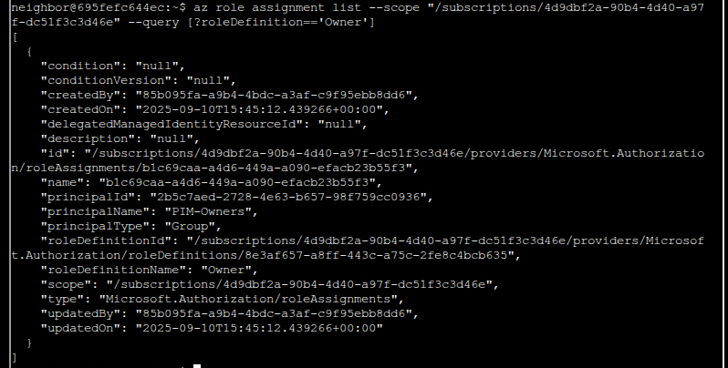
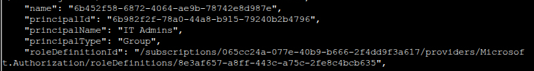
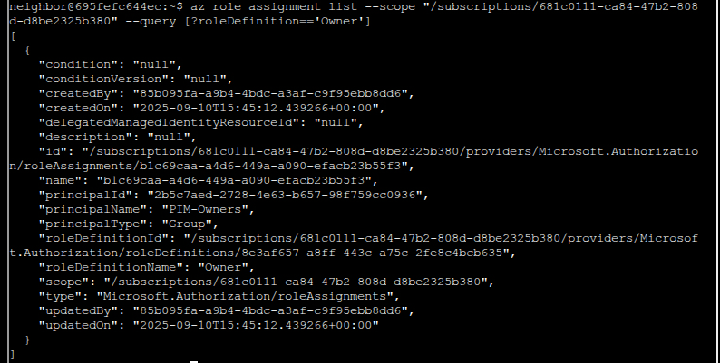
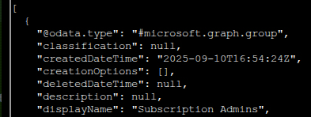
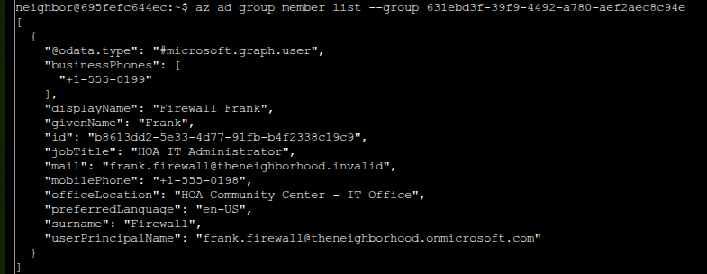

# Owner

**Difficulty:** ⭐⭐ (2/5)

## Challenge Overview

Help Goose James near the park audit Azure RBAC (Role-Based Access Control) configuration to verify the Neighborhood HOA is following security best practices. They claim all elevated access uses PIM (Privileged Identity Management), but we need to verify there are no permanently assigned Owner roles at the subscription level.

**Objective:** Identify which identity has been granted excessive Owner permissions at the subscription level, violating the principle of least privilege.

---

## Character Introduction: James


*Goose James introduces the RBAC audit challenge*

> CLUCK CLU... I think I might be losing my mind. All the elves are gone and I'm still hearing voices.
> 
> The Neighborhood HOA uses Azure for their IT infrastructure. The Neighborhood network admins use RBAC for access control.
> 
> Your task is to audit their RBAC configuration to ensure they're following security best practices. They claim all elevated access uses PIM, but you need to verify there are no permanently assigned Owner roles.

---

## Azure Concepts

### What are Azure Subscriptions?

- **Logical containers** for Azure resources
- Each has its own billing, quotas, and access control
- Similar to separate AWS accounts
- Organizations often have multiple subscriptions (production, development, testing, etc.)

### Azure Hierarchy

```
Azure AD Tenant (Organization)
└── Management Groups (optional)
    └── Subscriptions
        └── Resource Groups
            └── Resources (VMs, Storage, etc.)
```

### What is RBAC?

**Role-Based Access Control** manages who has access to Azure resources:

- **Owner:** Full control over resources including access management
- **Contributor:** Can create and manage resources but NOT assign permissions
- **Reader:** Read-only access to resources
- **Custom Roles:** Specific permissions tailored to needs

### What is PIM?

**Privileged Identity Management** provides:

- ✅ Just-in-time access activation
- ✅ Time-limited assignments
- ✅ Approval workflows
- ✅ Audit trails and alerts
- ✅ Best practice for elevated permissions

---

## Solution Walkthrough

### Step 1: Learn JMESPath Query Syntax

The challenge starts with a tutorial on Azure CLI's `--query` parameter using JMESPath:

```bash
az account list --query "[].name"
```

**JMESPath Breakdown:**
- `[]` = Loop through each item in the array
- `.name` = Extract the `name` field from each item


*Tutorial explaining how to use JMESPath to filter Azure CLI output*

### Step 2: List All Subscriptions

Let's discover what subscriptions exist in the tenant:

```bash
az account list --query "[].name"
```

**Result:**


*Four subscriptions discovered in the tenant*

```json
[
  "theneighborhood-sub",
  "theneighborhood-sub-2",
  "theneighborhood-sub-3",
  "theneighborhood-sub-4"
]
```

**Analysis:** The tenant has 4 Azure subscriptions that need to be audited.

### Step 3: Get Subscription IDs with Custom Output

Now let's get both names AND IDs using advanced JMESPath:

```bash
az account list --query "[?state=='Enabled'].{Name:name, ID:id}"
```

**JMESPath Query Breakdown:**
- `[?state=='Enabled']` = **Filter:** Only show enabled subscriptions
- `.{Name:name, ID:id}` = **Custom output:** Display only Name and ID fields


*Custom formatted output showing subscription names and IDs*

```json
[
  {
    "ID": "2b0942f3-9bca-484b-a508-abdae2db5e64",
    "Name": "theneighborhood-sub"
  },
  {
    "ID": "4d9dbf2a-90b4-4d40-a97f-dc51f3c3d46e",
    "Name": "theneighborhood-sub-2"
  },
  {
    "ID": "065cc24a-077e-40b9-b666-2f4dd9f3a617",
    "Name": "theneighborhood-sub-3"
  },
  {
    "ID": "681c0111-ca84-47b2-808d-d8be2325b380",
    "Name": "theneighborhood-sub-4"
  }
]
```

### Step 4: Check Owner Role Assignments

Now we'll check each subscription for Owner role assignments:

#### Subscription 1: theneighborhood-sub

```bash
az role assignment list --scope "/subscriptions/2b0942f3-9bca-484b-a508-abdae2db5e64" --query [?roleDefinitionName=='Owner']
```


*Subscription 1 shows only PIM-Owners group*

**Result:**
```json
{
  "principalName": "PIM-Owners",
  "principalType": "Group",
  "roleDefinitionName": "Owner"
}
```

**✅ Verdict:** Legitimate - uses PIM-protected access as claimed.

#### Subscription 2: theneighborhood-sub-2

```bash
az role assignment list --scope "/subscriptions/4d9dbf2a-90b4-4d40-a97f-dc51f3c3d46e" --query [?roleDefinitionName=='Owner']
```



*Subscription 2 also shows only PIM-Owners group*

**Result:** Same as Subscription 1 - only PIM-Owners group

**✅ Verdict:** Secure configuration.

#### Subscription 3: theneighborhood-sub-3 🚨

```bash
az role assignment list --scope "/subscriptions/065cc24a-077e-40b9-b666-2f4dd9f3a617" --query [?roleDefinitionName=='Owner']
```


*Subscription 3 shows TWO Owner assignments - suspicious!*

**Result:** **TWO** Owner assignments found!

```json
[
  {
    "principalName": "PIM-Owners",
    "principalType": "Group",
    "roleDefinitionName": "Owner"
  },
  {
    "principalName": "IT Admins",
    "principalType": "Group",
    "roleDefinitionName": "Owner",
    "principalId": "6b982f2f-78a0-44a8-b915-79240b2b4796"
  }
]
```



*Close-up of the suspicious "IT Admins" group with Owner permissions*

**🚨 CRITICAL FINDING:**

A group called **"IT Admins"** has been granted Owner permissions at the subscription level. This violates several security principles:

1. ❌ **Owner role is too broad** - Full control over everything
2. ❌ **Subscription scope is too wide** - Affects ALL resources
3. ❌ **Group assignment** - Every member of "IT Admins" gets Owner access
4. ❌ **Not PIM-protected** - Unlike "PIM-Owners", this is permanent, always-on access

#### Subscription 4: theneighborhood-sub-4

```bash
az role assignment list --scope "/subscriptions/681c0111-ca84-47b2-808d-d8be2325b380" --query [?roleDefinitionName=='Owner']
```



*Subscription 4 returns to secure configuration with only PIM-Owners*

**Result:** Only PIM-Owners group

**✅ Verdict:** Secure configuration.

### Step 5: Investigate the "IT Admins" Group

Let's see who's in this group:

```bash
az ad group member list --group 6b982f2f-78a0-44a8-b915-79240b2b4796
```



*Discovering a nested group instead of direct users*

**Result:** A nested group!

```json
{
  "@odata.type": "#microsoft.graph.group",
  "displayName": "Subscription Admins",
  "id": "631ebd3f-39f9-4492-a780-aef2aec8c94e",
  "securityEnabled": true
}
```

**What are Nested Groups?**

```
Owner Permission on Subscription
    ↓
"IT Admins" Group (6b982f2f-78a0-44a8-b915-79240b2b4796)
    ↓ (contains)
"Subscription Admins" Group (631ebd3f-39f9-4492-a780-aef2aec8c94e)
    ↓ (contains)
??? (actual users - need to drill down further)
```

Because "Subscription Admins" is a member of "IT Admins", and "IT Admins" has Owner permissions, **everyone in "Subscription Admins" also gets Owner permissions** through inheritance!

### Step 6: Drill Down Through Nested Groups

Let's find the actual users:

```bash
az ad group member list --group 631ebd3f-39f9-4492-a780-aef2aec8c94e
```



*Finally discovering the user with excessive permissions: Firewall Frank*

**Result:** Found the user!

```json
{
  "@odata.type": "#microsoft.graph.user",
  "displayName": "Firewall Frank",
  "givenName": "Frank",
  "surname": "Firewall",
  "id": "b8613dd2-5e33-4d77-91fb-b4f2338c19c9",
  "jobTitle": "HOA IT Administrator",
  "mail": "frank.firewall@theneighborhood.invalid",
  "userPrincipalName": "frank.firewall@theneighborhood.onmicrosoft.com",
  "businessPhones": ["+1-555-0199"],
  "mobilePhone": "+1-555-0198",
  "officeLocation": "HOA Community Center - IT Office"
}
```

---

## The Security Violation

### The Identity Chain

```
Subscription: theneighborhood-sub-3 (065cc24a-077e-40b9-b666-2f4dd9f3a617)
    ↓ Owner Role (PERMANENT - NOT PIM!)
"IT Admins" Group (6b982f2f-78a0-44a8-b915-79240b2b4796)
    ↓ Member
"Subscription Admins" Group (631ebd3f-39f9-4492-a780-aef2aec8c94e)
    ↓ Member
Firewall Frank (frank.firewall@theneighborhood.onmicrosoft.com) 🚨
```

### The Violation: Excessive Permissions

| **Aspect** | **What Frank Has** | **What Frank Should Have** |
|------------|-------------------|---------------------------|
| **Role** | Owner (full control) | Network Contributor or similar |
| **Scope** | Entire subscription | Specific resource groups |
| **Access Type** | Permanent, always-on | PIM with time limits |
| **Assignment** | Hidden in nested groups | Direct, auditable |

### Why This Violates Least Privilege

Frank is an **"HOA IT Administrator"** - he probably needs to:
- ✅ Manage firewalls
- ✅ Configure network security
- ✅ Maybe manage VMs or storage

He does **NOT** need to:
- ❌ Delete entire subscriptions
- ❌ Modify billing and cost management
- ❌ Grant permissions to others
- ❌ Access ALL resources in the subscription
- ❌ Change security policies

**What the Owner Role Allows:**
- Full administrative access to all resources
- Ability to grant and revoke access for others
- Modify subscription-level settings
- Access to billing and cost management
- Far more than a firewall/network admin needs!

---

## The Answer

**Identity with Excessive Permissions:** **Firewall Frank**

**Email:** frank.firewall@theneighborhood.onmicrosoft.com

**Violation Details:**
- **Permanent Owner role** at subscription level (not PIM-protected)
- **Hidden in nested groups** (IT Admins → Subscription Admins → Frank)
- **Violates least privilege** (firewall admin doesn't need Owner)
- **No approval workflow** or time limits

---

## Security Recommendations

### Immediate Actions

1. **Remove the "IT Admins" group** from Owner role on subscription 3
2. **Grant Frank specific roles** like "Network Contributor" scoped to relevant resource groups
3. **Enable PIM** for any elevated access Frank requires
4. **Audit all nested groups** for similar hidden permissions

### Long-Term Improvements

1. **Implement PIM for all privileged roles**
   - Just-in-time activation
   - Time-limited assignments
   - Approval workflows

2. **Apply Least Privilege Principle**
   - Grant minimum necessary permissions
   - Scope to smallest necessary boundary
   - Regular access reviews

3. **Avoid Nested Group Complexity**
   - Makes auditing difficult
   - Hides actual permission assignments
   - Easy to lose track of who has what access

4. **Use Azure Policy**
   - Prevent Owner assignments at subscription scope
   - Require PIM for privileged roles
   - Automated compliance checking

---

## Key Concepts Learned

### Azure RBAC Hierarchy

| **Built-in Role** | **Capabilities** | **Best Use** |
|------------------|-----------------|-------------|
| **Owner** | Full control including access management | Avoid at subscription level |
| **Contributor** | Create/manage resources, no access management | Development/operations |
| **Reader** | Read-only access | Auditors, viewers |
| **Custom Roles** | Specific permissions only | Tailored to job function |

### Security Principles

1. **Least Privilege**
   - Grant minimum permissions needed
   - Scope to smallest boundary
   - Time-limit when possible

2. **Just-in-Time Access (PIM)**
   - Activate privileges only when needed
   - Automatic expiration
   - Approval workflows for sensitive roles

3. **Separation of Duties**
   - Different people for different tasks
   - Prevents single point of failure
   - Reduces insider threat risk

4. **Regular Auditing**
   - Review role assignments periodically
   - Check for nested group memberships
   - Remove unused permissions

### Common Misconfigurations

| **Misconfiguration** | **Risk** | **Fix** |
|---------------------|---------|---------|
| Permanent Owner at subscription | Complete control of all resources | Use PIM with time limits |
| Nested groups hiding permissions | Difficult to audit who has what | Flatten group structure |
| Overly broad role assignments | More access than needed | Use specific roles |
| No PIM for privileged access | Always-on elevated permissions | Enable PIM |

---

## Azure CLI Commands Reference

### List Subscriptions

```bash
# Simple list
az account list --query "[].name"

# With custom output
az account list --query "[?state=='Enabled'].{Name:name, ID:id}"

# In table format
az account list -o table
```

### Check Role Assignments

```bash
# List all Owner assignments for a subscription
az role assignment list \
  --scope "/subscriptions/{SUBSCRIPTION_ID}" \
  --query "[?roleDefinitionName=='Owner']"

# List all role assignments for a specific principal
az role assignment list \
  --assignee {USER_OR_GROUP_ID}
```

### Azure AD Group Investigation

```bash
# List group members
az ad group member list --group {GROUP_ID}

# Get group details
az ad group show --group {GROUP_ID}

# Search for groups
az ad group list --filter "displayName eq 'IT Admins'"
```

---

## Challenge Complete! 🎉

**Status:** ✅ Completed

**Excessive Permission Holder:** Firewall Frank (frank.firewall@theneighborhood.onmicrosoft.com)

**Violation:** Permanent Owner role at subscription level through nested group membership

**Recommendation:** Replace with scoped Network Contributor role using PIM

---

*Challenge writeup by SFC David P. Collette*  
*Regional Cyber Center - Korea (RCC-K)*  
*SANS Holiday Hack Challenge 2025*
