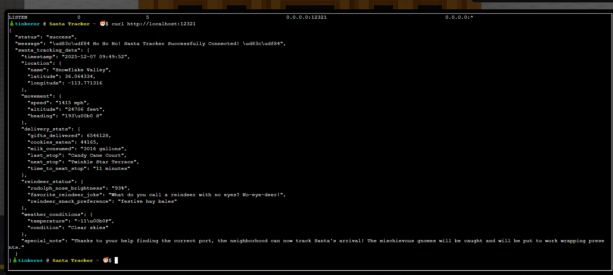

# Santa's Gift-Tracking Service Port Mystery

**Difficulty:** ⭐

---

## Challenge Overview

Help the neighborhood tinkerer locate Santa's gift-tracking service after mischievous gnomes tampered with the port configuration. The service has moved from its original port 8080 to an unknown location!

### Yori Kvitchko

Yori was Ed's "lost intern" back in 2015 (but was found!). Now she needs help accessing the gift tracker system using cURL, but the port has mysteriously changed.

> **Challenge Quote:** "Think you can check out this terminal for me? I need to use cURL to access the gift tracker system, but it has me stumped. Please see what you can do!"

## Objective

Use network tools to:
1. Identify which port the `santa_tracker` process is listening on
2. Verify the service is running correctly
3. Restore the neighborhood's ability to track Santa's arrival on Christmas Eve

---

## The Challenge Interface


*The Santa-tracking service needs to be located before Christmas Eve!*

### The Scenario

```
======= Neighborhood Santa-Tracking Service =======

Oh no! Mischievous gnomes have tampered with the neighborhood's
Santa-tracking service, built by the local tinkerer to help everyone
know when Santa arrives on Christmas Eve!

The tracking application was originally configured to run on port 8080,
but after the gnomes' meddling, it's nowhere to be found. Without this
tracker, nobody in the neighborhood will know when to expect Santa's arrival!

The tinkerer needs your help to find out which port the santa_tracker
process is currently using so the neighborhood tracking display can be
updated before Christmas Eve!

Your task:
1. Use the 'ss' tool to identify which port the santa_tracker process is listening on
2. Connect to that port to verify the service is running

Hint: The ss command can show you all listening TCP ports and the
processes using them. Try: ss -tlnp
```

---

## Solution Walkthrough

### Environment Overview

**Shell Environment:** Restricted bash (rbash)

The challenge provides a limited command environment with only essential tools available:
- `ss` - Socket statistics (modern netstat replacement)
- `curl` - Transfer data from/to servers
- `telnet` - Connect to TCP ports
- `ls`, `cat`, `grep`, `clear` - Basic utilities

All commands are symlinked from `~/tools/` directory, creating a sandboxed learning environment.

---

### Step 1: Identify the Listening Port

The hint suggests using the `ss` command to find listening ports and processes.

```bash
ss -tlnp
```

**Command Breakdown:**

| Flag | Meaning | Purpose |
|------|---------|---------|
| `-t` | TCP sockets only | Filter for TCP connections (not UDP) |
| `-l` | Listening ports only | Show only services waiting for connections |
| `-n` | Numeric output | Display IP addresses and port numbers (don't resolve names) |
| `-p` | Show processes | Display which process is using each socket |

**Output:**

```
State   Recv-Q  Send-Q  Local Address:Port  Peer Address:Port  Process
LISTEN  0       5       0.0.0.0:12321       0.0.0.0:*
```

**Analysis:**

- **State:** `LISTEN` - Service is actively listening for connections
- **Local Address:** `0.0.0.0:12321` - Listening on all network interfaces, port 12321
- **Port Found:** **12321** ✅

The service has moved from port 8080 to port **12321**!

---

### Step 2: Verify the Service with cURL

Now that we know the port, let's connect to it and verify it's the Santa tracker:

```bash
curl http://localhost:12321
```

**Result:**



*The service responds with detailed Santa tracking data in JSON format!*

**Complete JSON Response:**

```json
{
  "status": "success",
  "message": "🎄 Ho Ho Ho! Santa Tracker Successfully Connected! 🎄",
  "santa_tracking_data": {
    "timestamp": "2025-12-07 09:49:52",
    "location": {
      "name": "Snowflake Valley",
      "latitude": 36.064334,
      "longitude": -113.771316
    },
    "movement": {
      "speed": "1415 mph",
      "altitude": "24706 feet",
      "heading": "193° S"
    },
    "delivery_stats": {
      "gifts_delivered": 6546128,
      "cookies_eaten": 44165,
      "milk_consumed": "3016 gallons",
      "last_stop": "Candy Cane Court",
      "next_stop": "Twinkle Star Terrace",
      "time_to_next_stop": "11 minutes"
    },
    "reindeer_status": {
      "rudolph_nose_brightness": "93%",
      "favorite_reindeer_joke": "What do you call a reindeer with no eyes? No-eye-deer!",
      "reindeer_snack_preference": "festive hay bales"
    },
    "weather_conditions": {
      "temperature": "-11°F",
      "condition": "Clear skies"
    },
    "special_note": "Thanks to your help finding the correct port, the neighborhood can now track Santa's arrival! The mischievous gnomes will be caught and will be put to work wrapping presents."
  }
}
```

**Success!** The Santa tracker is working perfectly and tracking Santa's progress:
- ✅ **Real-time location:** Snowflake Valley
- ✅ **Speed:** 1,415 mph (supersonic sleigh!)
- ✅ **Gifts delivered:** Over 6.5 million
- ✅ **Rudolph's nose:** 93% brightness
- ✅ **Next stop:** Twinkle Star Terrace in 11 minutes

---

### Step 3: Alternative Verification (Optional)

You can also verify the service using `telnet` for a more manual approach:

```bash
telnet localhost 12321
```

This connects directly to the TCP port and shows the raw HTTP response, confirming the service is indeed running on port 12321.

---

## Challenge Complete!


*Successfully located the Santa tracker service!*

### Yori's Response

> *"Great work - thank you! Geez, maybe you can be my intern now!"*

---

## Technical Concepts Learned

### 1. The `ss` Command (Socket Statistics)

**What is `ss`?**

`ss` is the modern replacement for the older `netstat` command. It's used to investigate sockets and display network connection information.

**Why use `ss` instead of `netstat`?**
- **Faster** - Uses kernel information directly
- **More detailed** - Provides better information about TCP connections
- **Modern** - Actively maintained and improved
- **Better filtering** - More powerful filtering options

**Common `ss` Commands:**

```bash
# Show all listening TCP ports with process info
ss -tlnp

# Show all established connections
ss -tn

# Show UDP sockets
ss -ulnp

# Show summary statistics
ss -s

# Show all sockets (listening + established)
ss -a
```

### 2. Understanding Socket States

| State | Meaning |
|-------|---------|
| **LISTEN** | Server is waiting for incoming connections |
| **ESTABLISHED** | Active connection between client and server |
| **TIME-WAIT** | Connection closed, waiting for packets to clear |
| **CLOSE-WAIT** | Remote end closed connection |

### 3. Network Address Formats

**`0.0.0.0:12321` Breakdown:**

- `0.0.0.0` - Listening on **all network interfaces** (loopback, ethernet, wifi, etc.)
- `12321` - Port number
- Alternative: `127.0.0.1:12321` would only listen on localhost (loopback interface)

**Why `0.0.0.0` vs `127.0.0.1`?**

| Address | Accessible From |
|---------|----------------|
| `0.0.0.0` | All interfaces (localhost + network) |
| `127.0.0.1` | Only localhost (loopback only) |
| `192.168.1.100` | Only that specific IP |

### 4. Restricted Shell Environments (rbash)

**What is rbash?**

Restricted bash is a limited shell environment where:
- Cannot change directory (`cd` blocked)
- Cannot modify `PATH`
- Cannot redirect output (`>`, `>>`)
- Cannot execute commands outside approved directories

**Why use rbash?**

Common in:
- CTF challenges (like this one!)
- Training environments
- Restricted user accounts
- Honeypots

**How it works in this challenge:**

All available commands are symlinked in `~/tools/`:
```bash
ls -la tools/
# Output shows symlinks to:
# ss -> /usr/bin/ss
# curl -> /usr/bin/curl
# telnet -> /usr/bin/telnet
# etc.
```

### 5. Service Verification Methods

| Method | Command | Best For |
|--------|---------|----------|
| **cURL** | `curl http://host:port` | HTTP services, APIs |
| **Telnet** | `telnet host port` | Raw TCP testing |
| **netcat** | `nc host port` | Port scanning, data transfer |
| **wget** | `wget http://host:port` | Downloading content |

---

## Additional Enumeration Techniques

### Hex Port Conversion Verification

For deeper understanding, you can view raw kernel network data:

```bash
cat /proc/net/tcp
```

**Output Example:**
```
local_address: 00000000:3021
```

**Conversion:**
- `3021` (hexadecimal) = `12321` (decimal) ✓

This confirms the port at the kernel level!

### Process Identification

The `-p` flag in `ss -tlnp` shows which process owns each socket:

```
LISTEN  0  5  0.0.0.0:12321  0.0.0.0:*  users:(("santa_tracker",pid=1234,fd=3))
```

This reveals:
- **Process name:** `santa_tracker`
- **PID:** 1234
- **File descriptor:** 3

---

## Key Takeaways

### Quick Reference

1. ✅ **`ss` is the modern `netstat`** - Use it for socket investigation
2. ✅ **`-tlnp` flags are essential** - Show TCP, listening, numeric, process info
3. ✅ **Verify services with curl** - Confirm functionality after discovery
4. ✅ **Understand port numbers** - Know how to find and interpret them
5. ✅ **Restricted shells teach focus** - Limited tools force proper technique

### Common Port Discovery Workflow

```
1. Enumerate listening ports → ss -tlnp
2. Identify service port → Read output
3. Verify service → curl/telnet to port
4. Analyze response → Confirm correct service
```

### Real-World Applications

This technique is essential for:
- **Network troubleshooting** - Finding which ports services use
- **Security auditing** - Discovering unexpected listening services
- **Penetration testing** - Enumerating attack surface
- **System administration** - Managing service configurations
- **Forensics** - Investigating suspicious network activity

---

## Challenge Summary

| Aspect | Details |
|--------|---------|
| **Challenge Type** | Network Enumeration |
| **Primary Skill** | Socket Statistics (`ss` command) |
| **Difficulty** | ⭐ Beginner |
| **Original Port** | 8080 (before gnomes) |
| **Actual Port** | **12321** (after gnomes) |
| **Service Name** | `santa_tracker` |
| **Verification Method** | cURL HTTP request |
| **Response Format** | JSON with Santa tracking data |

---

## The Answer

**Port:** **12321**

**Solution:**
```bash
# Step 1: Find the port
ss -tlnp
# Output: 0.0.0.0:12321

# Step 2: Verify service
curl http://localhost:12321
# Output: JSON with Santa tracking data
```

---

## Bonus: Understanding the Port Number

### Why Port 12321?

**Port number:** 12321  
**Binary:** 11000000100001  
**Palindrome:** 1-2-3-2-1 (reads same forwards and backwards!)

This is a playful choice by the challenge designers - a palindrome port number for a holiday challenge! 🎄

### Port Number Categories

| Range | Category | Purpose |
|-------|----------|---------|
| 0-1023 | **Well-known ports** | Standard services (HTTP=80, HTTPS=443) |
| 1024-49151 | **Registered ports** | Applications register with IANA |
| 49152-65535 | **Dynamic/Private** | Temporary/private use |

Port 12321 falls in the **registered ports** range - suitable for application services.

---

**SANS Holiday Hack Challenge 2025**  
*Act 1: Santa's Gift-Tracking Service Port Mystery*

**Status:** ✅ Completed  
**Port Discovered:** 12321  
**Christmas Spirit:** Saved! 🎅🎄
