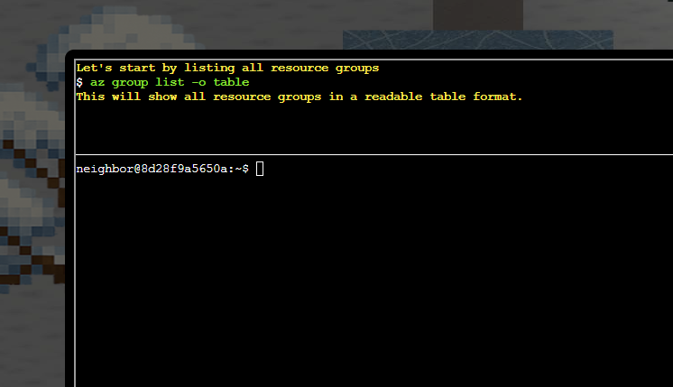

# Spare Key - Terraform SAS Token Leak

**Challenge:** Spare Key | **Difficulty:** ⭐⭐ | **Category:** Azure Storage, Infrastructure as Code Security

---

## Challenge Overview

**Character:** Goose Barry (noir detective goose, pond location)

**Objective:** An admin accidentally uploaded an infrastructure config file containing a long-lived SAS token to Azure Storage. Use Azure CLI to find the leak and report exactly where it lives.

### Barry's Challenge:

*"You want me to say what exactly? Do I really look like someone who says MOOO?"*

The Neighborhood HOA hosts a static website on Azure Storage. An admin accidentally uploaded an infrastructure config file that contains a long-lived SAS token.

Use Azure CLI to find the leak and report exactly where it lives.

---

## Solution Walkthrough

### Step 1: List Resource Groups

First, identify all resource groups in the Azure tenant:

```bash
az group list -o table
```

**Result:**



**Five resource groups discovered:**
- `rg-the-neighborhood` (eastus)
- `rg-hoa-maintenance` (eastus)
- `rg-hoa-clubhouse` (eastus)
- `rg-hoa-security` (eastus)
- `rg-hoa-landscaping` (eastus)

### Step 2: Enumerate Storage Accounts

Search for storage accounts in the neighborhood resource group:

```bash
az storage account list --resource-group rg-the-neighborhood -o table
```

**Target Storage Account Identified:**
- **Name:** `neighborhoodhoa` 🚨
- **Type:** StorageV2 (supports static websites)
- **Location:** eastus
- **Resource Group:** rg-the-neighborhood

### Step 3: Check Static Website Configuration

Verify if static website hosting is enabled:

```bash
az storage blob service-properties show --account-name neighborhoodhoa --auth-mode login
```

**Static Website Status:**

✅ **Static website hosting is ENABLED**

- Index document: `index.html`
- Error document: `404.html`
- Creates special `$web` container for public content

### Step 4: List Storage Containers

List all containers and their public access levels:

```bash
az storage container list --account-name neighborhoodhoa --auth-mode login -o table
```

**Containers Found:**

| Container Name | Public Access | Security Status |
|---------------|---------------|-----------------|
| `$web` | None | ✓ Secure (requires auth) |
| `public` | Blob | ⚠️ Insecure (anonymous read) |

**Public Access Levels Explained:**
- **None/Private:** No anonymous access (secure)
- **Blob:** Anonymous read access to individual blobs (risky if URLs are known)
- **Container:** Anonymous read access to entire container + list all blobs (very risky)

### Step 5: Examine $web Container Files

List all files in the static website container:

```bash
az storage blob list --account-name neighborhoodhoa --container-name '$web' --auth-mode login -o table
```

**Files Discovered:**
- `index.html` (512 bytes, text/html)
- `about.html` (384 bytes, text/html)
- **`iac/terraform.tfvars`** (1024 bytes, text/plain) 🚨 **SUSPICIOUS!**

### What is iac/terraform.tfvars?

- **IAC** = Infrastructure as Code
- **Terraform** = Cloud infrastructure provisioning tool
- **`.tfvars`** = Terraform variables file (contains configuration values)

**Typical .tfvars contents:**
- API keys and passwords
- SAS tokens (Shared Access Signatures)
- Connection strings
- Access keys
- Database credentials

### Step 6: Download and Examine the Config File

Extract the terraform.tfvars file:

```bash
az storage blob download --account-name neighborhoodhoa --container-name '$web' --name 'iac/terraform.tfvars' --file /dev/stdout --auth-mode login
```

---

## The Leaked SAS Token

### 🚨 Critical Security Vulnerability Discovered

**File Location:**
- **Storage Account:** neighborhoodhoa
- **Container:** $web (static website)
- **File:** iac/terraform.tfvars
- **Access:** Publicly accessible via website URL

### Terraform Configuration Excerpt:

```terraform
# TEMPORARY: Direct storage access for migration script
# WARNING: Remove after data migration to new storage account
# This SAS token provides full access - HIGHLY SENSITIVE!
migration_sas_token = "sv=2023-11-03&ss=b&srt=co&sp=rlacwdx&se=2100-01-01T00:00:00Z&spr=https&sig=1djO1Q%2Bv0wIh7mYi3n%2F7r1d%2F9u9H%2F5%2BQxw8o2i9QMQc%3D"
```

### SAS Token Parameter Analysis

| Parameter | Value | Meaning |
|-----------|-------|---------|
| `sv` | 2023-11-03 | Storage service version |
| `ss` | b | Service: Blob storage |
| `srt` | co | Resource types: Container + Object |
| **`sp`** | **rlacwdx** | **FULL ACCESS: Read, List, Add, Create, Write, Delete, Execute** 🚨 |
| **`se`** | **2100-01-01** | **Expires in year 2100 (75 years!)** 🚨 |
| `spr` | https | HTTPS only |
| `sig` | 1djO1Q%2B... | Signature/authentication token |

---

## Security Impact Assessment

### Why This Is Critical:

#### 1. Full Permissions (rlacwdx)

The SAS token grants complete control over blob storage:
- **Read:** View all container contents
- **List:** Enumerate all blobs and containers
- **Add/Create:** Upload new files
- **Write:** Modify existing files
- **Delete:** Remove any blob or container
- **Execute:** Run operations on blobs

#### 2. Essentially Permanent Access

- **Expiration:** Year 2100 (75+ years from now)
- **No rotation mechanism** in place
- **Labeled as 'TEMPORARY'** but never removed

#### 3. Publicly Accessible

- Located in `$web` container (static website)
- Anyone can download via website URL
- **No authentication required**
- File comment: "DO NOT COMMIT TO PUBLIC REPOS"
- Reality: Uploaded to public website instead! 🤦

#### 4. Developer Mistake Pattern

- Created for 'temporary' migration task
- Comments warn about removal
- Never cleaned up after migration
- Left in production configuration

### Ironically: Good Security Practices Found

Most other secrets properly use **Azure Key Vault:**

```terraform
database_password_vault_ref = "@Microsoft.KeyVault(SecretUri=https://kv-neighborhoodhoa-prod.vault.azure.net/secrets/db-password/)"
sendgrid_api_key_vault_ref = "@Microsoft.KeyVault(SecretUri=https://kv-neighborhoodhoa-prod.vault.azure.net/secrets/sendgrid-key/)"
```

This is the **correct** way to handle secrets! The organization made an exception for the 'temporary' migration token and forgot to remove it.

---images/act1/spare-key-02-completion.png

## Challenge Completion


### Answer Summary:

| Attribute | Value |
|-----------|-------|
| **Storage Account** | neighborhoodhoa |
| **Container** | $web |
| **File** | iac/terraform.tfvars |
| **Leaked Secret** | Long-lived SAS token with full permissions |
| **Expiration** | 2100-01-01 (75 years!) |
| **Permissions** | rlacwdx (Full access) |

---

## Key Concepts Learned

### 1. Azure Static Website Hosting

- Creates special `$web` container for public content
- Serves files directly via HTTPS
- Often misconfigured with sensitive files

### 2. Infrastructure as Code (IAC)

- **Terraform:** Popular IAC tool for cloud provisioning
- **`.tfvars` files:** Terraform variable files (often contain secrets)
- **Common mistake:** Committing secrets to version control or public locations

### 3. SAS Tokens (Shared Access Signatures)

- Provide delegated access to Azure Storage
- Can grant specific permissions (read, write, delete, etc.)
- Should have **short expiration periods**
- **Never** commit to source control or public websites

### 4. Azure Key Vault

- Proper way to store secrets in Azure
- Centralized secret management
- Access logging and auditing
- Supports automatic rotation

### 5. Azure CLI Enumeration

- `az group list`: List resource groups
- `az storage account list`: List storage accounts
- `az storage blob service-properties show`: Check static website config
- `az storage container list`: List containers and access levels
- `az storage blob list`: List files in container
- `az storage blob download`: Download specific files

---

## Security Best Practices

### Secret Management:

✅ **DO:**
- Use Azure Key Vault for all secrets
- Reference secrets via Key Vault URIs, never embed values
- Implement automatic secret rotation
- Use short-lived SAS tokens (hours/days, not years!)

❌ **DON'T:**
- Never commit secrets to git repositories
- Never upload config files to public containers

### Temporary Access:

- Create formal cleanup process for temporary credentials
- Set calendar reminders to remove temporary access
- Use expiration dates that force action (e.g., 7 days, not 75 years)
- Document WHY temporary access was granted
- Regular audits of all active credentials

### Static Website Security:

- Only serve truly public content from `$web` container
- Scan for sensitive files before enabling static hosting
- Implement access logs and monitoring
- Use separate storage accounts for public vs. private content

---

## Tools & Commands Reference

### Azure CLI Commands Used:

```bash
# List all resource groups
az group list -o table

# List storage accounts in resource group
az storage account list --resource-group rg-the-neighborhood -o table

# Check static website configuration
az storage blob service-properties show --account-name neighborhoodhoa --auth-mode login

# List containers and public access levels
az storage container list --account-name neighborhoodhoa --auth-mode login -o table

# List files in container
az storage blob list --account-name neighborhoodhoa --container-name '$web' --auth-mode login -o table

# Download and view file
az storage blob download --account-name neighborhoodhoa --container-name '$web' --name 'iac/terraform.tfvars' --file /dev/stdout --auth-mode login
```

---

## Challenge Summary

| Attribute | Details |
|-----------|---------|
| **Challenge** | Spare Key |
| **Difficulty** | ⭐⭐ (2/5) |
| **Character** | Goose Barry (noir detective, pond location) |
| **Category** | Azure Storage Security, Infrastructure as Code |
| **Vulnerability** | Publicly accessible terraform.tfvars file containing long-lived SAS token |
| **Attack Vector** | Azure CLI enumeration → Static website discovery → Config file download |
| **Impact** | Full access to blob storage with 75-year expiration |
| **Skills Learned** | Azure CLI, Static website enumeration, SAS token analysis, IAC security |
| **Answer** | **neighborhoodhoa/$web/iac/terraform.tfvars** |

---

## Barry's Final Words:

*"There it is. A SAS token with read-write-delete permissions, publicly accessible. At least someone around here knows how to do a proper security audit."*

**Challenge Status: ✅ COMPLETED**

---

*Write-up by: SFC David P. Collette*  
*Organization: Regional Cyber Center - Korea (RCC-K)*  
*SANS Holiday Hack Challenge 2025*
