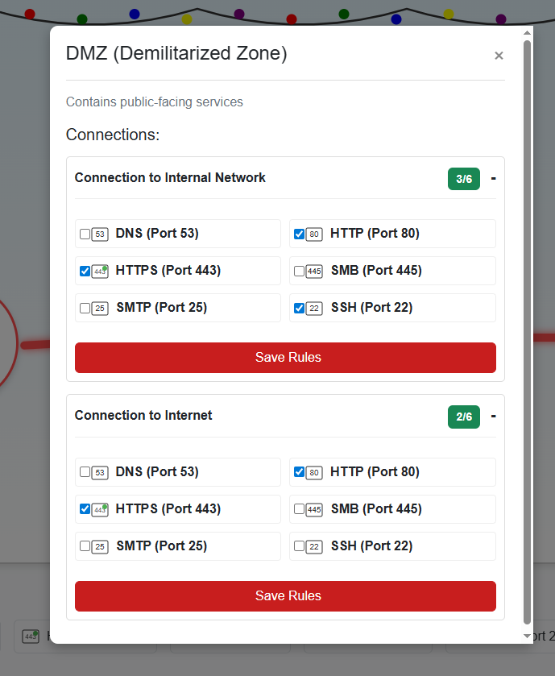
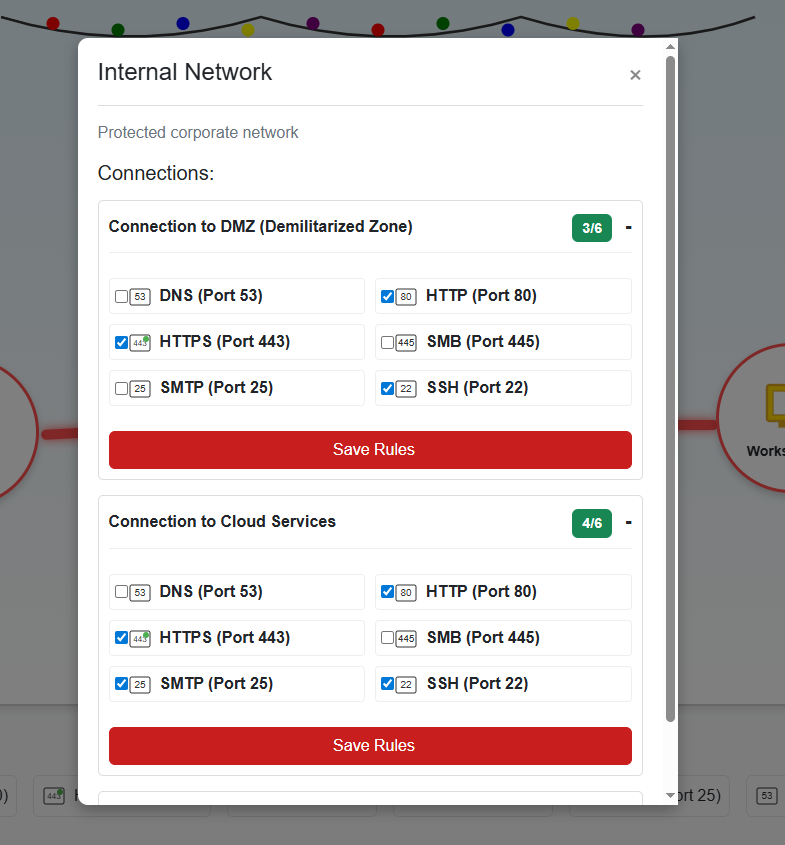
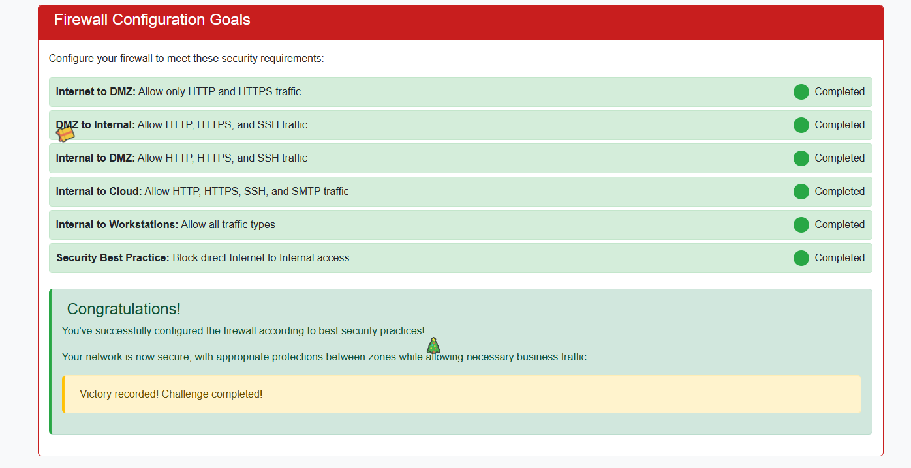

# Visual Firewall Thinger

**Difficulty:** ⭐⭐

---

## Challenge Overview

Master firewall fundamentals through an interactive network security simulator! Chris Elgee has created an engaging visual tool that teaches you how firewalls protect different network zones. Learn the principles of network segmentation, defense in depth, and proper firewall rule configuration - all through hands-on practice.

### Chris Elgee

> *"Oh hi! Am I on the road again? I should buy souvenirs for the family. Loud shirts? Love them. Because - hey, if you aren't having fun, what are you even doing?? Welcome to my little corner of network security! \*finger guns\* I've whipped up something sweeter than my favorite whoopie pie - an interactive firewall simulator that'll teach you more in ten minutes than most textbooks do in ten chapters. Don't worry about breaking anything; that's half the fun of learning!"*

**Chris Elgee Facts:**
- Works at Counter Hack
- Loves loud shirts and whoopie pies
- Believes finger guns are 100% appropriate for military portraits
- Master of making security training fun and engaging

## Objective

Configure firewall rules between different network zones to meet security requirements while maintaining functionality. Learn how to:
- Segment networks into security zones
- Configure appropriate firewall rules
- Understand the DMZ concept
- Apply defense in depth principles
- Balance security with usability

---

## Understanding Network Zones

Before diving into the challenge, let's understand the different network zones:

### The Network Architecture


*The interactive firewall simulator showing all network zones and connections*

### Network Zones Explained

| Zone | Purpose | Trust Level | Example Services |
|------|---------|-------------|------------------|
| **Internet** | External world | Untrusted | Public web, attackers |
| **DMZ** | Public-facing servers | Semi-trusted | Web servers, mail servers, DNS |
| **Internal Network** | Corporate network | Trusted | File servers, databases, applications |
| **Workstations** | Employee computers | Trusted | Desktops, laptops, printers |
| **Cloud Services** | External resources | Semi-trusted | AWS, Azure, SaaS applications |

### What is a DMZ?

**DMZ (Demilitarized Zone)** is a physical or logical subnetwork that contains and exposes an organization's external-facing services to an untrusted network (usually the Internet).

**Why use a DMZ?**
- ✅ Adds an extra layer of security between Internet and internal network
- ✅ If DMZ server is compromised, internal network remains protected
- ✅ Allows controlled access to public services
- ✅ Implements defense in depth strategy

**DMZ Architecture:**
```
Internet
   ↓
Firewall 1 (External)
   ↓
DMZ (Web servers, Email servers, DNS)
   ↓
Firewall 2 (Internal)
   ↓
Internal Network (Databases, File servers, Applications)
```

---

## Firewall Configuration Goals

The challenge requires configuring rules for six different connection paths:

### Security Requirements Checklist

| Connection Path | Required Protocols | Status |
|-----------------|-------------------|--------|
| **Internet → DMZ** | HTTP (80), HTTPS (443) | ❌ Incomplete |
| **DMZ → Internal** | HTTP (80), HTTPS (443), SSH (22) | ❌ Incomplete |
| **Internal → DMZ** | HTTP (80), HTTPS (443), SSH (22) | ❌ Incomplete |
| **Internal → Cloud** | HTTP (80), HTTPS (443), SSH (22), SMTP (25) | ❌ Incomplete |
| **Internal → Workstations** | ALL traffic types | ❌ Incomplete |
| **Internet → Internal** | BLOCK ALL (Security Best Practice) | ✅ Already blocked |

---

## Solution Walkthrough

### Step 1: Configure Internet to DMZ

**Requirement:** Allow only HTTP and HTTPS traffic


*Click on the connection between Internet and DMZ zones*

**Rules to Add:**
- ✅ **HTTP (Port 80)** - Web traffic
- ✅ **HTTPS (Port 443)** - Secure web traffic

**Why these protocols?**
- The DMZ hosts public-facing web servers
- Users on the Internet need to access websites (HTTP/HTTPS)
- No other protocols should be accessible from the Internet

**Security Note:** Never expose SSH (22), RDP (3389), or database ports (3306, 5432) directly to the Internet!

---

### Step 2: Configure DMZ to Internal Network

**Requirement:** Allow HTTP, HTTPS, and SSH traffic



*Configure communication between DMZ and Internal network*

**Rules to Add:**
- ✅ **HTTP (Port 80)** - Web server may need internal resources
- ✅ **HTTPS (Port 443)** - Secure API calls to internal services
- ✅ **SSH (Port 22)** - Administrative access for maintenance

**Why allow DMZ to Internal?**
- Web servers in DMZ may need to query internal databases
- DMZ servers may need to communicate with internal APIs
- Administrators need SSH access for server management

**Security Consideration:** This violates pure DMZ design! Ideally, DMZ should NOT initiate connections to Internal. Better design: Internal initiates connections TO DMZ.

---

### Step 3: Configure Internal to DMZ

**Requirement:** Allow HTTP, HTTPS, and SSH traffic



*Configure communication from Internal network to DMZ*

**Rules to Add:**
- ✅ **HTTP (Port 80)** - Access web services in DMZ
- ✅ **HTTPS (Port 443)** - Secure access to DMZ servers
- ✅ **SSH (Port 22)** - Administrative access for management

**Why allow Internal to DMZ?**
- IT staff needs to manage servers in the DMZ
- Internal applications may need to access DMZ services
- Monitoring systems need to check DMZ server health

**This is safer!** Internal → DMZ is much safer than DMZ → Internal. Internal network has more security controls.

---

### Step 4: Configure Internal to Cloud Services

**Requirement:** Allow HTTP, HTTPS, SSH, and SMTP traffic

**Rules to Add:**
- ✅ **HTTP (Port 80)** - Access cloud APIs (though HTTPS preferred)
- ✅ **HTTPS (Port 443)** - Secure cloud communication
- ✅ **SSH (Port 22)** - Manage cloud servers
- ✅ **SMTP (Port 25)** - Send email via cloud email services

**Why these protocols?**
- **HTTPS:** Most cloud APIs use HTTPS for secure communication
- **SSH:** Manage cloud servers and instances
- **SMTP:** Send transactional emails through cloud email services
- **HTTP:** Some legacy APIs (but HTTPS should be preferred)

**Cloud Security Best Practices:**
- Always prefer HTTPS over HTTP
- Use API keys and OAuth for authentication
- Implement least privilege access
- Monitor cloud access logs

---

### Step 5: Configure Internal to Workstations

**Requirement:** Allow ALL traffic types

**Rules to Add:**
- ✅ **ALL PROTOCOLS** - Complete access between internal network and workstations

**Why allow all traffic?**
- Workstations are part of the trusted internal network
- Employees need access to all internal services
- File sharing, printing, collaboration tools all require various protocols

**Common protocols in use:**
- **SMB (445)** - File sharing
- **RDP (3389)** - Remote desktop
- **HTTP/HTTPS** - Web applications
- **DNS (53)** - Name resolution
- **LDAP (389)** - Active Directory
- **SSH (22)** - Server management

**Trust but Verify:** Even internal traffic should be monitored for anomalies!

---

### Step 6: Security Best Practice - Block Internet to Internal



*Complete firewall configuration with all rules in place*

**Requirement:** Block direct Internet to Internal access

**Status:** ✅ **Already Blocked** (Default deny rule)

**Why this is critical:**
- The internal network should NEVER be directly accessible from the Internet
- All external access must go through the DMZ
- This is the foundation of defense in depth
- Prevents direct attacks on internal resources

**What happens if Internet → Internal is allowed?**
- ❌ Attackers can directly target internal servers
- ❌ Malware can spread from Internet to internal network
- ❌ Data exfiltration becomes easier
- ❌ Complete security failure

---

## Challenge Complete!


*Successfully configured all firewall rules!*

### Chris Elgee's Response

> *"\*finger guns\* Nice work! You've mastered those firewall fundamentals like a true network security pro. Now that was way more fun than sitting through another boring lecture, wasn't it?"*

---

## Key Concepts Learned

### 1. Network Segmentation

**Definition:** Dividing a network into multiple segments or subnets, each acting as its own small network.

**Benefits:**
- ✅ Limits blast radius of security incidents
- ✅ Improves performance by reducing broadcast traffic
- ✅ Easier to apply security policies
- ✅ Better compliance with regulations (PCI-DSS, HIPAA)

**Common Segments:**
- Public DMZ
- Private DMZ (for B2B partners)
- Corporate network
- Guest WiFi
- Management network
- OT/SCADA network (for industrial systems)

### 2. Defense in Depth

**Layered Security Approach:**

```
Layer 1: Perimeter Firewall (Internet → DMZ)
   ↓
Layer 2: DMZ Segmentation (DMZ → Internal blocked)
   ↓
Layer 3: Internal Firewall (Internal → DMZ controlled)
   ↓
Layer 4: Host-based Firewalls (on each server)
   ↓
Layer 5: Application-level Security (WAF, authentication)
```

**Philosophy:** If one layer fails, other layers still provide protection.

### 3. Principle of Least Privilege

**Apply to firewall rules:**
- Only open ports that are absolutely necessary
- Use specific source/destination IPs when possible
- Implement time-based access controls
- Regularly review and remove unused rules

### 4. Default Deny Strategy

**Firewall Rule Order:**
1. Allow specific necessary traffic (explicit allow rules)
2. Deny everything else (implicit deny at the end)

**Why default deny?**
- Unknown protocols are blocked by default
- Reduces attack surface
- Forces intentional security decisions
- Easier to audit (explicit allows)

---

## Firewall Rule Deep Dive

### Understanding Firewall Rules

Each firewall rule typically contains:

| Component | Description | Example |
|-----------|-------------|---------|
| **Source** | Where traffic originates | Internet, 192.168.1.0/24 |
| **Destination** | Where traffic is going | DMZ, 10.0.1.0/24 |
| **Protocol** | TCP, UDP, ICMP | TCP |
| **Port** | Service port number | 80 (HTTP), 443 (HTTPS) |
| **Action** | Allow or Deny | Allow |
| **Direction** | Inbound or Outbound | Inbound |

### Common Firewall Ports Reference

| Port | Protocol | Service | Security Level |
|------|----------|---------|----------------|
| **20/21** | TCP | FTP | ⚠️ Insecure (use SFTP) |
| **22** | TCP | SSH | ✅ Secure (if configured properly) |
| **23** | TCP | Telnet | ❌ Never use (plaintext) |
| **25** | TCP | SMTP | ⚠️ Email (can be abused) |
| **53** | UDP/TCP | DNS | ✅ Essential |
| **80** | TCP | HTTP | ⚠️ Unencrypted web |
| **443** | TCP | HTTPS | ✅ Encrypted web |
| **445** | TCP | SMB | ⚠️ File sharing (internal only) |
| **3306** | TCP | MySQL | ❌ Never expose to Internet |
| **3389** | TCP | RDP | ❌ Never expose to Internet |
| **5432** | TCP | PostgreSQL | ❌ Never expose to Internet |

### Dangerous Ports to NEVER Expose

**Management Protocols:**
- ❌ Port 22 (SSH) - If exposed to Internet, use VPN + 2FA
- ❌ Port 3389 (RDP) - Major ransomware attack vector
- ❌ Port 23 (Telnet) - Plaintext, no encryption
- ❌ Port 5900 (VNC) - Remote access, often weak passwords

**Database Ports:**
- ❌ Port 3306 (MySQL/MariaDB)
- ❌ Port 5432 (PostgreSQL)
- ❌ Port 1433 (MS SQL Server)
- ❌ Port 27017 (MongoDB)

**File Sharing:**
- ❌ Port 445 (SMB) - WannaCry, NotPetya attack vector
- ❌ Port 139 (NetBIOS)
- ❌ Port 2049 (NFS)

---

## Real-World Firewall Best Practices

### 1. Stateful vs Stateless Firewalls

**Stateless Firewall:**
- Examines each packet independently
- No context of previous packets
- Faster but less secure
- Simple packet filtering

**Stateful Firewall:**
- Tracks connection state
- Remembers established connections
- More intelligent decisions
- Modern standard

**Example:**
```
Stateless: Allow port 80 from anywhere
Stateful: Allow port 80 from Internet, track connection, allow return traffic
```

### 2. Application-Aware Firewalls

**Next-Generation Firewalls (NGFW):**
- Understand application protocols (not just ports)
- Can block specific applications (BitTorrent, gaming)
- Deep packet inspection (DPI)
- Integrated intrusion prevention (IPS)

**Example:**
Traditional firewall: Allow port 443
NGFW: Allow port 443, but block file downloads over 100MB, scan for malware

### 3. Zero Trust Architecture

**Traditional Perimeter Security:**
```
Internet (Untrusted) → Firewall → Internal Network (Trusted)
```

**Zero Trust Model:**
```
Trust nothing, verify everything
  ↓
Micro-segmentation
  ↓
Continuous authentication
  ↓
Least privilege access
```

**Zero Trust Principles:**
- Never trust, always verify
- Assume breach has occurred
- Verify explicitly (user, device, location, behavior)
- Use micro-segmentation
- Minimize blast radius

### 4. Logging and Monitoring

**Essential Firewall Logs:**
- ✅ Denied connections (potential attacks)
- ✅ Allowed connections to sensitive resources
- ✅ Rule changes (who modified what)
- ✅ Connection state changes
- ✅ Bandwidth usage by source/destination

**SIEM Integration:**
- Send firewall logs to Security Information and Event Management (SIEM)
- Correlate with other security logs
- Alert on suspicious patterns
- Compliance reporting

---

## Common Firewall Misconfigurations

### 1. Overly Permissive Rules

**Bad:**
```
Allow ANY → ANY: Port ANY
```

**Good:**
```
Allow 192.168.1.0/24 → 10.0.1.5: Port 443
```

### 2. Exposing Management Interfaces

**Never expose to Internet:**
- Firewall admin panel
- Router management interface
- Switch configuration interface
- Server BMC/iLO/iDRAC

**Better:**
- Use VPN for remote management
- Restrict by source IP
- Implement strong authentication (2FA)

### 3. Forgetting Return Traffic

**Stateless firewalls require explicit return rules:**
```
Outbound: Allow Internal → Internet: Port 80
Inbound: Allow Internet → Internal: Port >1024 (ephemeral ports)
```

**Stateful firewalls handle this automatically!**

### 4. Shadow Rules

**Problem:** Hidden or forgotten rules that override security policies

**Example:**
```
Rule 1: Deny Internet → Internal: Port 22
Rule 50: Allow ANY → ANY: Port 22  ← Shadow rule!
```

**Solution:** Regular rule audits and cleanup

---

## DMZ Design Patterns

### Single DMZ Architecture

```
Internet
   ↓
Firewall
   ├─→ DMZ (Web servers)
   └─→ Internal Network
```

**Pros:** Simple, cost-effective
**Cons:** DMZ compromise may expose internal network

### Dual DMZ Architecture

```
Internet
   ↓
Firewall 1 (External)
   ↓
DMZ (Public services)
   ↓
Firewall 2 (Internal)
   ↓
Internal Network
```

**Pros:** Better security, defense in depth
**Cons:** More complex, higher cost

### Triple DMZ Architecture

```
Internet
   ↓
Firewall 1
   ↓
Public DMZ (Web, Email)
   ↓
Firewall 2
   ↓
Private DMZ (B2B, Partners)
   ↓
Firewall 3
   ↓
Internal Network
```

**Pros:** Maximum security, granular control
**Cons:** Complex management, expensive

---

## Testing Your Firewall Rules

### Tools for Testing

**Network Scanners:**
```bash
# Nmap - Port scanning
nmap -sV -p- target.example.com

# Test specific port
nc -zv target.example.com 443

# Check if port is open
telnet target.example.com 80
```

**Application Testing:**
```bash
# HTTP request
curl -v http://target.example.com

# HTTPS with certificate check
openssl s_client -connect target.example.com:443

# SSH connection test
ssh -v user@target.example.com
```

**Firewall Verification:**
```bash
# Check local firewall rules (Linux)
sudo iptables -L -n -v

# Windows firewall
netsh advfirewall show allprofiles

# Test connectivity
ping target.example.com
traceroute target.example.com
```

### Penetration Testing

**External Test:**
- Try to access internal services from Internet
- Attempt to bypass firewall rules
- Look for exposed management interfaces

**Internal Test:**
- Verify segmentation between zones
- Test lateral movement restrictions
- Check for overly permissive rules

---

## Compliance and Regulatory Requirements

### PCI-DSS (Payment Card Industry)

**Requirement 1: Install and maintain firewall configuration**
- ✅ Block all unauthorized traffic
- ✅ Prohibit direct public access to cardholder data
- ✅ Implement DMZ for public-facing services
- ✅ Restrict outbound traffic

### HIPAA (Healthcare)

**Administrative Safeguards:**
- ✅ Implement firewall protection
- ✅ Network segmentation
- ✅ Access controls
- ✅ Audit logs

### NIST Cybersecurity Framework

**Protect Function:**
- ✅ Network segmentation (PR.AC-5)
- ✅ Protective technology (PR.PT-4)
- ✅ Least functionality (PR.IP-1)

---

## Troubleshooting Common Issues

### Issue 1: Legitimate Traffic Blocked

**Symptoms:** Application doesn't work, timeouts

**Diagnosis:**
1. Check firewall logs for denied connections
2. Verify source and destination IPs
3. Confirm required ports

**Solution:**
```
Add explicit allow rule for:
Source: 192.168.1.50
Destination: 10.0.1.100
Port: 8443
Protocol: TCP
```

### Issue 2: Asymmetric Routing

**Problem:** Traffic goes out one path, returns on another

**Symptoms:** Connections timeout or reset

**Solution:**
- Use stateful firewall rules
- Implement proper routing policies
- Check for multiple Internet connections

### Issue 3: Performance Degradation

**Symptoms:** Slow network, high latency

**Causes:**
- Too many firewall rules (check rule count)
- Deep packet inspection overhead
- Insufficient firewall resources

**Solutions:**
- Optimize rule order (most-used rules first)
- Hardware upgrade
- Implement rule consolidation

---

## Challenge Summary

### Configuration Completed

| Zone Connection | Protocols Allowed | Security Rationale |
|-----------------|-------------------|-------------------|
| **Internet → DMZ** | HTTP, HTTPS | Public web access only |
| **DMZ → Internal** | HTTP, HTTPS, SSH | Backend communication (with caution) |
| **Internal → DMZ** | HTTP, HTTPS, SSH | Management and monitoring |
| **Internal → Cloud** | HTTP, HTTPS, SSH, SMTP | Cloud service access |
| **Internal → Workstations** | ALL | Trusted internal traffic |
| **Internet → Internal** | NONE (BLOCKED) | Defense in depth |

### Key Takeaways

1. ✅ **Network segmentation isolates zones** - Limits attack spread
2. ✅ **DMZ provides buffer layer** - Protects internal network
3. ✅ **Defense in depth uses multiple layers** - No single point of failure
4. ✅ **Least privilege applies to firewall rules** - Only open what's needed
5. ✅ **Default deny is safer** - Block by default, allow explicitly
6. ✅ **Internet → Internal must always be blocked** - Foundation of perimeter security
7. ✅ **Regular rule audits prevent drift** - Security degrades over time without maintenance
8. ✅ **Logging and monitoring detect issues** - Can't protect what you can't see

---

## Beyond the Basics

### Advanced Topics

**Firewall Evasion Techniques:**
- Fragmentation attacks
- Protocol tunneling (ICMP, DNS)
- Encrypted tunnels
- Application layer proxies

**Defense Against Evasion:**
- Stateful inspection
- Protocol validation
- Anomaly detection
- Regular security updates

### Cloud Firewall Services

**AWS Security Groups:**
- Stateful virtual firewall
- Applied to EC2 instances
- Supports ingress/egress rules

**Azure Network Security Groups:**
- Layer 3-4 filtering
- Applied to subnets or NICs
- Priority-based rule evaluation

**GCP Firewall Rules:**
- Global resource
- Applied via tags
- Supports hierarchical policies

---

## Additional Resources

### Learning More

**Books:**
- "Firewalls and Internet Security" by Cheswick & Bellovin
- "Network Security Architectures" by Convery & Trudel

**Online Resources:**
- SANS Firewall Essentials Course
- Cisco CCNA Security
- CompTIA Security+ (Network Security section)

**Hands-On Practice:**
- GNS3 or EVE-NG for lab environments
- pfSense open-source firewall
- Cisco Packet Tracer

---

**SANS Holiday Hack Challenge 2025**  
*Act 1: Visual Firewall Thinger*

**Status:** ✅ Challenge Completed  
**Skills Mastered:** Network segmentation, firewall rules, DMZ design, defense in depth  
**Security Level:** Network Fundamentals 🔥🛡️

---

*Challenge writeup by SFC David P. Collette*  
*Regional Cyber Center - Korea (RCC-K)*  
*SANS Holiday Hack Challenge 2025*
