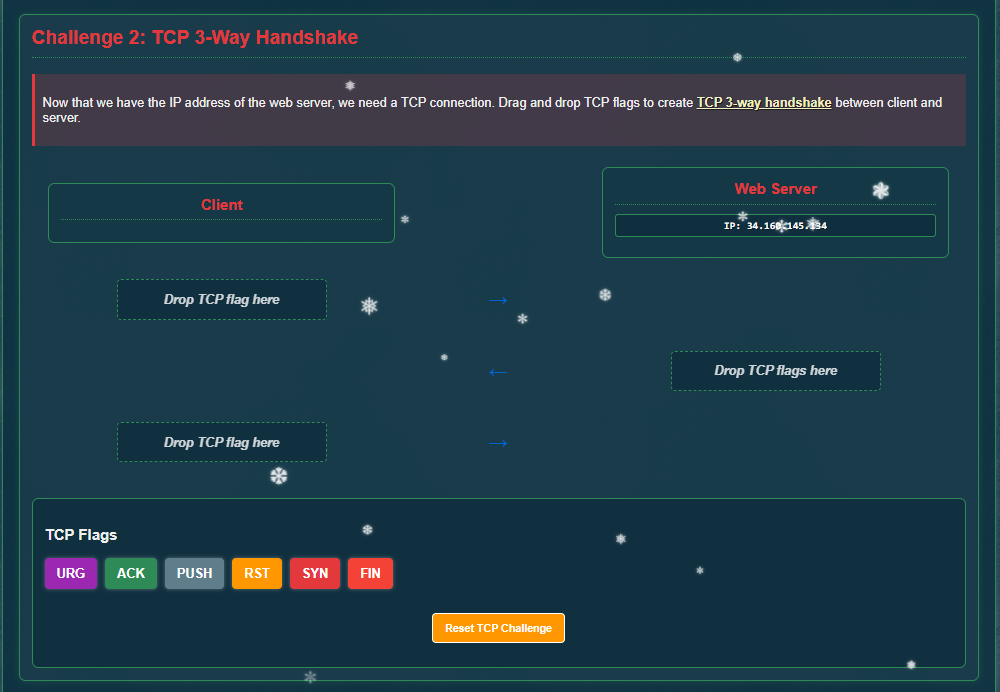
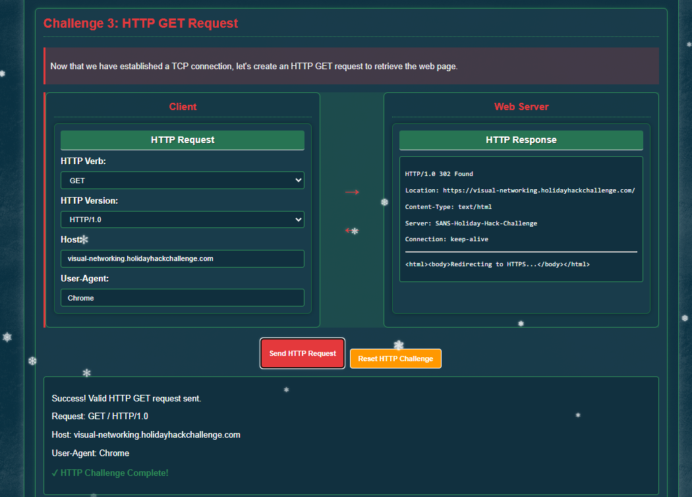
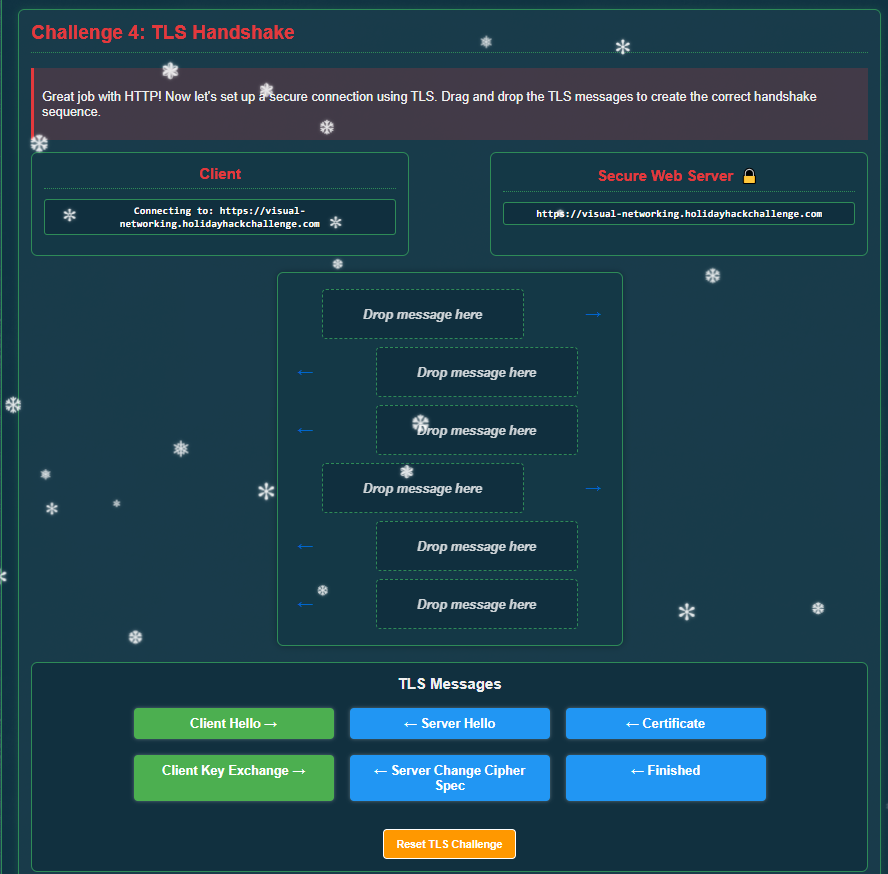
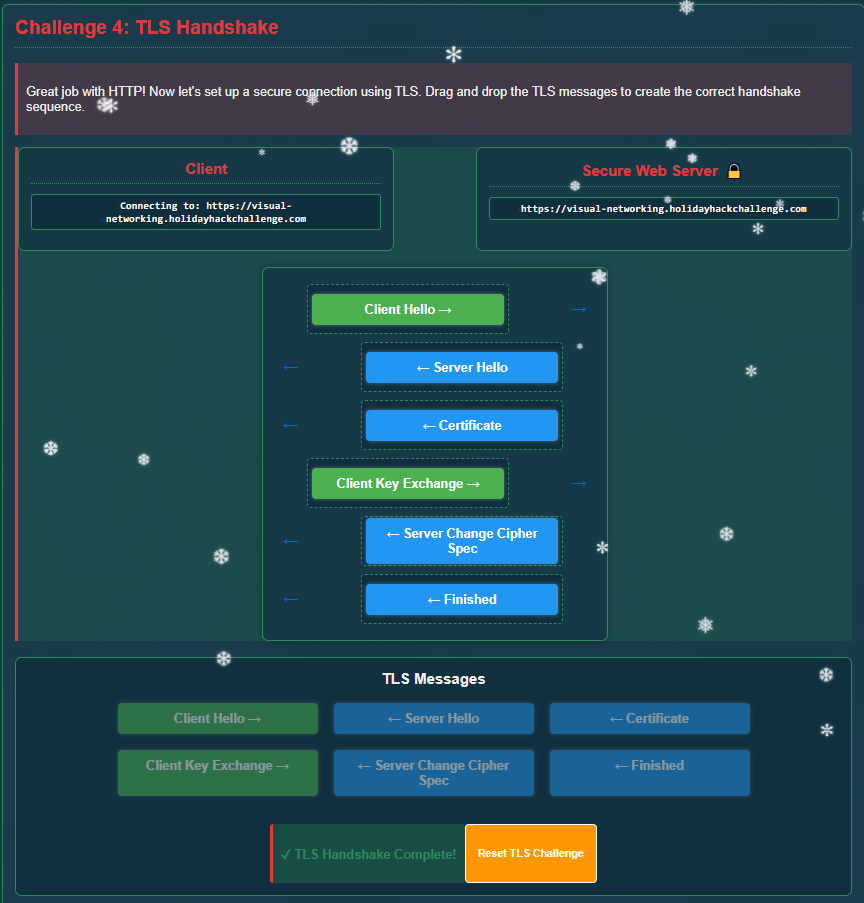
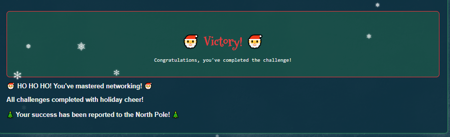

# Visual Networking Thinger

**Difficulty:** ⭐

---

## Challenge Overview

Learn networking fundamentals through interactive visualization! Jared Folkins has created an engaging way to see exactly how packets travel, how protocols work, and why networks behave the way they do. This hands-on challenge covers DNS, TCP handshakes, HTTP, TLS, and HTTPS - all the essential building blocks of modern internet communication.

### Jared Folkins

> *"Jared Folkins here! My favorite Christmas movie is White Christmas. Santa's got the right idea about giving, and I'm excited to give you a fantastic way to learn networking fundamentals! This interactive visualization shows you exactly how packets travel, how protocols work, and why networks behave the way they do. It's way better than staring at boring textbooks - you can actually see what's happening!"*

## Objective

Complete five interactive networking challenges to understand:
1. **DNS Resolution** - How domain names become IP addresses
2. **TCP Handshake** - How connections are established
3. **HTTP Requests** - How web pages are requested
4. **TLS Handshake** - How secure connections are created
5. **HTTPS Requests** - How secure web communication works

---

## The Challenge Interface


*The interactive Visual Networking Terminal - learning by doing!*

---

## Challenge 1: DNS Query Resolution

### What is DNS?

**DNS (Domain Name System)** is the internet's phone book. It translates human-readable domain names (like `google.com`) into IP addresses (like `142.250.185.46`) that computers use to identify each other on the network.

### The Challenge


*DNS query interface - translate a domain name to an IP address*

### Task

Query DNS to resolve: `visual-networking.holidayhackchallenge.com`

**Configuration:**
- **Request Type:** A (Address record)
- **Port:** 53 (standard DNS port)

### Solution

```
Query: visual-networking.holidayhackchallenge.com
Type: A
Result: 34.160.145.134
```

**Success!** ✅ The DNS server returned an A record with the IPv4 address.

### How DNS Works

```
1. User enters domain name → visual-networking.holidayhackchallenge.com
2. DNS Query sent to DNS server (port 53)
3. DNS server looks up domain in its records
4. Server returns A record → 34.160.145.134
5. Computer can now connect to that IP address
```

### DNS Record Types

| Record Type | Purpose | Example |
|-------------|---------|---------|
| **A** | IPv4 address | `192.168.1.1` |
| **AAAA** | IPv6 address | `2001:0db8::1` |
| **CNAME** | Alias to another domain | `www` → `example.com` |
| **MX** | Mail server | `mail.example.com` |
| **TXT** | Text information | SPF, DKIM records |
| **NS** | Nameserver | `ns1.example.com` |

---

## Challenge 2: TCP Three-Way Handshake

### What is the TCP Handshake?

The **TCP three-way handshake** is how computers establish a reliable connection before exchanging data. It's like a polite conversation starter: "Hello!" → "Hello back!" → "Great, let's talk!"

### The Challenge



*Interactive TCP handshake visualization*

### The Three Steps

```
1. SYN (Synchronize)
   Client → Server: "I want to connect. My sequence number is X."

2. SYN-ACK (Synchronize-Acknowledge)  
   Server → Client: "I acknowledge your request. My sequence number is Y."

3. ACK (Acknowledge)
   Client → Server: "I acknowledge your response. Let's start communicating!"
```

### Solution


*Successfully established TCP connection through three-way handshake*

**Success!** ✅ Connection established and ready for data transfer.

### Why Three Steps?

The three-way handshake ensures:
- ✅ Both sides are ready to communicate
- ✅ Both sides agree on initial sequence numbers
- ✅ Lost packets can be detected and retransmitted
- ✅ Connection is reliable and synchronized

### TCP vs UDP

| Feature | TCP | UDP |
|---------|-----|-----|
| **Connection** | Connection-oriented (handshake) | Connectionless |
| **Reliability** | Guaranteed delivery | Best effort |
| **Speed** | Slower (overhead) | Faster |
| **Use Cases** | Web, email, file transfer | Video streaming, gaming, DNS |

---

## Challenge 3: HTTP GET Request

### What is HTTP?

**HTTP (Hypertext Transfer Protocol)** is the foundation of data communication on the web. It defines how messages are formatted and transmitted between web browsers and servers.

### The Challenge


*Building an HTTP GET request - the basics of web communication*

### Task

Construct a valid HTTP GET request with the required headers.

### Solution



*Complete HTTP GET request ready to send*

**HTTP Request:**
```http
GET / HTTP/1.1
Host: visual-networking.holidayhackchallenge.com
User-Agent: chrome
```

**Success!** ✅ Valid HTTP request constructed.

### HTTP Request Components

**Request Line:**
- **Method:** GET (retrieve data), POST (send data), PUT, DELETE, etc.
- **Path:** `/` (root), `/index.html`, `/api/users`, etc.
- **Version:** HTTP/1.1, HTTP/2, HTTP/3

**Headers:**
- **Host:** Domain name of the server (required in HTTP/1.1)
- **User-Agent:** Browser/client identification
- **Accept:** Content types the client can handle
- **Cookie:** Session data

### Common HTTP Methods

| Method | Purpose | Safe? | Idempotent? |
|--------|---------|-------|-------------|
| **GET** | Retrieve data | Yes | Yes |
| **POST** | Submit data | No | No |
| **PUT** | Update/replace | No | Yes |
| **DELETE** | Remove resource | No | Yes |
| **HEAD** | Get headers only | Yes | Yes |
| **PATCH** | Partial update | No | No |

### HTTP Status Codes

| Code | Meaning | Example |
|------|---------|---------|
| **2xx** | Success | 200 OK, 201 Created |
| **3xx** | Redirection | 301 Moved Permanently, 302 Found |
| **4xx** | Client Error | 404 Not Found, 403 Forbidden |
| **5xx** | Server Error | 500 Internal Server Error, 503 Unavailable |

---

## Challenge 4: TLS Handshake

### What is TLS?

**TLS (Transport Layer Security)** creates an encrypted tunnel for secure communication. It ensures that data between your browser and a server cannot be read or tampered with by anyone in between.

### The Challenge



*Building a TLS handshake - establishing encryption*

### The TLS Handshake Process

```
1. Client Hello
   → "I want a secure connection. Here are the cipher suites I support."

2. Server Hello
   → "Great! Let's use this cipher suite."

3. Certificate
   → "Here's my SSL/TLS certificate to prove my identity."

4. Client Key Exchange
   → "Here are parameters to generate our shared encryption key."

5. Server Change Cipher Spec
   → "From now on, all my messages will be encrypted."

6. Finished
   → "Handshake complete! Secure communication established."
```

### Solution



*Successfully established secure TLS connection*

**Success!** ✅ TLS handshake completed - encrypted tunnel established.

### Challenge Completion Message

> *"Success! You've correctly established a secure TLS connection. The TLS handshake creates a secure encrypted tunnel for HTTP traffic."*

### Why TLS Matters

**Without TLS (HTTP):**
- ❌ Data sent in plain text
- ❌ Anyone can read passwords, credit cards, personal info
- ❌ No way to verify server identity
- ❌ Data can be modified in transit

**With TLS (HTTPS):**
- ✅ All data encrypted
- ✅ Server identity verified with certificates
- ✅ Data integrity guaranteed
- ✅ Protection against man-in-the-middle attacks

### TLS Versions

| Version | Released | Status |
|---------|----------|--------|
| SSL 2.0 | 1995 | Deprecated (insecure) |
| SSL 3.0 | 1996 | Deprecated (insecure) |
| TLS 1.0 | 1999 | Deprecated |
| TLS 1.1 | 2006 | Deprecated |
| **TLS 1.2** | 2008 | **Still widely used** |
| **TLS 1.3** | 2018 | **Current standard** |

---

## Challenge 5: HTTPS GET Request

### What is HTTPS?

**HTTPS (HTTP Secure)** combines HTTP with TLS encryption. It's HTTP running inside an encrypted TLS tunnel - the standard for secure web communication.

### The Challenge


*Building an HTTPS request - secure web communication*

### Task

Construct a valid HTTPS GET request using HTTP/2 protocol.

### Solution


*Complete HTTPS GET request over TLS connection*

**HTTPS Request:**
```http
GET / HTTP/2
Host: visual-networking.holidayhackchallenge.com
User-Agent: chrome
```

**Success!** ✅ Valid HTTPS request sent over encrypted connection.

### HTTP vs HTTPS vs HTTP/2

| Feature | HTTP | HTTPS | HTTP/2 |
|---------|------|-------|--------|
| **Encryption** | ❌ No | ✅ Yes (TLS) | ✅ Yes (TLS) |
| **Port** | 80 | 443 | 443 |
| **Speed** | Fast | Slightly slower | Faster (multiplexing) |
| **Security** | None | Strong | Strong |
| **Multiplexing** | ❌ | ❌ | ✅ Multiple streams |

### How HTTPS Works (Complete Flow)

```
1. DNS Resolution
   → Resolve domain to IP address (Challenge 1)

2. TCP Handshake  
   → Establish connection (Challenge 2)

3. TLS Handshake
   → Create encrypted tunnel (Challenge 4)

4. HTTP Request
   → Send encrypted HTTP request (Challenge 3 + 5)

5. HTTP Response
   → Receive encrypted response

6. Connection Close
   → Terminate connection gracefully
```

---

## Challenge Complete!



*Successfully mastered all networking fundamentals!*

### Jared's Response

> *"Wonderful! You've mastered those networking basics beautifully. Now you can see how all the pieces of the network puzzle fit together - it's truly better to give knowledge than to keep it to yourself!"*

---

## Key Concepts Learned

### 1. The Network Stack (OSI Model)

Understanding how different protocols work at different layers:

| Layer | Example Protocols | This Challenge |
|-------|-------------------|----------------|
| **7. Application** | HTTP, HTTPS, DNS | ✅ Challenges 1, 3, 5 |
| **6. Presentation** | TLS/SSL, encoding | ✅ Challenge 4 |
| **5. Session** | TLS session management | ✅ Challenge 4 |
| **4. Transport** | TCP, UDP | ✅ Challenge 2 |
| **3. Network** | IP, ICMP | (Implied in DNS) |
| **2. Data Link** | Ethernet, WiFi | (Not covered) |
| **1. Physical** | Cables, radio | (Not covered) |

### 2. The Client-Server Model

All these challenges demonstrate client-server communication:
```
CLIENT                    SERVER
  |                         |
  |--- DNS Query ---------->|
  |<-- IP Address ----------|
  |                         |
  |--- SYN ---------------->|
  |<-- SYN-ACK -------------|
  |--- ACK ---------------->|
  |                         |
  |--- Client Hello ------->|
  |<-- Server Hello --------|
  |<-- Certificate ---------|
  |--- Key Exchange ------->|
  |                         |
  |=== ENCRYPTED TUNNEL ====|
  |                         |
  |--- HTTP GET ----------->|
  |<-- HTTP Response -------|
```

### 3. Defense in Depth

Modern web security uses multiple layers:
1. **TLS Encryption** - Protects data in transit
2. **HTTPS** - Ensures encrypted communication
3. **Certificates** - Verifies server identity
4. **HTTP/2** - Improves performance and security
5. **HSTS** - Forces HTTPS usage
6. **Certificate Transparency** - Detects fraudulent certificates

### 4. Port Numbers

Standard ports used in these challenges:

| Service | Port | Protocol |
|---------|------|----------|
| **DNS** | 53 | UDP/TCP |
| **HTTP** | 80 | TCP |
| **HTTPS** | 443 | TCP |

---

## Real-World Applications

### Network Troubleshooting

Understanding these concepts helps diagnose issues:
- **DNS not working?** Check port 53 connectivity
- **Can't establish connection?** TCP handshake might be failing
- **Certificate errors?** TLS handshake issue
- **Site not loading?** HTTP request/response problem

### Security Analysis

These fundamentals are essential for:
- **Penetration Testing** - Understanding how to intercept and analyze traffic
- **Network Security** - Configuring firewalls and monitoring
- **Incident Response** - Investigating security incidents
- **Threat Detection** - Identifying malicious network activity

### Web Development

Developers need to understand:
- **HTTP methods** - Building RESTful APIs
- **Status codes** - Handling errors properly
- **Headers** - Security headers, CORS, cookies
- **HTTPS** - Securing applications

---

## Technical Deep Dive

### DNS Resolution Details

**Query Process:**
1. Check browser cache
2. Check OS cache
3. Check router cache
4. Query recursive DNS server (ISP)
5. Query root nameserver
6. Query TLD nameserver (.com)
7. Query authoritative nameserver
8. Return IP address

### TCP Handshake Security

**SYN Flood Attack:**
- Attacker sends many SYN packets
- Never completes handshake (no ACK)
- Server runs out of resources
- **Defense:** SYN cookies, rate limiting

### TLS Certificate Chain

**Certificate Validation:**
```
Root CA (trusted by browser)
  → Intermediate CA
    → Server Certificate
      → Your website
```

Browser verifies:
- ✅ Certificate is signed by trusted CA
- ✅ Certificate hasn't expired
- ✅ Domain name matches certificate
- ✅ Certificate hasn't been revoked

---

## Quick Reference

### Common Network Commands

```bash
# DNS lookup
nslookup example.com
dig example.com

# TCP connection test
telnet example.com 80
nc -zv example.com 80

# HTTPS connection test
openssl s_client -connect example.com:443

# HTTP request
curl -v http://example.com
curl -v https://example.com
```

### Wireshark Filters

```
# Filter by protocol
dns
tcp
http
tls

# Filter by IP
ip.addr == 192.168.1.1

# Filter by port
tcp.port == 443

# Filter handshakes
tcp.flags.syn == 1
```

---

## Challenge Summary

| Challenge | Protocol/Concept | Port | Completed |
|-----------|-----------------|------|-----------|
| 1 | DNS Query (A record) | 53 | ✅ |
| 2 | TCP Three-Way Handshake | - | ✅ |
| 3 | HTTP GET Request | 80 | ✅ |
| 4 | TLS Handshake | 443 | ✅ |
| 5 | HTTPS GET Request (HTTP/2) | 443 | ✅ |

---

## Key Takeaways

1. ✅ **DNS translates names to IPs** - The internet's phone book
2. ✅ **TCP handshake establishes connections** - SYN, SYN-ACK, ACK
3. ✅ **HTTP is stateless** - Each request is independent
4. ✅ **TLS provides encryption** - Secure tunnel for data
5. ✅ **HTTPS = HTTP + TLS** - Encrypted web communication
6. ✅ **Layers work together** - Each protocol builds on the one below
7. ✅ **Security requires multiple layers** - Defense in depth
8. ✅ **Understanding fundamentals matters** - Essential for troubleshooting and security

---

## What's Next?

Now that you understand these networking basics, you can:

**Learn More:**
- **Wireshark** - Packet analysis and network forensics
- **tcpdump** - Command-line packet capture
- **Burp Suite** - Web application security testing
- **Network protocols** - SMTP, FTP, SSH, RDP, etc.

**Apply Knowledge:**
- Network troubleshooting
- Security monitoring
- Web development
- Penetration testing
- Cloud networking

**Practice:**
- Capture your own traffic with Wireshark
- Set up a home network lab
- Try other HHC challenges
- Explore packet analysis

---

**SANS Holiday Hack Challenge 2025**  
*Act 1: Visual Networking Thinger*

**Status:** ✅ All 5 Challenges Completed  
**Skills Mastered:** DNS, TCP, HTTP, TLS, HTTPS  
**Knowledge Level:** Networking Fundamentals 🌐

---

*Challenge writeup by SFC David P. Collette*  
*Regional Cyber Center - Korea (RCC-K)*  
*SANS Holiday Hack Challenge 2025*
