# Quantgnome Leap

**Difficulty:** ⭐⭐

---

## Challenge Overview

This challenge explores post-quantum cryptography (PQC) through a progressive SSH authentication chain. Players advance through multiple gnome accounts, each protected by increasingly sophisticated cryptographic algorithms, culminating in access to an admin account secured with the strongest hybrid PQC implementation.

**Objective:** Traverse the authentication chain from classical cryptography through pure PQC to hybrid implementations, retrieving the flag from the admin account's directory.

---

## Challenge Description

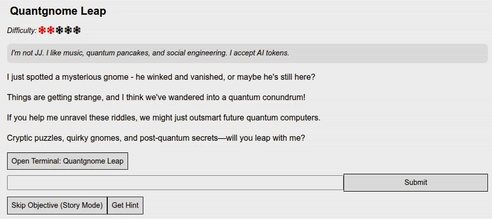

*Quantgnome Leap challenge introduction*

**Scenario:**

A mysterious gnome has appeared and vanished - or perhaps exists in quantum superposition. The challenge presents cryptographic puzzles involving the latest advancements in post-quantum cryptography (PQC), designed to secure digital communications against future quantum computers.

**Character Quote:**
> *"I'm not JJ. I like music, quantum pancakes, and social engineering. I accept AI tokens. I just spotted a mysterious gnome - he winked and vanished, or maybe he's still here? Things are getting strange, and I think we've wandered into a quantum conundrum! If you help me unravel these riddles, we might just outsmart future quantum computers."*

**Mission:** Navigate through SSH authentication challenges while learning about quantum-resistant cryptographic algorithms.

---

## Post-Quantum Cryptography Background

### The Quantum Threat

**Why PQC Matters:**

Classical public-key cryptography (RSA, ECC) relies on mathematical problems believed to be computationally hard:
- **RSA**: Integer factorization
- **ECC (Elliptic Curve)**: Discrete logarithm problem

**Shor's Algorithm** (1994) demonstrated that quantum computers can solve these problems efficiently:
- RSA-2048: Breakable by sufficiently large quantum computer
- ECC: Similarly vulnerable
- **Timeline**: Large-scale quantum computers potentially 10-20 years away

**Harvest Now, Decrypt Later:**
Adversaries are collecting encrypted data today to decrypt when quantum computers become available, making PQC urgent even before quantum computers exist.

### NIST Post-Quantum Cryptography Standardization

**NIST PQC Competition (2016-2024):**

In response to quantum threats, NIST initiated a multi-year process to standardize quantum-resistant algorithms.

**Selected Algorithms (FIPS 203-205):**

| FIPS Standard | Algorithm Name | Original Name | Purpose |
|---------------|----------------|---------------|---------|
| **FIPS 203** | ML-KEM | CRYSTALS-Kyber | Key Encapsulation |
| **FIPS 204** | ML-DSA | CRYSTALS-Dilithium | Digital Signatures |
| **FIPS 205** | SLH-DSA | SPHINCS+ | Digital Signatures (hash-based) |

**Security Levels:**

NIST defines security levels equivalent to symmetric cryptography:
- **Level 1**: AES-128 security (~2^128 operations)
- **Level 2**: SHA-256 collision resistance
- **Level 3**: AES-192 security (~2^192 operations)
- **Level 5**: AES-256 security (~2^256 operations)

### The Open Quantum Safe (OQS) Project

This challenge uses the **OQS SSH** implementation:
- **liboqs**: C library providing PQC algorithm implementations
- **OQS-OpenSSH**: Modified OpenSSH with PQC support
- **Website**: https://openquantumsafe.org/

**Purpose:** Enable testing and deployment of PQC algorithms in real-world protocols before full standardization.

---

## Initial System Access

### Gnome Account Discovery

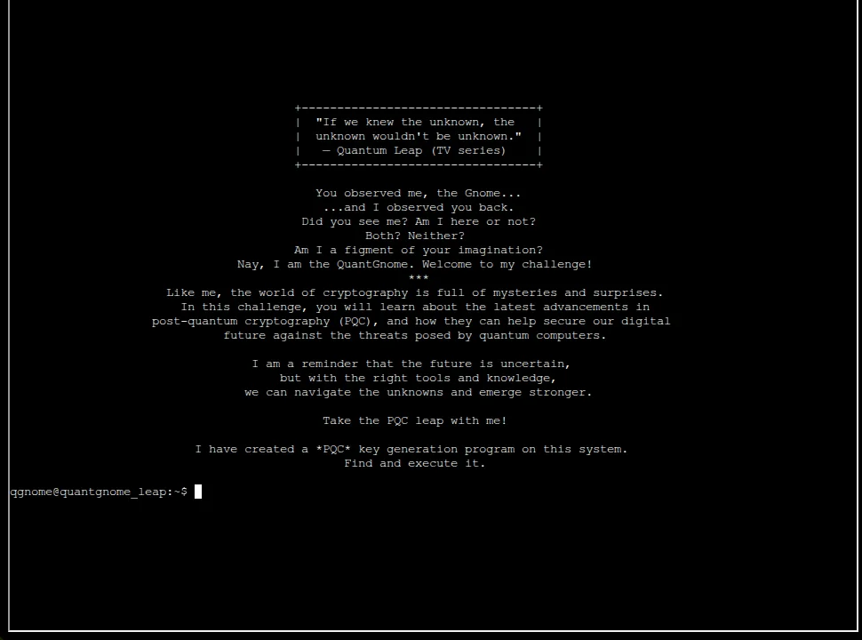

*QuantGnome welcome message referencing Quantum Leap TV series*

**Welcome Message:**
```
+--------------------------------+
| "If we knew the unknown, the   |
|  unknown wouldn't be unknown." |
|  -- Quantum Leap (TV series)   |
+--------------------------------+

You observed me, the Gnome...
...and I observed you back.
Did you see me? Am I here or not?
Both? Neither?
Am I a figment of your imagination?

Nay, I am the QuantGnome. Welcome to my challenge!

Like me, the world of cryptography is full of mysteries and surprises.
In this challenge, you will learn about the latest advancements in
post-quantum cryptography (PQC), and how they can help secure our digital
future against the threats posed by quantum computers.

I am a reminder that the future is uncertain,
but with the right tools and knowledge,
we can navigate the unknowns and emerge stronger.

Take the PQC leap with me!

I have created a *PQC* key generation program on this system.
Find and execute it.
```

**Initial Login:**
- **Account**: qgnome (local system)
- **Task**: Locate and execute the PQC key generation program

### PQC Key Generator Discovery

Exploring the system PATH reveals the OQS SSH installation:
```bash
echo $PATH
# /opt/oqs-ssh/bin:/usr/local/sbin:/usr/local/bin:/usr/sbin:/usr/bin:/sbin:/bin
```

The `/opt/oqs-ssh/bin` directory suggests Open Quantum Safe SSH tools are available.

Locating the key generator:
```bash
find /usr/local/bin -name "*pqc*" 2>/dev/null
# Result: /usr/local/bin/pqc-keygen
```

### Executing PQC Key Generation

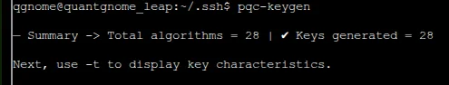

*Initial pqc-keygen execution showing 28 algorithms generated*
```bash
pqc-keygen
# Summary -> Total algorithms = 28 | ✓ Keys generated = 28
# Next, use -t to display key characteristics.
```

**Tool Capabilities:**
```bash
pqc-keygen --help
```

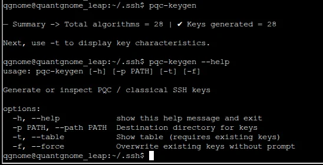

*Help menu showing available options*

**Options:**
- `-h, --help` - Show help message and exit
- `-p PATH, --path PATH` - Destination directory for keys
- `-t, --table` - Show table (requires existing keys)
- `-f, --force` - Overwrite existing keys without prompt

---

## Cryptographic Algorithm Analysis

### Generated Key Inventory

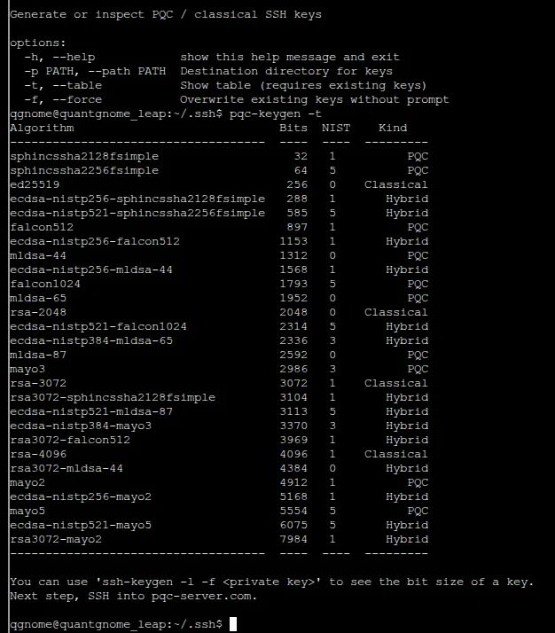

*Complete table of 28 PQC and classical algorithms with security levels*
```bash
pqc-keygen -t
```

**Output:**
```
Algorithm                        Bits  NIST   Kind
------------------------------------  ----  ----   -------
sphincssha2128fsimple                   32     1   PQC
sphincssha2256fsimple                   64     5   PQC
ed25519                                256     0   Classical
ecdsa-nistp256-sphincssha2128fsimple   288     1   Hybrid
ecdsa-nistp521-sphincssha2256fsimple   585     5   Hybrid
falcon512                              897     1   PQC
ecdsa-nistp256-falcon512              1153     1   Hybrid
mldsa-44                              1312     0   PQC
ecdsa-nistp256-mldsa-44               1568     1   Hybrid
falcon1024                            1793     5   PQC
mldsa-65                              1952     0   PQC
rsa-2048                              2048     0   Classical
ecdsa-nistp521-falcon1024             2314     5   Hybrid
ecdsa-nistp384-mldsa-65               2336     3   Hybrid
mldsa-87                              2592     0   PQC
mayo-2                                2986     3   PQC
rsa-3072                              3072     1   Classical
rsa3072-sphincssha2128fsimple         3104     1   Hybrid
ecdsa-nistp521-mldsa-87               3113     5   Hybrid
ecdsa-nistp384-mayo3                  3370     3   Hybrid
rsa3072-falcon512                     3969     1   Hybrid
rsa-4096                              4096     1   Classical
rsa3072-mldsa-44                      4384     1   Hybrid
mayo2                                 4912     1   PQC
ecdsa-nistp256-mayo2                  5168     1   Hybrid
mayo-5                                5554     5   PQC
ecdsa-nistp521-mayo3                  6075     5   Hybrid
rsa3072-mayo2                         7984     1   Hybrid
```

**Key Categories:**

**1. Classical Cryptography (Vulnerable to Quantum):**
- `ed25519` - Edwards-curve Digital Signature Algorithm (256-bit, NIST 0)
- `rsa-2048` - RSA 2048-bit (NIST 0)
- `rsa-3072` - RSA 3072-bit (NIST 1 equivalent)
- `rsa-4096` - RSA 4096-bit (NIST 1 equivalent)

**2. Pure PQC (Quantum-Resistant):**
- **SPHINCS+ family** (SLH-DSA):
  - `sphincssha2128fsimple` - 32 bits, NIST Level 1
  - `sphincssha2256fsimple` - 64 bits, NIST Level 5
- **Falcon family**:
  - `falcon512` - 897 bits, NIST Level 1
  - `falcon1024` - 1793 bits, NIST Level 5
- **ML-DSA family** (CRYSTALS-Dilithium):
  - `mldsa-44` - 1312 bits, NIST 0 (Level 2)
  - `mldsa-65` - 1952 bits, NIST 0 (Level 3)
  - `mldsa-87` - 2592 bits, NIST 0 (Level 5)
- **MAYO family** (emerging algorithm):
  - `mayo-2` - 2986 bits, NIST Level 3
  - `mayo2` - 4912 bits, NIST Level 1
  - `mayo-5` - 5554 bits, NIST Level 5

**3. Hybrid Cryptography (Classical + PQC):**
- `ecdsa-nistp256-sphincssha2128fsimple` - ECDSA P-256 + SPHINCS+ (Level 1)
- `ecdsa-nistp521-sphincssha2256fsimple` - ECDSA P-521 + SPHINCS+ (Level 5)
- `ecdsa-nistp256-falcon512` - ECDSA P-256 + Falcon-512 (Level 1)
- `ecdsa-nistp521-mldsa-87` - **ECDSA P-521 + ML-DSA-87 (Level 5)** ← Strongest available

**Why Hybrid?**
- Combines proven classical cryptography with emerging PQC
- Both signatures must be valid for authentication
- Provides "quantum agility" during transition period
- Protected against failures in either component

---

## Authentication Chain Navigation

### Gnome 1: Classical RSA Authentication

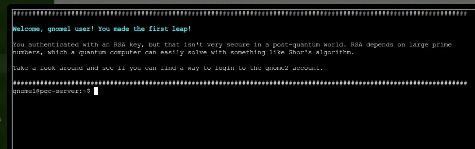

*First successful authentication using RSA*

**Welcome Message:**
```
Welcome, gnome1 user! You made the first leap!

You authenticated with an RSA key, but that isn't very secure in a post-quantum world. 
RSA depends on large prime numbers, which a quantum computer can easily solve with 
something like Shor's algorithm.

Take a look around and see if you can find a way to login to the gnome2 account.
```

**Authentication:**
```bash
ssh -i ~/.ssh/id_rsa gnome1@pqc-server.com
```

**Key Location Discovery:**

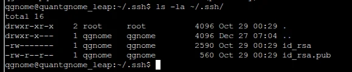

*Listing gnome1's .ssh directory*
```bash
ls -la ~/.ssh/
```

**Contents:**
```
total 16
drwxr-xr-x  2 root    root    4096 Oct 29 00:29 .
drwxr-x---  1 qgnome  qgnome  2590 Oct 29 00:29 ..
-rw-r-----  1 qgnome  qgnome   560 Oct 29 00:29 id_rsa.pub
```

**RSA Vulnerability:**
- Based on integer factorization problem
- Shor's algorithm provides exponential speedup on quantum computers
- 2048-bit RSA breakable by sufficiently large quantum computer
- Deprecated for future use in NIST PQC standards

**Next Key Discovery:**

Examining gnome1's home directory reveals the next authentication key for gnome2.

### Gnome 2: Classical Ed25519 Authentication

**Authentication:**
```bash
ssh -i ~/.ssh/id_ed25519 gnome2@localhost
```

**Welcome Message:**
```
Welcome, gnome2 user! You made the second leap!

You authenticated with an Ed25519 key. While this is more efficient than RSA, 
it's still vulnerable to quantum attacks as it relies on the elliptic curve 
discrete logarithm problem.

Take a look around and see if you can find a way to login to the gnome3 account.
```

**Ed25519 Analysis:**
- Edwards-curve Digital Signature Algorithm
- 256-bit key size (much smaller than RSA)
- Faster than RSA for signing/verification
- **Still vulnerable to quantum attacks** via Shor's algorithm
- Discrete logarithm problem solvable by quantum computers

### Gnome 3: Pure PQC (MAYO) Authentication

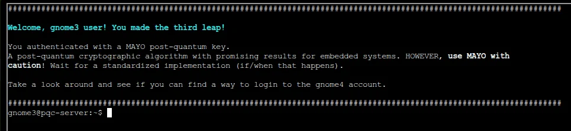

*MAYO algorithm authentication success*

**Authentication:**
```bash
ssh -i ~/.ssh/id_mayo2 gnome3@localhost
```

**Welcome Message:**
```
Welcome, gnome3 user! You made the third leap!

You authenticated with a MAYO post-quantum key.
A post-quantum cryptographic algorithm with promising results for embedded systems. 
HOWEVER, use MAYO with caution! Wait for a standardized implementation (if/when that happens).

Take a look around and see if you can find a way to login to the gnome4 account.
```

**MAYO Algorithm:**
- **Type**: Multivariate cryptography
- **Status**: Not NIST-standardized (experimental)
- **Advantage**: Efficient for resource-constrained embedded systems
- **Caution**: Awaiting formal standardization and security proofs
- **Use Case**: Research and testing environments only

**Security Note:**
Pure PQC algorithms like MAYO provide quantum resistance but lack the battle-tested reliability of classical algorithms. Hybrid approaches are recommended for production systems.

### Gnome 4: Hybrid PQC Authentication

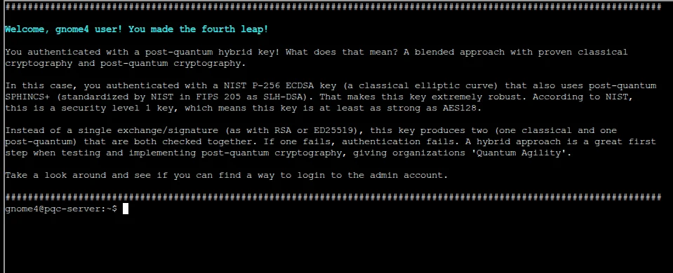

*Hybrid ECDSA + SPHINCS+ authentication*

**Authentication:**
```bash
ssh -i ~/.ssh/id_ecdsa_nistp256_sphincssha2128fsimple gnome4@localhost
```

**Welcome Message:**
```
Welcome, gnome4 user! You made the fourth leap!

You authenticated with a post-quantum hybrid key! What does that mean? A blended approach 
with proven classical cryptography and post-quantum cryptography.

In this case, you authenticated with a NIST P-256 ECDSA key (a classical elliptic curve) 
that also uses post-quantum SPHINCS+ (standardized by NIST in FIPS 205 as SLH-DSA). 
That makes this key extremely robust. According to NIST, this is a security level 1 key, 
which means this key is at least as strong as AES128.

Instead of a single exchange/signature (as with RSA or ED25519), this key produces two 
(one classical and one post-quantum) that are both checked together. If one fails, 
authentication fails. A hybrid approach is a great first step when testing and 
implementing post-quantum cryptography, giving organizations 'quantum agility'.

Take a look around and see if you can find a way to login to the admin account.
```

**Hybrid Key Components:**

**1. Classical Component: ECDSA NIST P-256**
- Elliptic Curve Digital Signature Algorithm
- 256-bit prime field elliptic curve
- Equivalent to ~3072-bit RSA security
- Proven, widely deployed, trusted

**2. PQC Component: SPHINCS+ SHA2-128f**
- Hash-based signature scheme
- NIST FIPS 205 standardized as SLH-DSA
- Security Level 1 (AES-128 equivalent)
- Conservative, well-understood security

**Authentication Flow:**
1. Client generates two signatures (ECDSA + SPHINCS+)
2. Server verifies both signatures independently
3. Both must succeed for authentication
4. Failure of either component = authentication denied

**Quantum Agility:**
- If quantum computers break ECDSA → SPHINCS+ still secure
- If SPHINCS+ vulnerability discovered → ECDSA provides fallback
- Smooth transition as PQC algorithms mature

---

## Admin Access: Maximum Security

### Final Authentication

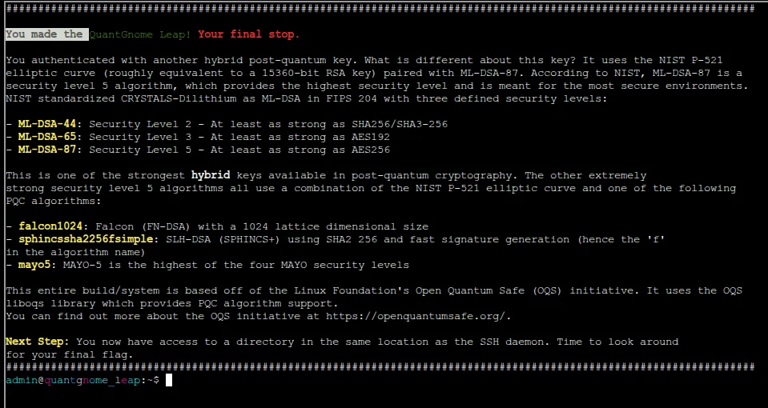

*Admin account accessed with strongest hybrid key (ECDSA P-521 + ML-DSA-87)*

**Authentication:**
```bash
ssh -i ~/.ssh/id_ecdsa_nistp521_mldsa87 admin@localhost
```

**Welcome Message:**
```
You made the QuantGnome Leap! Your final stop.

You authenticated with another hybrid post-quantum key. What is different about this key? 
It uses the NIST P-521 elliptic curve (roughly equivalent to a 15360-bit RSA key) paired 
with ML-DSA-87. According to NIST, ML-DSA-87 is a security level 5 algorithm, which means 
this is meant for the most secure environments. NIST standardized CRYSTALS-Dilithium as 
ML-DSA in FIPS 204 with three defined security levels:

- ML-DSA-44: Security Level 2 - At least as strong as SHA256/SHA-3-256
- ML-DSA-65: Security Level 3 - At least as strong as AES192
- ML-DSA-87: Security Level 5 - At least as strong as AES256

This is one of the strongest hybrid keys available in post-quantum cryptography. The other 
extremely strong security level 5 algorithms all use a combination of the NIST P-521 
elliptic curve and one of the following PQC algorithms:

- falcon1024: Falcon (FN-DSA) with a 1024 lattice dimensional size
- sphincssha2256fsimple: SLH-DSA (SPHINCS+) using SHA2 and MAYO-5 security level
- mayo3: MAYO-5 is the highest of the four MAYO security levels

This entire build/system is based off of the Linux Foundation's Open Quantum Safe (OQS) 
initiative. It uses the OQS liboqs library which provides PQC algorithm support.
You can find out more about the OQS initiative at https://openquantumsafe.org/.

Next Step: You now have access to a directory in the same location as the SSH daemon. 
Time to look around for your final flag.
```

### Flag Retrieval

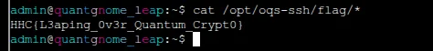

*Flag file discovered in /opt/oqs-ssh/flag/ directory*

**Flag Discovery:**
```bash
ls -la /opt/oqs-ssh/flag/
cat /opt/oqs-ssh/flag/*
```

**Flag:** `HHC{L3aping_0v3r_Quantum_Crypt0}`

---

## Technical Deep Dive

### ML-DSA (CRYSTALS-Dilithium) Analysis

**Algorithm Foundation:**
- **Type**: Lattice-based cryptography
- **Hard Problem**: Module Learning With Errors (M-LWE)
- **NIST Standard**: FIPS 204
- **Original Name**: CRYSTALS-Dilithium

**Security Levels:**

| Variant | Security Level | Equivalent Strength | Public Key Size | Signature Size |
|---------|----------------|---------------------|-----------------|----------------|
| ML-DSA-44 | 2 | SHA-256 collision | 1,312 bytes | 2,420 bytes |
| ML-DSA-65 | 3 | AES-192 | 1,952 bytes | 3,293 bytes |
| ML-DSA-87 | 5 | AES-256 | 2,592 bytes | 4,595 bytes |

**Why Lattice-Based?**
- Resistant to both classical and quantum attacks
- Based on worst-case hardness assumptions
- Efficient implementation possible
- Structured lattices (modules) reduce key sizes

**Trade-offs:**
- Larger keys than classical algorithms
- Larger signatures than ECDSA/EdDSA
- More computational overhead
- Still efficient enough for real-world deployment

### SPHINCS+ (SLH-DSA) Analysis

**Algorithm Foundation:**
- **Type**: Hash-based signatures
- **Security Basis**: Cryptographic hash function security
- **NIST Standard**: FIPS 205
- **Original Name**: SPHINCS+

**Advantages:**
- **Conservative security**: Based on well-understood hash functions
- **Minimal assumptions**: Only requires collision-resistant hash
- **Long-term security**: Hash functions historically very stable

**Disadvantages:**
- **Large signatures**: 7-49 KB depending on variant
- **Slow signing**: Multiple hash computations required
- **Use case**: Long-term signatures, firmware signing, certificates

### Falcon Analysis

**Algorithm Foundation:**
- **Type**: Lattice-based (NTRU lattices)
- **Advantage**: Smallest signatures among NIST finalists
- **Status**: NIST standardization as FN-DSA (expected FIPS 206)

**Variants:**
- **Falcon-512**: ~666-byte signatures, NIST Level 1
- **Falcon-1024**: ~1,280-byte signatures, NIST Level 5

**Trade-off:**
- Complex implementation (floating-point arithmetic)
- Smaller signatures compensate for implementation complexity
- Suitable for bandwidth-constrained applications

### MAYO Analysis

**Algorithm Foundation:**
- **Type**: Multivariate quadratic equations
- **Status**: Not NIST-standardized (alternative candidate)
- **Use Case**: Embedded systems, IoT devices

**Warning from Challenge:**
> "Use MAYO with caution! Wait for a standardized implementation (if/when that happens)."

**Why Caution?**
- Newer algorithm with less cryptanalysis
- Not yet peer-reviewed to NIST standards
- Potential for undiscovered vulnerabilities
- Should not be used in production without hybrid approach

---

## Authentication Chain Summary

### Progressive Cryptographic Strength
```
qgnome (local system)
  ↓ (Classical RSA - 2048-bit)
gnome1@pqc-server
  ↓ (Classical Ed25519 - 256-bit)
gnome2@pqc-server
  ↓ (Pure PQC - MAYO-2)
gnome3@pqc-server
  ↓ (Hybrid - ECDSA P-256 + SPHINCS+ SHA2-128f, Level 1)
gnome4@pqc-server
  ↓ (Hybrid - ECDSA P-521 + ML-DSA-87, Level 5)
admin@pqc-server
  ↓
FLAG: HHC{L3aping_0v3r_Quantum_Crypt0}
```

### Security Evolution Table

| Account | Algorithm | Type | NIST Level | Quantum Safe? | Key Size |
|---------|-----------|------|------------|---------------|----------|
| gnome1 | RSA-2048 | Classical | 0 | ❌ No | 2048 bits |
| gnome2 | Ed25519 | Classical | 0 | ❌ No | 256 bits |
| gnome3 | MAYO-2 | Pure PQC | 3 | ✅ Yes | 2986 bits |
| gnome4 | ECDSA P-256 + SPHINCS+ | Hybrid | 1 | ✅ Yes | 288 + 32 bits |
| admin | ECDSA P-521 + ML-DSA-87 | Hybrid | 5 | ✅ Yes | 585 + 2592 bits |

---

## Key Generation Tool Analysis

### PQC-Keygen Functionality

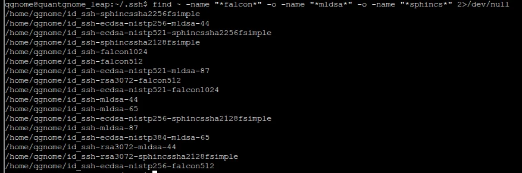

*Using find command to locate all generated SSH keys*

**Key Storage Location:**
```bash
find ~/.ssh -name "id_ssh*" -o -name "*falcon*" -o -name "*mldsa*" -o -name "*sphincs*" 2>/dev/null
```

**Result:**
```
/home/qgnome/id_ssh-ecdsa-nistp256-mldsa-44
/home/qgnome/id_ssh-ecdsa-nistp521-sphincssha2256fsimple
/home/qgnome/id_ssh-sphincssha2128fsimple
/home/qgnome/id_ssh-falcon1024
/home/qgnome/id_ssh-falcon512
/home/qgnome/id_ssh-ecdsa-nistp521-mldsa-87
/home/qgnome/id_ssh-mldsa-44
/home/qgnome/id_ssh-mldsa-65
/home/qgnome/id_ssh-ecdsa-nistp256-sphincssha2128fsimple
/home/qgnome/id_ssh-mldsa-87
/home/qgnome/id_ssh-rsa3072-falcon512
/home/qgnome/id_ssh-ecdsa-nistp521-falcon1024
/home/qgnome/id_ssh-ecdsa-nistp384-mldsa-65
/home/qgnome/id_ssh-rsa3072-mldsa-44
/home/qgnome/id_ssh-rsa3072-sphincssha2128fsimple
/home/qgnome/id_ssh-ecdsa-nistp256-falcon512
```

**Key Naming Convention:**
- `id_ssh-[classical]-[pqc]` for hybrid keys
- `id_ssh-[algorithm]` for pure classical/PQC keys

**File Pair Structure:**
```bash
id_ssh-ecdsa-nistp521-mldsa-87      # Private key
id_ssh-ecdsa-nistp521-mldsa-87.pub  # Public key
```

### SSH Key Usage

**Specifying Key for Authentication:**
```bash
ssh -i /path/to/private_key user@host
```

**Example:**
```bash
ssh -i ~/.ssh/id_ecdsa_nistp521_mldsa87 admin@localhost
```

**Key Permissions:**
- Private keys: `600` (read/write for owner only)
- Public keys: `644` (readable by all)
- Incorrect permissions cause SSH to reject keys

---

## Real-World Implications

### Transition Timeline

**Current State (2024-2025):**
- NIST PQC standards published (FIPS 203-205)
- Major vendors implementing PQC support
- Testing and deployment beginning
- Hybrid mode recommended

**Near Future (2025-2030):**
- Widespread PQC adoption in TLS, SSH, VPNs
- Classical algorithms gradually deprecated
- Hybrid mode standard practice
- Certificate authorities issuing PQC certificates

**Long Term (2030+):**
- Pure PQC deployments increase
- Classical algorithms phased out for most use cases
- Quantum computers potentially operational
- Post-quantum security essential

### Migration Strategies

**1. Inventory Current Cryptography:**
- Identify all systems using RSA, ECDSA, ECDH
- Document key sizes and lifespans
- Assess quantum vulnerability exposure

**2. Implement Hybrid Solutions:**
- Deploy hybrid TLS (X25519 + Kyber)
- Use hybrid SSH (ECDSA + ML-DSA)
- Maintain backward compatibility

**3. Test and Validate:**
- Performance benchmarking
- Interoperability testing
- Security audit of implementations

**4. Plan for Pure PQC:**
- Timeline for classical deprecation
- Training for administrators
- Budget for infrastructure upgrades

### Industry Adoption

**Organizations Leading PQC Deployment:**
- **Google**: Chrome implementing Kyber in TLS
- **Cloudflare**: PQC experimentation in production
- **Microsoft**: Azure quantum-safe cryptography
- **AWS**: Post-quantum TLS support
- **Signal**: PQXDH protocol for messaging

---

## Answer

**Flag:** `HHC{L3aping_0v3r_Quantum_Crypt0}`

**Retrieved From:** `/opt/oqs-ssh/flag/`

---

## Key Takeaways

### Post-Quantum Cryptography Fundamentals

1. **Quantum Threat is Real:**
   - Shor's algorithm breaks RSA and ECC
   - Large-scale quantum computers potentially 10-20 years away
   - "Harvest now, decrypt later" attacks already occurring

2. **NIST Standardization Complete:**
   - FIPS 203: ML-KEM (Kyber) for key exchange
   - FIPS 204: ML-DSA (Dilithium) for signatures
   - FIPS 205: SLH-DSA (SPHINCS+) for conservative signatures

3. **Hybrid Approach Recommended:**
   - Combines classical + PQC security
   - Provides quantum agility during transition
   - Protected against failures in either component

4. **Multiple Algorithm Types:**
   - Lattice-based (ML-DSA, Falcon, Kyber)
   - Hash-based (SPHINCS+)
   - Multivariate (MAYO - experimental)
   - Code-based (Classic McEliece - not in this challenge)

### SSH PQC Implementation

1. **OQS-OpenSSH:**
   - Drop-in replacement for standard OpenSSH
   - Supports 28 classical and PQC algorithms
   - Enables testing of quantum-safe authentication

2. **Key Management:**
   - Generate multiple algorithm variants
   - Test compatibility and performance
   - Plan migration paths

3. **Progressive Authentication:**
   - Classical → Pure PQC → Hybrid
   - Demonstrates security evolution
   - Educational pathway for understanding PQC

### Security Best Practices

1. **Don't Wait for Quantum Computers:**
   - Begin PQC planning now
   - Implement hybrid solutions immediately
   - Protect long-term sensitive data

2. **Use Standardized Algorithms:**
   - Prefer NIST FIPS standards (ML-DSA, SLH-DSA)
   - Avoid experimental algorithms in production
   - Wait for full standardization (Falcon, MAYO)

3. **Defense in Depth:**
   - Multiple algorithm types (lattice + hash)
   - Hybrid classical + PQC
   - Regular security audits

4. **Performance Considerations:**
   - PQC algorithms have larger keys/signatures
   - May require infrastructure upgrades
   - Test throughput and latency impacts

---

## Challenge Complete! 🎊

**Status:** ✅ Completed

**Authentication Chain:** Classical RSA → Ed25519 → Pure PQC (MAYO) → Hybrid Level 1 (ECDSA+SPHINCS) → Hybrid Level 5 (ECDSA+ML-DSA-87)

**Final Algorithm:** ECDSA NIST P-521 + ML-DSA-87 (Maximum security, NIST Level 5)

**Educational Value:** Comprehensive introduction to post-quantum cryptography, NIST standardization, and practical PQC deployment via SSH

---

## References

### NIST PQC Standards
- [FIPS 203 - ML-KEM (Kyber)](https://csrc.nist.gov/pubs/fips/203/final)
- [FIPS 204 - ML-DSA (Dilithium)](https://csrc.nist.gov/pubs/fips/204/final)
- [FIPS 205 - SLH-DSA (SPHINCS+)](https://csrc.nist.gov/pubs/fips/205/final)
- [NIST PQC Project Overview](https://csrc.nist.gov/projects/post-quantum-cryptography)

### Open Quantum Safe
- [OQS Project Website](https://openquantumsafe.org/)
- [liboqs Library](https://github.com/open-quantum-safe/liboqs)
- [OQS-OpenSSH](https://github.com/open-quantum-safe/openssh)

### Algorithm Documentation
- [CRYSTALS-Dilithium](https://pq-crystals.org/dilithium/)
- [SPHINCS+](https://sphincs.org/)
- [Falcon](https://falcon-sign.info/)
- [MAYO](https://pqmayo.org/)

### Learning Resources
- [Quantum Computing Threat Timeline - NIST](https://csrc.nist.gov/publications/detail/white-paper/2016/04/27/quantum-resistant-public-key-cryptography-a-survey/final)
- [Migration to Post-Quantum Cryptography](https://media.defense.gov/2021/Aug/04/2002821837/-1/-1/1/Quantum_FAQs_20210804.PDF)
- [Cloudflare PQC Blog](https://blog.cloudflare.com/post-quantum-cryptography/)

---

*Writeup by SFC David P. Collette*  
*Regional Cyber Center - Korea (RCC-K)*  
*SANS Holiday Hack Challenge 2025*
