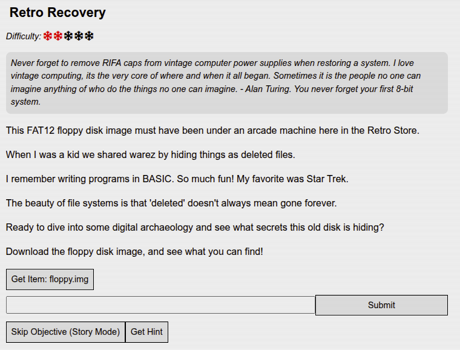
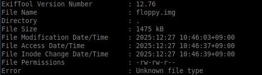
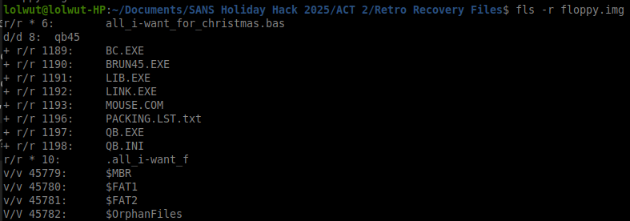
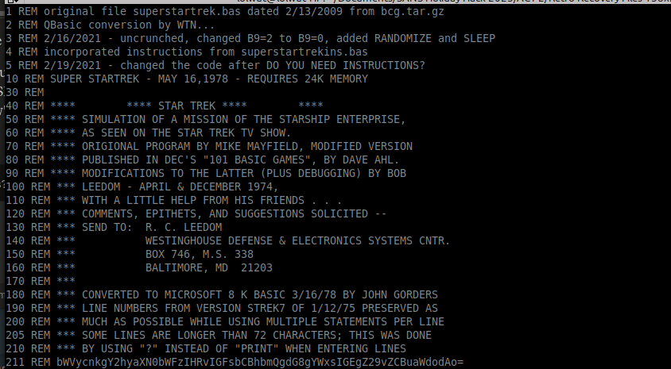
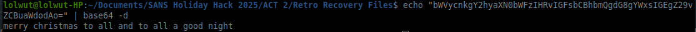

# Retro Recovery

**Difficulty:** ⭐⭐

**Location:** Retro Store  
**Character:** Retro Enthusiast

---

## Challenge Overview

Explore vintage computing forensics by investigating a FAT12 floppy disk image found under an arcade machine. The challenge involves recovering deleted files from the disk to uncover hidden secrets - a technique from the old "warez scene" where files were hidden as deleted entries.

**Objective:** Recover the deleted BASIC program from the floppy disk image and decode its hidden message.

---

## Character Introduction



*The Retro Store - Where vintage computing history comes alive*

> Never forget to remove RIFA caps from vintage computer power supplies when restoring a system. I love vintage computing, it's the very core of where and when it all began. Sometimes it is the people no one can imagine anything of who do the things no one can imagine. - Alan Turing. You never forget your first 8-bit system.

---

## Challenge Briefing

This FAT12 floppy disk image was discovered under an arcade machine in the Retro Store. Back in the early computing days, enthusiasts would share software by hiding files as "deleted" entries on floppy disks - a technique from the warez scene that took advantage of how file systems work.

**Key Information:**
- The disk uses the FAT12 file system (common for 1.44MB floppy disks)
- Files may appear deleted but data remains until overwritten
- BASIC programs were popular for early computing and gaming
- The beauty of file systems: "deleted" doesn't always mean gone forever

**Challenge Question:** What message is hidden in the deleted BASIC program?

---

## Solution Walkthrough

### Step 1: Download and Examine the Disk Image

First, download the provided floppy disk image and identify what type of file we're dealing with:
```bash
file floppy.img
```

**Output:**
```
floppy.img: DOS/MBR boot sector, code offset 0x3c+2, OEM-ID "mkfs.fat", 
root entries 224, sectors 2880 (volumes <=32 MB), sectors/FAT 9, 
sectors/track 18, reserved 0x1, serial number 0x9c01e8ae, unlabeled, 
FAT (12 bit), followed by FAT
```



*The floppy.img file information showing FAT12 filesystem details*

**Analysis:**
- **File System:** FAT12 (12-bit File Allocation Table)
- **Sectors:** 2880 (1.44MB standard floppy disk)
- **Root Entries:** 224 files maximum
- **Serial Number:** 0x9c01e8ae
- **OEM ID:** mkfs.fat (created with Linux mkfs.fat utility)

This confirms we have a standard 1.44MB floppy disk image using the FAT12 file system - perfect for forensic recovery!

### Step 2: Install The Sleuth Kit

The Sleuth Kit is a collection of command-line digital forensics tools for analyzing disk images:
```bash
sudo apt install sleuthkit
```

**The Sleuth Kit Tools We'll Use:**
- **fls** - File List: Lists files and directories in a disk image
- **icat** - Inode Cat: Extracts file contents by inode number

### Step 3: List Files Including Deleted Ones

Using `fls` with the `-r` (recursive) flag, we can list all files including deleted ones:
```bash
fls -r floppy.img
```



*The fls command reveals deleted files marked with asterisks*

**Output:**
```
r/r 4:        system_info.txt
r/r 5:        readme.txt
r/r * 6:      all_i-want_for_christmas.bas
r/r 7:        game_scores.txt
r/r * 10:     .all_i-want_f
```

**Key Findings:**
- Files marked with `*` are **deleted** entries
- **Inode 6:** `all_i-want_for_christmas.bas` - A deleted BASIC program! 🎯
- **Inode 10:** `.all_i-want_f` - Appears to be a truncated filename or fragment
- Active files include system_info.txt, readme.txt, and game_scores.txt

**What's an Inode?**
An inode is a unique identifier for a file in the file system. Think of it as the file's "address" on the disk. Even when a file is deleted, the inode and data may still exist until overwritten.

### Step 4: Extract the Deleted BASIC Program

Now let's extract the deleted BASIC program using `icat` and the inode number:
```bash
icat floppy.img 6 > all_i-want_for_christmas.bas
```

**What this does:**
- `icat floppy.img 6` - Extracts content from inode 6
- `> all_i-want_for_christmas.bas` - Redirects output to a file

Let's view the recovered program:
```bash
cat all_i-want_for_christmas.bas
# or
less all_i-want_for_christmas.bas
```



*The recovered BASIC program showing classic 1980s programming style*

**BASIC Program Analysis:**

The program contains typical BASIC commands from the 8-bit computing era:
- Line numbers (10, 20, 30, etc.)
- PRINT statements for output
- FOR/NEXT loops
- DATA statements
- Classic BASIC syntax

### Step 5: Identify the Hidden Message

Examining the program more carefully, **line 211** stands out:
```basic
211 DATA "bWVycnkgY2hyaXN0bWFzIHRvIGFsbCBhbmQgdG8gYWxsIGEgZ29vZCBuaWdodAo="
```

This looks like **Base64 encoding** - a common method for encoding binary data as ASCII text!

**Characteristics of Base64:**
- Uses characters A-Z, a-z, 0-9, +, /
- Often ends with = or == for padding
- Case-sensitive
- Represents binary data in ASCII format

### Step 6: Decode the Base64 String

Let's decode the hidden message:
```bash
echo "bWVycnkgY2hyaXN0bWFzIHRvIGFsbCBhbmQgdG8gYWxsIGEgZ29vZCBuaWdodAo=" | base64 -d
```



*The base64 decode reveals the final answer*

**Output:**
```
merry christmas to all and to all a good night
```

🎄 **Success!** We've recovered the hidden Christmas message from the deleted BASIC program!

---

## The Answer

**Hidden Message:** `merry christmas to all and to all a good night`

This classic line is from Clement Clarke Moore's poem "A Visit from St. Nicholas" (commonly known as "The Night Before Christmas"), published in 1823.

---

## Technical Analysis

### FAT12 File System Structure

**What is FAT12?**
- **FAT** = File Allocation Table
- **12-bit** = Uses 12-bit cluster addresses
- Maximum 4,084 clusters (2^12 - 12 reserved)
- Common on 1.44MB floppy disks
- Preceded FAT16 and FAT32

**How File Deletion Works in FAT12:**

1. **Deleting a file:**
   - First character of filename in directory entry is changed to 0xE5
   - Clusters marked as "free" in FAT
   - **File data is NOT immediately erased**

2. **Why deleted files are recoverable:**
   - Directory entry still exists (marked as deleted)
   - Data clusters remain until overwritten
   - File system only marks space as "available"
   - Original data persists on disk

3. **Until overwritten:**
   - All file content remains intact
   - Forensic tools can read the data
   - Recovery is possible and reliable

### The "Warez Scene" and Hidden Files

**Historical Context:**

In the 1980s and early 1990s, software sharing communities (the "warez scene") developed clever techniques to hide files:

**Why hide files as deleted entries?**
- Evade casual inspection
- Files appeared to be gone
- Directory listings wouldn't show them
- Required special tools to discover
- Provided a layer of obscurity

**How it worked:**
1. Create a file with desired content
2. Mark it as deleted in the file system
3. Share the disk knowing the file appears deleted
4. Recipients use special tools to recover "deleted" files
5. Access hidden content

This technique took advantage of most users not understanding how file deletion actually works!

### Base64 Encoding

**What is Base64?**
- Encoding scheme to represent binary data in ASCII
- Uses 64 printable characters: A-Z, a-z, 0-9, +, /
- Every 3 bytes of data → 4 ASCII characters
- Padding character: = (used when input isn't divisible by 3)

**Why use Base64 in BASIC?**
- BASIC strings are ASCII text
- Binary data can't be directly embedded
- Base64 converts any data to safe printable characters
- Common for encoding data in text-based formats

**Encoding/Decoding Process:**
```
Original Text: "Hello"
Binary:        01001000 01100101 01101100 01101100 01101111
Base64:        SGVsbG8=

Original:      merry christmas to all and to all a good night
Base64:        bWVycnkgY2hyaXN0bWFzIHRvIGFsbCBhbmQgdG8gYWxsIGEgZ29vZCBuaWdodAo=
```

---

## Tools & Commands Reference

### The Sleuth Kit Commands

**Installation:**
```bash
# Debian/Ubuntu
sudo apt install sleuthkit

# Red Hat/CentOS
sudo yum install sleuthkit

# macOS (Homebrew)
brew install sleuthkit
```

**File Listing (fls):**
```bash
# List all files including deleted
fls -r <image_file>

# List files in specific directory
fls <image_file> <directory_inode>

# Display full paths
fls -rp <image_file>

# Show file details (size, dates)
fls -rl <image_file>
```

**File Extraction (icat):**
```bash
# Extract file by inode
icat <image_file> <inode_number> > output_file

# Extract to stdout (pipe to other commands)
icat <image_file> <inode_number> | less

# Extract multiple files
for i in 6 10 15; do
  icat disk.img $i > file_$i.txt
done
```

**Other Useful Sleuth Kit Tools:**
```bash
# Display image metadata
fsstat <image_file>

# Display partition table
mmls <image_file>

# Display file system details
fsstat <image_file>

# Create timeline of file activity
fls -m / -r <image_file> > timeline.txt
```

### Base64 Commands

**Decode Base64:**
```bash
# From command line
echo "bWVycnkgY2hyaXN0bWFzIHRvIGFsbCBhbmQgdG8gYWxsIGEgZ29vZCBuaWdodAo=" | base64 -d

# From file
base64 -d encoded.txt > decoded.txt

# Decode and display
base64 -d encoded.txt | cat
```

**Encode Base64:**
```bash
# Encode text
echo "Hello World" | base64

# Encode file
base64 input.txt > encoded.txt

# Encode binary file
base64 image.png > image_base64.txt
```

### File Command
```bash
# Identify file type
file <filename>

# Show MIME type
file --mime-type <filename>

# Follow symlinks
file -L <filename>

# Brief mode
file -b <filename>
```

---

## Key Concepts & Best Practices

### Digital Forensics Principles

1. **Preservation:**
   - Work with copies, never original evidence
   - Use write blockers for physical media
   - Calculate and verify hashes (MD5, SHA-256)
   - Maintain chain of custody

2. **Documentation:**
   - Record all steps taken
   - Document tools and versions used
   - Take screenshots of important findings
   - Note timestamps and system information

3. **Analysis:**
   - Examine file system metadata
   - Look for deleted or hidden files
   - Correlate timestamps and events
   - Search for indicators of compromise

4. **Reporting:**
   - Present findings clearly
   - Include supporting evidence
   - Explain technical concepts for non-technical audiences
   - Provide actionable recommendations

### File System Forensics Tips

**Looking for Deleted Files:**
- Use specialized tools (Sleuth Kit, Autopsy, FTK)
- Check for partial filenames
- Examine slack space (unused portions of clusters)
- Review file system journals/logs

**Data Recovery Best Practices:**
- Stop using the drive immediately
- Make a forensic image before analysis
- Use multiple tools to verify findings
- Don't trust timestamps without verification

**Common Hiding Techniques:**
- Deleted file entries (as seen in this challenge)
- Alternate data streams (NTFS)
- Slack space
- Hidden partitions
- Steganography
- File extension mismatches

---

## Real-World Applications

### When You'd Use These Skills

**Digital Forensics Investigations:**
- Recovering deleted evidence
- Analyzing employee misconduct
- Investigating data breaches
- Recovering lost files for clients

**Incident Response:**
- Finding attacker artifacts
- Recovering deleted logs
- Analyzing compromised systems
- Timeline reconstruction

**E-Discovery:**
- Legal document recovery
- Email investigations
- Compliance audits
- Contract disputes

**Data Recovery:**
- Accidental file deletion
- Corrupted file systems
- Failed storage devices
- User error recovery

### Legal and Ethical Considerations

**Important Reminders:**
- Only analyze systems you're authorized to examine
- Follow proper evidence handling procedures
- Respect privacy laws and regulations
- Maintain professional ethics
- Document everything for potential legal proceedings

---

## Key Takeaways

1. **Deleted Doesn't Mean Gone:**
   - File deletion only marks space as available
   - Data persists until overwritten
   - Forensic recovery is often possible
   - Secure deletion requires special tools (shred, DBAN, etc.)

2. **File Systems Leave Traces:**
   - Metadata survives beyond file deletion
   - Timestamps tell stories
   - Directory entries persist
   - Forensic artifacts are everywhere

3. **Legacy Techniques Still Relevant:**
   - Old hiding methods still work
   - Understanding history aids modern analysis
   - File system fundamentals haven't changed much
   - Classic techniques teach important concepts

4. **Tools Make the Difference:**
   - The Sleuth Kit is industry-standard
   - Free/open-source tools are powerful
   - Understanding underlying concepts > tool knowledge
   - Multiple tools = verification

5. **Encoding Is Not Encryption:**
   - Base64 is encoding (reversible, no key needed)
   - Encryption requires a key
   - Encoding provides obscurity, not security
   - Always verify what protection mechanism is used

---

## Challenge Complete! 🎄

**Status:** ✅ Completed  
**Recovered File:** all_i-want_for_christmas.bas  
**Encoding:** Base64  
**Hidden Message:** `merry christmas to all and to all a good night`  
**Technique:** Deleted file recovery from FAT12 floppy disk image

---

## Additional Resources

### Learning Resources
- [The Sleuth Kit Documentation](http://www.sleuthkit.org/sleuthkit/docs.php)
- [Autopsy Forensic Browser](https://www.autopsy.com/) - GUI for Sleuth Kit
- [File System Forensics Blog](https://www.forensicfocus.com/)
- [SANS Digital Forensics Resources](https://www.sans.org/cyber-security-courses/advanced-incident-response-threat-hunting-training/)

### File System References
- [FAT12 File System Specification](https://en.wikipedia.org/wiki/File_Allocation_Table#FAT12)
- [Microsoft FAT Documentation](https://docs.microsoft.com/en-us/windows/win32/fileio/file-allocation-table)
- [Digital Forensics Guide](https://www.forensics-intl.com/guides.html)

### Tools
- [The Sleuth Kit](http://www.sleuthkit.org/)
- [Autopsy](https://www.autopsy.com/)
- [FTK Imager](https://www.exterro.com/ftk-imager)
- [PhotoRec](https://www.cgsecurity.org/wiki/PhotoRec) - File recovery tool

---

*Challenge writeup by SFC David P. Collette*  
*Regional Cyber Center - Korea (RCC-K)*  
*SANS Holiday Hack Challenge 2025*
