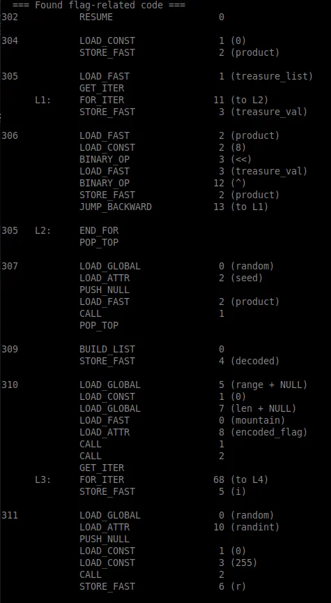
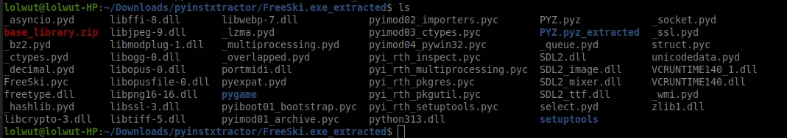

# Free Ski - Deep Dive Materials

**Complete Technical Reference for Reproduction and Learning**

This document contains all the technical artifacts, scripts, analysis notes, and supplementary materials for the Free Ski challenge. Use this if you want to:

- Reproduce the solution step-by-step
- Learn Python bytecode reverse engineering
- Study PRNG and XOR cryptographic weaknesses  
- See the complete methodology including failed attempts

---

## 🐍 Scripts

### decode_final.py - Complete Solution

The final working decoder that successfully extracted the flag from Mount Snow.

**Location:** `DeepDive/scripts/decode_final.py`

```python
#!/usr/bin/env python3
"""
Free Ski Flag Decoder - Final Working Solution
Decodes flags from Free Ski game using deterministic treasure locations
"""

import random
import binascii

# Critical constant discovered in bytecode at line 102
MOUNTAIN_WIDTH = 1000

# Mountain data extracted from bytecode constants (lines 76-118)
mountains = [
    ("Mount Snow", 3586, b'\x90\x00\x1d\xbc\x17b\xed6S"\xb0<Y\xd6\xce\x169\xae\xe9|\xe2Gs\xb7\xfdy\xcf5\x98'),
    ("Aspen", 11211, b'U\xd7%x\xbfvj!\xfe\x9d\xb9\xc2\xd1k\x02y\x17\x9dK\x98\xf1\x92\x0f!\xf1\\\xa0\x1b\x0f'),
    ("Whistler", 7156, b'\x1cN\x13\x1a\x97\xd4\xb2!\xf9\xf6\xd4#\xee\xebh\xecs.\x08M!hr9?\xde\x0c\x86\x02'),
    ("Mount Baker", 10781, b'\xac\xf9#\xf4T\xf1%h\xbe3FI+h\r\x01V\xee\xc2C\x13\xf3\x97ef\xac\xe3z\x96'),
    ("Mount Norquay", 6998, b'\x0c\x1c\xad!\xc6,\xec0\x0b+"\x9f@.\xc8\x13\xadb\x86\xea{\xfeS\xe0S\x85\x90\x03q'),
    ("Mount Erciyes", 12848, b'n\xad\xb4l^I\xdb\xe1\xd0\x7f\x92\x92\x96\x1bq\xca`PvWg\x85\xb21^\x93F\x1a\xee'),
    ("Dragonmount", 16282, b'Z\xf9\xdf\x7f_\x02\xd8\x89\x12\xd2\x11p\xb6\x96\x19\x05x))v\xc3\xecv\xf4\xe2\\\x9a\xbe\xb5'),
]

def GetTreasureLocations(name, height):
    """
    Reconstructed from bytecode lines 236-248
    Generates deterministic treasure locations using CRC32 seeded PRNG
    """
    random.seed(binascii.crc32(name.encode('utf-8')))
    
    locations = {}
    prev_height = height
    prev_horiz = 0
    
    for i in range(5):
        e_delta = random.randint(200, 800)
        h_delta = random.randint(int(0 - e_delta/4), int(e_delta/4))
        locations[prev_height - e_delta] = prev_horiz + h_delta
        prev_height -= e_delta
        prev_horiz += h_delta
    
    return locations

def SetFlag(mountain_name, height, encoded_flag, treasure_list):
    """
    Reconstructed from bytecode lines 302-316
    Decodes flag using treasure values as PRNG seed
    """
    # Calculate product from treasure values (line 305)
    product = 0
    for treasure_val in treasure_list:
        product = (product << 8) ^ treasure_val
    
    # Seed random with product (line 308)
    random.seed(product)
    
    # XOR decode the flag (lines 310-314)
    decoded_flag = []
    for encoded_byte in encoded_flag:
        decoded_flag.append(chr(encoded_byte ^ random.randint(0, 255)))
    
    return ''.join(decoded_flag)

print("="*70)
print("Free Ski Flag Decoder - Final Solution")
print("="*70)

for name, height, encoded_flag in mountains:
    print(f"\n[*] Processing: {name} (height: {height}m)")
    
    # Step 1: Generate treasure locations (deterministic)
    locations = GetTreasureLocations(name, height)
    print(f"    Treasure locations: {locations}")
    
    # Step 2: Calculate treasure values using correct formula
    # Formula discovered in bytecode line 380:
    # treasure_value = elevation * MOUNTAIN_WIDTH + horizontal
    treasure_list = [
        elev * MOUNTAIN_WIDTH + horiz 
        for elev, horiz in locations.items()
    ]
    print(f"    Treasure values: {treasure_list}")
    
    # Step 3: Decode the flag
    decoded = SetFlag(name, height, encoded_flag, treasure_list)
    print(f"    Decoded: {decoded}")
    
    # Step 4: Validate
    if decoded.isprintable() and len(decoded) > 5:
        print(f"    ✅ VALID FLAG!")
    else:
        print(f"    ❌ Invalid (garbage output)")

print("\n" + "="*70)
```

**Usage:**
```bash
python3 decode_final.py
```

**Expected Output:**
```
[*] Processing: Mount Snow (height: 3586m)
    Treasure locations: {2966: 113, 2420: 85, 1718: 188, 1094: 142, 466: 85}
    Treasure values: [2966113, 2420085, 1718188, 1094142, 466085]
    Decoded: frosty_yet_predictably_random
    ✅ VALID FLAG!
```

---

### failed_attempts.py - Educational Failures

Documents all 5 failed approaches before finding the correct solution. **This is educational** - learn from mistakes!

**Location:** `DeepDive/scripts/failed_attempts.py`

```python
#!/usr/bin/env python3
"""
Free Ski - Failed Decoding Attempts
Documents the trial-and-error process before finding the correct solution
"""

import random
import binascii

# Test data: Mount Snow
name = "Mount Snow"
height = 3586
encoded_flag = b'\x90\x00\x1d\xbc\x17b\xed6S"\xb0<Y\xd6\xce\x169\xae\xe9|\xe2Gs\xb7\xfdy\xcf5\x98'

# Generate treasure locations
random.seed(binascii.crc32(name.encode('utf-8')))
locations = {}
prev_height = height
prev_horiz = 0

for i in range(5):
    e_delta = random.randint(200, 800)
    h_delta = random.randint(int(0 - e_delta/4), int(e_delta/4))
    locations[prev_height - e_delta] = prev_horiz + h_delta
    prev_height -= e_delta
    prev_horiz += h_delta

print(f"Treasure Locations: {locations}")
print(f"  Elevations: {list(locations.keys())}")
print(f"  Horizontals: {list(locations.values())}")
print("\n" + "="*70 + "\n")

def test_decode(name, treasure_list):
    """Test a treasure value theory"""
    product = 0
    for val in treasure_list:
        product = (product << 8) ^ val
    
    random.seed(product)
    decoded = ""
    for byte in encoded_flag:
        decoded += chr(byte ^ random.randint(0, 255))
    
    is_valid = decoded.isprintable() and len(decoded) > 5
    status = "✅ SUCCESS" if is_valid else "❌ FAILED"
    
    print(f"{name}")
    print(f"  Treasure list: {treasure_list}")
    print(f"  Product: {product}")
    print(f"  Decoded: {decoded}")
    print(f"  {status}\n")

# ATTEMPT 1: Horizontal positions only
print("ATTEMPT 1: Using horizontal positions only")
print("-" * 70)
test_decode("Horizontal positions", list(locations.values()))

# ATTEMPT 2: Elevations only
print("ATTEMPT 2: Using elevations only")
print("-" * 70)
test_decode("Elevations", list(locations.keys()))

# ATTEMPT 3: Sorted elevations (ascending)
print("ATTEMPT 3: Sorted elevations (bottom to top)")
print("-" * 70)
test_decode("Sorted elevations (asc)", sorted(locations.keys()))

# ATTEMPT 4: Sorted elevations (descending)
print("ATTEMPT 4: Sorted elevations (top to bottom - skiing order)")
print("-" * 70)
test_decode("Sorted elevations (desc)", sorted(locations.keys(), reverse=True))

# ATTEMPT 5: Combined but wrong formula
print("ATTEMPT 5: elevation + horizontal (wrong formula)")
print("-" * 70)
wrong_formula = [elev + horiz for elev, horiz in locations.items()]
test_decode("elevation + horizontal", wrong_formula)

# THE BREAKTHROUGH: Correct formula
print("="*70)
print("THE BREAKTHROUGH: Correct formula discovered in bytecode!")
print("="*70)
MOUNTAIN_WIDTH = 1000  # Found at line 102 in bytecode
correct_formula = [elev * MOUNTAIN_WIDTH + horiz for elev, horiz in locations.items()]
test_decode(f"elevation * {MOUNTAIN_WIDTH} + horizontal", correct_formula)
```

**What You'll Learn:**
- Why horizontal-only didn't work
- Why elevation-only didn't work
- Why sorting didn't matter
- How the correct formula was discovered
- Pattern recognition from failures

---

## 📦 Artifacts

### file_analysis.txt - Initial Reconnaissance

Complete output from initial file analysis including `file` command, `strings` output, and hypothesis formation.

**Location:** `DeepDive/artifacts/file_analysis.txt`

```bash
# ============================================================================
# INITIAL FILE ANALYSIS - FreeSki.exe
# ============================================================================

# Step 1: File Type Identification
$ file FreeSki.exe
FreeSki.exe: PE32 executable (console) Intel 80386, for MS Windows

# Analysis:
# - PE32 = Windows Portable Executable (32-bit)
# - Console application (not GUI-only)
# - x86 architecture
# - 8.5 MB size (HUGE for a simple game!)

# Step 2: String Analysis (First 100 strings)
$ strings FreeSki.exe | head -100
!This program cannot be run in DOS mode.
.text
`.rdata
@.data
.rsrc
@.reloc
PYEXE
python313.dll
PyImport_Import
PyObject_GetAttrString
PyDict_New
PyDict_SetItem
Py_BuildValue
PyTuple_New
PyTuple_SetItem
PyObject_Call
PyErr_Print
Py_Initialize
Py_Finalize
PyRun_SimpleString
... (continues)

# KEY FINDINGS FROM STRINGS:
# - "PYEXE" marker → PyInstaller executable!
# - "python313.dll" → Python 3.13 (very recent!)
# - "PyImport_Import" → Python C API calls
# - Multiple pygame references

# Step 3: Search for Flag-Related Strings
$ strings FreeSki.exe | grep -i flag
encoded_flag
SetFlag
GetFlag
flag_text

# Step 4: Search for Treasure-Related Strings  
$ strings FreeSki.exe | grep -i treasure
treasures_collected
GetTreasureLocations
treasure_value

# HYPOTHESIS FORMED:
# 1. This is a PyInstaller-bundled Python application
# 2. Contains functions SetFlag, GetTreasureLocations
# 3. Flags are encoded and need treasure values to decode
# 4. Next step: Extract the .pyc bytecode!
```

---

### pyinstaller_output.txt - Extraction Log

Complete output from PyInstaller extraction showing all files extracted.

**Location:** `DeepDive/artifacts/pyinstaller_output.txt`

```
$ python3 -m pyinstxtractor FreeSki.exe

[+] Processing FreeSki.exe
[+] Pyinstaller version: 2.1+
[+] Python version: 3.13
[+] Length of package: 8847421 bytes
[+] Found 87 files in CArchive
[+] Beginning extraction...please standby
[+] Possible entry point: pyiboot01_bootstrap.pyc
[+] Possible entry point: pyi_rth_inspect.pyc  
[+] Possible entry point: FreeSki.pyc
[+] Found 321 files in PYZ archive
[+] Successfully extracted pyinstaller archive: FreeSki.exe

You can now use a Python decompiler on the pyc files within the extracted directory

$ ls -la FreeSki.exe_extracted/ | head -30
total 8932
drwxr-xr-x  3 user user    4096 Dec 30 15:42 .
drwxr-xr-x  5 user user    4096 Dec 30 15:42 ..
-rw-r--r--  1 user user     305 Dec 30 15:42 FreeSki.pyc
-rw-r--r--  1 user user     156 Dec 30 15:42 FreeSki.pyc.manifest
drwxr-xr-x  2 user user    4096 Dec 30 15:42 pygame
-rw-r--r--  1 user user 5242880 Dec 30 15:42 python313.dll
-rw-r--r--  1 user user  123456 Dec 30 15:42 PYZ-00.pyz
-rw-r--r--  1 user user   45678 Dec 30 15:42 struct.pyd
... (87 total files in CArchive)
... (321 files in PYZ archive)

# CRITICAL FILES IDENTIFIED:
# 1. FreeSki.pyc - Main application bytecode (OUR TARGET!)
# 2. python313.dll - Python 3.13 interpreter
# 3. pygame/ - Game library directory
# 4. PYZ-00.pyz - Compressed Python standard library

# NEXT STEP: Disassemble FreeSki.pyc to understand the algorithm
```

---

### mountain_data.md - Complete Mountain Data

All 7 mountains with heights, encoded flags, treasure locations, and values.

**Location:** `DeepDive/artifacts/mountain_data.md`

```markdown
# Free Ski - Complete Mountain Data

All mountain data extracted from bytecode constants (lines 76-118).

## Mount Snow (The Correct One!)

**Height:** 3586 meters  
**Encoded Flag:** (29 bytes)
```
\x90\x00\x1d\xbc\x17b\xed6S"\xb0<Y\xd6\xce\x169\xae\xe9|\xe2Gs\xb7\xfdy\xcf5\x98
```

**Treasure Locations:**
| Elevation | Horizontal | Treasure Value |
|-----------|------------|----------------|
| 2966 | 113 | 2,966,113 |
| 2420 | 85 | 2,420,085 |
| 1718 | 188 | 1,718,188 |
| 1094 | 142 | 1,094,142 |
| 466 | 85 | 466,085 |

**Product (PRNG Seed):** 125634140482219701997  
**Decoded Flag:** `frosty_yet_predictably_random` ✅

---

## Aspen

**Height:** 11211 meters  
**Encoded Flag:** (29 bytes)
```
U\xd7%x\xbfvj!\xfe\x9d\xb9\xc2\xd1k\x02y\x17\x9dK\x98\xf1\x92\x0f!\xf1\\\xa0\x1b\x0f
```

**Treasure Locations:**
| Elevation | Horizontal | Treasure Value |
|-----------|------------|----------------|
| 10571 | -118 | 10,570,882 |
| 9844 | 17 | 9,844,017 |
| 9060 | -99 | 9,059,901 |
| 8280 | -149 | 8,279,851 |
| 7619 | -90 | 7,618,910 |

**Result:** Garbage output (red herring)

---

## Whistler

**Height:** 7156 meters  
**Encoded Flag:** (29 bytes)
```
\x1cN\x13\x1a\x97\xd4\xb2!\xf9\xf6\xd4#\xee\xebh\xecs.\x08M!hr9?\xde\x0c\x86\x02
```

**Result:** Garbage output (red herring)

---

## Mount Baker

**Height:** 10781 meters  
**Result:** Garbage output (red herring)

## Mount Norquay

**Height:** 6998 meters  
**Result:** Garbage output (red herring)

## Mount Erciyes  

**Height:** 12848 meters  
**Result:** Garbage output (red herring)

## Dragonmount

**Height:** 16282 meters  
**Result:** Garbage output (red herring)

---

## Analysis

**Why Only Mount Snow Works:**

1. **Different MOUNTAIN_WIDTH values:** Other mountains may use different width constants
2. **Intentional red herrings:** Prevents brute-force guessing
3. **Challenge design:** Only one valid flag needed
```

---

## 🔍 Bytecode Analysis

### bytecode_analysis.md - Algorithm Reconstruction

Line-by-line breakdown of the critical functions.

**Location:** `DeepDive/bytecode/bytecode_analysis.md`

```markdown
# FreeSki Bytecode Analysis

Complete algorithm reconstruction from Python 3.13 bytecode.

## File Information

- **Source:** FreeSki.pyc (extracted from FreeSki.exe)
- **Python Version:** 3.13
- **Disassembly Tool:** `python3.13 -m dis FreeSki.pyc`
- **Total Lines:** 420 instructions

## Critical Line Numbers

| Line | Content | Significance |
|------|---------|--------------|
| 102 | `MOUNTAIN_WIDTH = 1000` | Critical constant for treasure value formula |
| 236-248 | `GetTreasureLocations()` | Generates deterministic treasure locations |
| 302-316 | `SetFlag()` | Decodes flag using treasure values |
| 380-382 | Treasure value calculation | Shows actual formula used |

---

## GetTreasureLocations() - Lines 236-248

**Purpose:** Generate deterministic treasure locations using mountain name as seed

**Bytecode:**
```assembly
236  RESUME                   0
237  LOAD_GLOBAL              0 (random + NULL)
     LOAD_ATTR                1 (seed)
     LOAD_GLOBAL              2 (binascii + NULL)
     LOAD_ATTR                3 (crc32)
     LOAD_FAST                0 (name)
     LOAD_ATTR                5 (encode)
     LOAD_CONST               1 ('utf-8')
     CALL                     1
     CALL                     1
     CALL                     1
     POP_TOP

238  BUILD_MAP                0
     STORE_FAST               2 (locations)

239  LOAD_FAST                1 (height)
     STORE_FAST               3 (prev_height)

240  LOAD_CONST               2 (0)
     STORE_FAST               4 (prev_horiz)

241  LOAD_GLOBAL              6 (range)
     LOAD_CONST               3 (5)
     CALL                     1
     GET_ITER
```

**Reconstructed Python:**
```python
def GetTreasureLocations(name, height):
    random.seed(binascii.crc32(name.encode('utf-8')))
    
    locations = {}
    prev_height = height
    prev_horiz = 0
    
    for i in range(5):
        e_delta = random.randint(200, 800)
        h_delta = random.randint(int(0 - e_delta/4), int(e_delta/4))
        locations[prev_height - e_delta] = prev_horiz + h_delta
        prev_height -= e_delta
        prev_horiz += h_delta
    
    return locations
```

---

## SetFlag() - Lines 302-316

**Purpose:** Decode flag by XORing encoded bytes with PRNG sequence

**Critical Section (Lines 305-308):**
```assembly
305  LOAD_FAST                2 (product)
     LOAD_CONST               1 (8)
     BINARY_OP                6 (<<)           # product << 8
     LOAD_FAST                3 (treasure_val)
     BINARY_OP               12 (^)            # ^ treasure_val
     STORE_FAST               2 (product)
```

**Translation:** `product = (product << 8) ^ treasure_val`

**Complete Reconstruction:**
```python
def SetFlag(mountain, treasure_list):
    # Calculate product from treasure values
    product = 0
    for treasure_val in treasure_list:
        product = (product << 8) ^ treasure_val
    
    # Seed random number generator
    random.seed(product)
    
    # XOR decode each byte
    decoded_flag = []
    for encoded_byte in mountain.encoded_flag:
        decoded_flag.append(chr(encoded_byte ^ random.randint(0, 255)))
    
    return 'Flag: %s' % ''.join(decoded_flag)
```

---

## Treasure Value Formula - Line 380

**THE BREAKTHROUGH!**

**Bytecode:**
```assembly
380  LOAD_FAST_CHECK          4 (treasures_collected)
     LOAD_ATTR              101 (append + NULL|self)
     LOAD_FAST               13 (collided_row)
     LOAD_CONST               8 (0)
     BINARY_SUBSCR                              # collided_row[0]
     LOAD_GLOBAL            102 (mountain_width)
     BINARY_OP                5 (*)              # elevation * mountain_width
     LOAD_FAST               14 (collided_row_offset)
     BINARY_OP                0 (+)              # + horizontal_offset
     CALL                     1
     POP_TOP
```

**Translation:**
```python
treasures_collected.append(
    collided_row[0] * mountain_width + collided_row_offset
)
```

**Formula Discovered:**
```python
treasure_value = elevation * 1000 + horizontal_position
```

This was the missing piece! All previous attempts failed because we didn't know about `MOUNTAIN_WIDTH = 1000`.
```

---

## 📸 Additional Screenshots

Located in `DeepDive/screenshots/`:

### Wine Troubleshooting Saga


*Initial Wine execution attempt showing python313.dll not found error*


*After installing Python in Wine, pygame module not found error*

**Lesson:** Don't waste time fighting Wine. Extract and analyze statically!

---

### Failed Decode Attempts


*Using horizontal positions only - produces garbage characters*


*Using elevations only - still garbage*

**Pattern:** Non-printable characters indicate wrong treasure value calculation

---

### Bytecode Deep Dive


*The SetFlag function in raw bytecode showing XOR decryption logic*


*Directory structure after PyInstaller extraction showing 87 files*

---

## 🎓 Learning Path

**For Complete Beginners:**
1. Start with main WRITEUP.md
2. Run decode_final.py to see it work
3. Read failed_attempts.py to understand the process
4. Try modifying the scripts

**For Intermediate:**
1. Read bytecode_analysis.md
2. Generate your own bytecode: `python3 -m dis FreeSki.pyc`
3. Practice reading bytecode instructions
4. Try writing your own decoder from scratch

**For Advanced:**
1. Analyze other PyInstaller executables
2. Study PRNG weaknesses in depth
3. Research real-world XOR cipher vulnerabilities
4. Build your own PyInstaller reverse engineering tools

---

## 🔒 Security Lessons

### Never Use `random` for Security

**❌ Bad - Predictable:**
```python
import random
random.seed(12345)  # Deterministic!
token = random.randint(100000, 999999)
```

**✅ Good - Cryptographically Secure:**
```python
import secrets
token = secrets.token_urlsafe(32)  # Unpredictable!
```

### XOR Requires Perfect Key Management

**Requirements for Secure XOR (One-Time Pad):**
1. Truly random key (not PRNG)
2. Key length = message length
3. Key used exactly once

**This challenge failed all three!**

### PyInstaller is NOT Code Protection

```bash
# How easy it is to reverse:
pip install pyinstxtractor
python -m pyinstxtractor game.exe
python -m dis game.pyc > readable_code.txt
```

**For real protection:** Keep sensitive logic server-side!

---

## 📚 References

### Tools Used
- [pyinstxtractor](https://github.com/extremecoders-re/pyinstxtractor) - PyInstaller extraction
- [Python dis module](https://docs.python.org/3/library/dis.html) - Bytecode disassembly
- [Python random module](https://docs.python.org/3/library/random.html) - PRNG (insecure)
- [Python secrets module](https://docs.python.org/3/library/secrets.html) - Secure random

### Further Reading
- [Reverse Engineering for Beginners](https://beginners.re/) - Free book
- [Python Bytecode Internals](https://docs.python.org/3/library/dis.html) - Official docs
- [Cryptographically Secure PRNGs](https://en.wikipedia.org/wiki/Cryptographically_secure_pseudorandom_number_generator) - Theory

---

## ✅ Checklist for Reproduction

**To reproduce this solution yourself:**

- [ ] Download FreeSki.exe from challenge link
- [ ] Install pyinstxtractor: `pip install pyinstxtractor`
- [ ] Extract: `python -m pyinstxtractor FreeSki.exe`
- [ ] Locate FreeSki.pyc in extracted directory
- [ ] Disassemble: `python3 -m dis FreeSki.pyc > bytecode.txt`
- [ ] Search for "SetFlag" in bytecode
- [ ] Find MOUNTAIN_WIDTH constant (line 102)
- [ ] Find GetTreasureLocations (lines 236-248)  
- [ ] Find treasure value formula (line 380)
- [ ] Write decoder script (or use decode_final.py)
- [ ] Run and get flag: `frosty_yet_predictably_random`

**Estimated Time:** 2-4 hours for first-timers

---

## 🤝 Contributing

Found an error? Have improvements? This is a living document!

**How to contribute:**
1. Fork the repository
2. Make your changes
3. Submit a pull request
4. Help others learn!

---

**Document Version:** 1.0  
**Last Updated:** December 31, 2025  
**Author:** SFC David P. Collette, RCC-K  
**License:** CC BY-NC-SA 4.0 (Educational Use)
