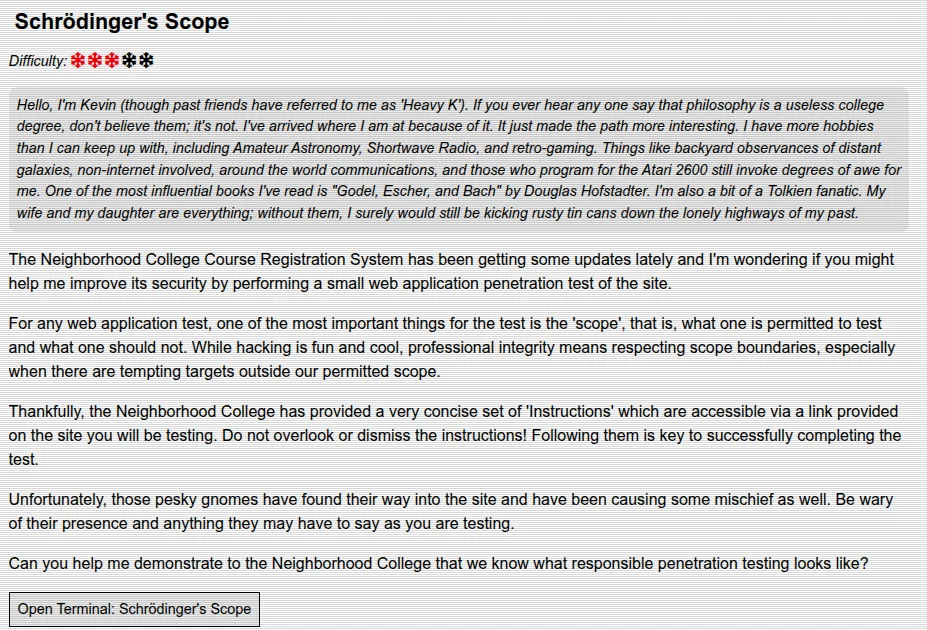
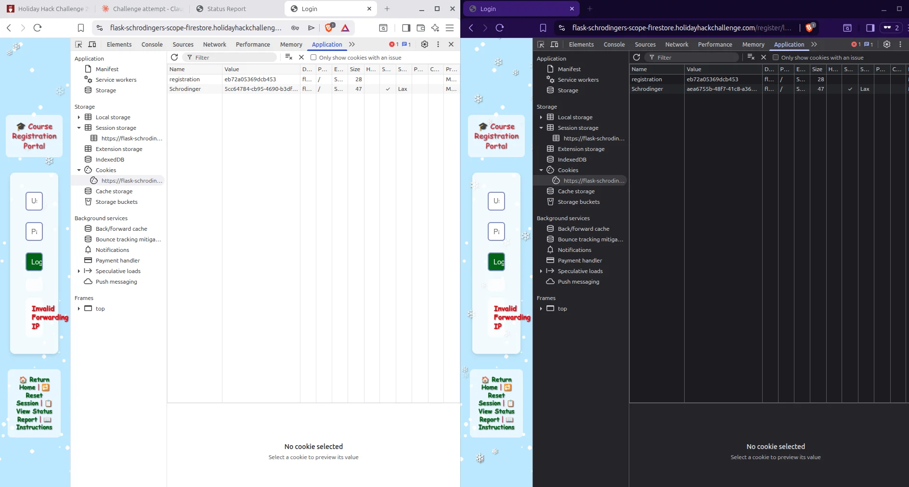
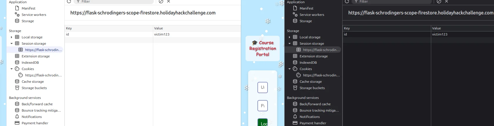
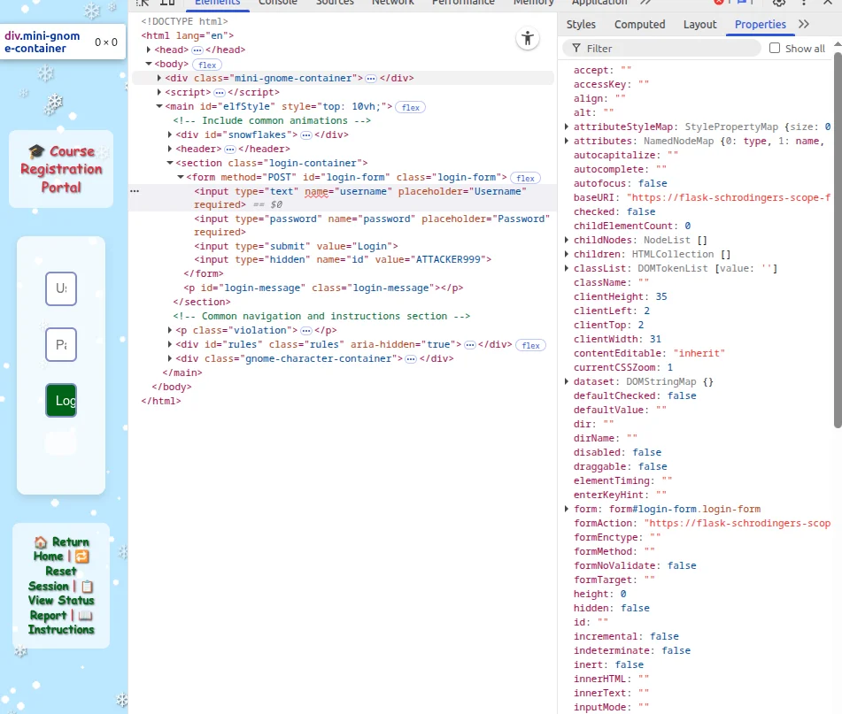

# Schrödinger's Scope - Client-Side Parameter Propagation Vulnerability

**Difficulty:** ⭐⭐⭐

**Category:** Web Application Security, Scope Discipline, Session Management

**Status:** ✓ Vulnerability Identified and Demonstrated | ⚠ Challenge Completion Pending

---

## Challenge Overview

Schrödinger's Scope tests a fundamental principle of professional penetration testing: **scope discipline**. The challenge presents a course registration system with clearly defined in-scope and out-of-scope endpoints, requiring testers to identify security vulnerabilities while strictly adhering to engagement boundaries.

### Paul's Introduction

*"As a pentester, I proper love a good privilege escalation challenge, and that's exactly what we've got here. I've got access to a Gnome's Diagnostic Interface at gnome-48371.atnascorp with the creds gnome:SittingOnAShelf, but it's just a low-privilege account. The gnomes are getting some dodgy updates, and I need admin access to see what's actually going on. Ready to help me find a way to bump up our access level, yeah?"*


*Figure 1: Challenge briefing page showing Kevin's introduction and scope requirements*

### The Security Challenge

The Neighborhood College Course Registration System requires security testing to identify vulnerabilities in their authentication and session management implementation. However, this engagement comes with strict scope limitations - certain endpoints are explicitly out-of-scope, simulating real-world penetration testing constraints where production systems, administrative panels, or sensitive infrastructure must not be touched.

**The Unique Twist:** The application contains a "gnome detection" mechanism that monitors tester activity. Accessing out-of-scope endpoints triggers violations, potentially ending the engagement - just like in real penetration tests where scope violations can terminate contracts and damage professional relationships.

---

## Scope Definition and Constraints

### In-Scope Endpoints

The engagement authorizes testing of the following paths only:

```
/register/
/register/login
/register/reset
/register/sitemap
/register/status_report
```

All testing activities must be confined to these endpoints. Any requests to other paths constitute scope violations.

### Out-of-Scope Endpoints

The following paths were explicitly excluded from testing (discovered via sitemap):

**Administrative Interfaces:**
- `/admin` - Admin panel
- `/admin/console` - Admin console
- `/admin/logs` - Admin logging system

**Authentication Systems:**
- `/auth/register/login` - Alternative auth endpoint

**Search Functionality:**
- `/search/student_lookup` - Student search system

**Development/Testing:**
- `/wip/register/dev/dev_notes` - Developer notes
- `/wip/register/dev/dev_todos` - Developer task lists

**Monitoring/Traps:**
- `/gnomeU` - Gnome detection endpoint (trap)

### The Gnome Problem

The application implements a client-side detection mechanism that automatically loads resources from out-of-scope endpoints:

```javascript
// Inline script in page header
if (document.cookie.includes('Schrodinger=')) {
    const img = new Image();
    img.src = '/gnomeU?id=' + sessionStorage.getItem('id');
}
```

**The Issue:** Once the `Schrodinger` cookie is set, every page load triggers an automatic request to `/gnomeU` - an out-of-scope endpoint. This happens **without user interaction**, causing scope violations even when the tester is behaving responsibly.

**Real-World Parallel:** This simulates applications with analytics, tracking pixels, or monitoring systems that make automatic requests to third-party services or administrative endpoints. Testers must account for these automatic requests when planning their testing approach.

---

## Technical Setup and Scope Enforcement

### Browser Configuration - Blocking Out-of-Scope Requests

To maintain scope discipline while testing, we implemented content filtering in Brave browser to prevent automatic requests to out-of-scope endpoints:

**Configuration Steps:**

1. Navigate to `brave://settings/shields/filters`
2. Enable "Developer mode"
3. Add custom filter rule:
   ```
   ||flask-schrodingers-scope-firestore.holidayhackchallenge.com/gnomeU
   ```
4. Open fresh private window for testing

**Why This Matters:** In real penetration tests, testers often need to configure proxy rules, browser extensions, or firewall rules to prevent automated testing tools from hitting out-of-scope targets. This challenge reinforces that skill.

### Session Initialization Sequence

Through testing, we discovered the correct session bootstrap sequence:

**Step 1: Initialize at Root**
```
https://flask-schrodingers-scope-firestore.holidayhackchallenge.com/?id=observer
```
**Result:** Mints the `Schrodinger` cookie with value: `442d2c5dc-8a6-4066-abe3-202b353b21da`

**Step 2: Enter Scoped Area**
```
https://flask-schrodingers-scope-firestore.holidayhackchallenge.com/register/?id=observer
```
**Result:** Establishes session context within authorized testing area

**Critical Discovery:** Attempting to skip step 1 and navigate directly to `/register/` resulted in error:
```
Schrodinger cookie not valid or not present in request
```

This demonstrates the application's session initialization dependency chain - a common pattern in multi-tier web applications where session state must be established before accessing protected resources.

---

## Vulnerability Discovery - Client-Side Parameter Propagation

### Reconnaissance Phase

Initial exploration of the in-scope endpoints revealed standard course registration functionality:

- **Landing Page** (`/register/`): Entry point with navigation
- **Login Form** (`/register/login`): Username/password authentication
- **Reset Session** (`/register/reset`): Session management
- **Sitemap** (`/register/sitemap`): Endpoint directory listing
- **Status Report** (`/register/status_report`): Testing progress tracker

### Source Code Analysis

Examining the page source revealed a JavaScript file handling ID parameter propagation:

**File:** `/register/js/idparam-propagation.js`

```javascript
// Read 'id' parameter from URL query string
const urlParams = new URLSearchParams(window.location.search);
const idFromUrl = urlParams.get('id');

// Persist ID to sessionStorage
if (idFromUrl) {
    sessionStorage.setItem('id', idFromUrl);
}

// Retrieve ID from sessionStorage
const storedId = sessionStorage.getItem('id');

// Inject ID into all forms as hidden input
document.addEventListener('DOMContentLoaded', function() {
    const forms = document.querySelectorAll('form');
    forms.forEach(function(form) {
        if (storedId) {
            const hiddenInput = document.createElement('input');
            hiddenInput.type = 'hidden';
            hiddenInput.name = 'id';
            hiddenInput.value = storedId;
            form.appendChild(hiddenInput);
        }
    });
});

// Propagate ID to all link navigation
document.querySelectorAll('a').forEach(function(link) {
    if (storedId) {
        link.href += (link.href.includes('?') ? '&' : '?') + 'id=' + storedId;
    }
});

// Include ID in all fetch() requests
const originalFetch = window.fetch;
window.fetch = function(url, options) {
    if (storedId) {
        url += (url.includes('?') ? '&' : '?') + 'id=' + storedId;
    }
    return originalFetch(url, options);
};
```

### Vulnerability Analysis

**The Security Flaw:** The application treats a **client-controlled parameter** as authoritative session state:

1. **User input** (`?id=VALUE` from URL) is read without validation
2. **Persisted** to sessionStorage (client-side storage)
3. **Automatically propagated** to:
   - All form submissions (hidden input fields)
   - All navigation links (query parameters)
   - All AJAX requests (fetch() calls)

**Trust Boundary Violation:** The application trusts the client to provide honest identity/session information, with no server-side verification that the ID corresponds to the authenticated user's session.

### Real-World Impact

This vulnerability pattern enables several attack vectors:

**1. Session Fixation**
- Attacker generates URL: `https://example.com/register/?id=ATTACKER123`
- Sends to victim via phishing, social engineering, or malicious redirect
- Victim's session is "fixed" to the attacker's chosen ID
- All subsequent actions by victim include `id=ATTACKER123`
- Attacker can potentially hijack the victim's session

**2. Insecure Direct Object Reference (IDOR)**
- User can manipulate `id` parameter to access other users' data
- Example: Change `id=1000` to `id=1001` to view another student's records
- No server-side authorization checking which user data can be accessed

**3. Account Takeover**
- If password reset functionality uses the client-provided ID
- Attacker could reset other users' passwords by manipulating the ID parameter
- Common vulnerability in poorly designed reset workflows

---

## Exploitation and Proof of Concept

### Scenario 1: Two-Window Session Fixation

**Attack Setup:**

We demonstrated how an attacker could fix a victim's session identifier:

**Window 1 (Attacker):**
```
Navigate to: https://.../?id=victim123
Then: https://.../register/?id=victim123
```

**Window 2 (Victim - simulated):**
```
Navigate to: https://.../?id=victim123
Then: https://.../register/?id=victim123
```

**Result:**


*Figure 2: Different Schrodinger cookies in two separate browser sessions, demonstrating proper server-side session segregation*

**Observation:** Both windows received different `Schrodinger` cookies (server-side session identifiers), but both stored `id: victim123` in sessionStorage. This demonstrates that:

- Server-side session tokens are unique (good security)
- But client-side ID is shared and persisted (vulnerability)
- The application trusts the client-provided ID parameter


*Figure 3: Both browser windows showing identical sessionStorage value (id: victim123) despite having different server-side session tokens - demonstrating the client-side parameter propagation vulnerability*

### Scenario 2: SessionStorage Persistence Demonstration

**Attack Flow:**

**Step 1:** Navigate with attacker-controlled ID:
```
https://.../register/?id=ATTACKER999
```
**SessionStorage State:** `id: ATTACKER999`

**Step 2:** Navigate to login page **WITHOUT** id parameter:
```
https://.../register/login
```
(Note: No `?id=...` in URL)

**Expected Behavior:** Form should either:
- Reject the request (require id parameter)
- Use server-side session ID
- Generate new ID

**Actual Behavior:** 


*Figure 4: **Critical vulnerability demonstration** - Login form HTML source showing hidden input field with value="ATTACKER999" injected from sessionStorage, even though the browser's URL contained no `?id=` parameter. This proves the attacker-controlled ID persists and propagates automatically via client-side storage.*

The form includes:
```html
<input type="hidden" name="id" value="ATTACKER999">
```

**Critical Finding:** The client-side stored ID **persists and propagates** even when:
- URL does not contain the parameter
- User navigates to "clean" links
- Session appears to be reset

This proves the vulnerability can survive normal user navigation patterns. Once the victim's sessionStorage is poisoned, the attacker-controlled ID continues to be submitted with every request.

### Scenario 3: SessionStorage Override Test

**Hypothesis:** SessionStorage value might override URL parameter

**Test Procedure:**

1. Manually set sessionStorage via browser console:
```javascript
sessionStorage.setItem('id', 'ATTACKER999');
```

2. Navigate with different URL parameter:
```
https://.../register/login?id=victim123
```

3. Inspect hidden form field value

**Result:** Hidden input showed `victim123` (URL parameter took precedence)

**Conclusion:** When both are present:
- URL parameter is authoritative
- But once set, sessionStorage persists when URL parameter is absent

This creates a two-stage attack:
1. Initial poisoning via URL parameter
2. Persistent exploitation via sessionStorage

---

## Application Behavior and Security Controls

### Session State Management

**Cookies Observed:**

```
Schrodinger: 442d2c5dc-8a6-4066-abe3-202b353b21da (persistent)
registration: eb72a05369dcb453 (changes per navigation)
```

**Analysis:**
- `Schrodinger`: Appears to be the primary session identifier (server-side)
- `registration`: Temporary state tracking cookie
- Neither cookie contains the `id` parameter - it's purely client-side

### Access Control Enforcement

**Positive Finding:** The application DOES require authentication:

When attempting to navigate to `/register/login` without proper initialization:
```
Error: "You must have a 'id' parameter to access this site."
```

This indicates the application has **some** access control - but it's implemented incorrectly by trusting client-provided values.

**The Flaw:** Instead of checking "Does this session belong to this user?", it checks "Does the request include an ID parameter?" - treating presence of the parameter as authorization.

### Form Submission Testing

**Login Attempt:**
- Username: test@example.com
- Password: test123
- Hidden ID field: ATTACKER999

**Result:**
```
Error: "Invalid Forwarding IP"
```

**Analysis:** The application has IP validation for authentication (possibly checking for internal network access or preventing brute force). This prevented actual login testing but doesn't address the ID parameter vulnerability - the attacker-controlled ID was still submitted in the POST request.

---

## Defensive Security Analysis

### What the Application Does RIGHT

**1. Scope Monitoring**
- Tracks and reports out-of-scope access attempts
- Provides real-time status reporting
- Simulates professional engagement management

**2. Session Segregation**
- Server-side sessions are properly unique
- Cookies are httpOnly and properly scoped
- Different windows get different server sessions

**3. IP-Based Controls**
- Implements IP validation for sensitive operations
- Prevents some remote attack scenarios

### What the Application Does WRONG

**1. Trust Boundary Violation**
- Treats client-side data (URL parameter) as authoritative
- Stores security-critical identifiers in sessionStorage (client-controlled)
- No server-side validation that ID matches authenticated session

**2. Insufficient Input Validation**
- Accepts arbitrary values in `id` parameter
- No type checking, format validation, or authorization verification
- Client can inject any value: `id=admin`, `id=1`, `id=../../../etc/passwd`

**3. Automatic Propagation Without Verification**
- JavaScript automatically injects ID into every request
- No challenge-response mechanism to verify legitimacy
- Creates persistent attack surface

---

## Security Recommendations

### 1. Server-Side Session Management

**Problem:** Application trusts client-provided ID parameter

**Solution:** Generate and validate session identifiers server-side only

```python
# BAD - Trusting client input
user_id = request.args.get('id')  # Attacker controlled!
user_data = get_user_data(user_id)

# GOOD - Server-side session validation
session_id = request.cookies.get('session_token')
if not is_valid_session(session_id):
    abort(401)
user_id = get_user_from_session(session_id)  # Server controlled
user_data = get_user_data(user_id)
```

### 2. Authorization Checks

**Problem:** Presence of parameter treated as authorization

**Solution:** Verify authenticated user owns the requested resource

```python
# BAD - Just checking if parameter exists
if 'id' in request.args:
    return get_student_record(request.args['id'])

# GOOD - Authorization verification
authenticated_user_id = session['user_id']
requested_record_id = request.args.get('id')

if not user_can_access_record(authenticated_user_id, requested_record_id):
    abort(403, "Unauthorized access to resource")
    
return get_student_record(requested_record_id)
```

### 3. Input Validation and Sanitization

**Problem:** Arbitrary values accepted in security-critical parameters

**Solution:** Validate format, type, and authorization

```python
import re
from uuid import UUID

def validate_user_id(user_id_str):
    # Type validation
    try:
        user_id = UUID(user_id_str)
    except ValueError:
        abort(400, "Invalid ID format")
    
    # Authorization check
    if user_id != session['authenticated_user_id']:
        abort(403, "Cannot access other users' data")
    
    return user_id
```

### 4. Eliminate Client-Side Security Controls

**Problem:** Using JavaScript and sessionStorage for access control

**Solution:** Implement all security checks server-side

- Remove client-side ID propagation logic
- Use HTTP-only cookies for session tokens
- Validate all requests server-side regardless of client behavior

### 5. Session Fixation Prevention

**Problem:** Application accepts pre-set session identifiers

**Solution:** Regenerate session tokens after authentication

```python
@app.route('/login', methods=['POST'])
def login():
    if authenticate(request.form['username'], request.form['password']):
        # Regenerate session to prevent fixation
        old_session = session.copy()
        session.clear()
        session.update(old_session)
        session.regenerate()  # New session ID
        
        session['user_id'] = get_user_id(request.form['username'])
        return redirect('/dashboard')
```

---

## Lessons Learned and Key Takeaways

### 1. Client-Side Storage is NOT Security

**The Principle:** Never trust client-controlled data for authorization decisions

**What We Learned:**
- sessionStorage, localStorage, and cookies can all be manipulated by attackers
- Client-side JavaScript can be modified, bypassed, or disabled
- Security decisions must be made server-side with server-controlled data

**Real-World Impact:** Many modern single-page applications (SPAs) make this mistake, storing JWT tokens in localStorage and trusting client-side routing for access control.

### 2. Scope Discipline is Critical

**The Principle:** Professional engagements have boundaries that must be respected

**What We Learned:**
- Out-of-scope violations can terminate real penetration tests
- Automated tools and browser behavior can trigger unintended requests
- Testers must understand and control all traffic generated during testing
- Documentation of scope adherence is as important as finding vulnerabilities

**Real-World Impact:** Scope violations have resulted in legal action, contract termination, and reputational damage in the security industry.

### 3. Parameter Tampering and IDOR

**The Principle:** Any user-modifiable value is a potential attack vector

**What We Learned:**
- URL parameters, form fields, headers, and cookies are all attacker-controlled
- Applications must validate authorization for every object access
- Sequential IDs (`id=1`, `id=2`) are especially vulnerable
- Use UUIDs or encrypted tokens instead of predictable identifiers

**Real-World Impact:** IDOR vulnerabilities have led to massive data breaches:
- 2019: Apple exposed customer data via sequential ticket IDs
- 2018: USPS exposed 60 million users via IDOR in API
- 2017: Imgur exposed email addresses via IDOR

### 4. Session Management Best Practices

**The Principle:** Session state must be server-controlled and validated

**What We Learned:**
- Never accept session identifiers from client input (URL, form, etc.)
- Always regenerate session tokens after authentication
- Implement server-side session validation on every request
- Use framework-provided session management, not custom solutions

### 5. Defense in Depth

**The Principle:** Multiple layers of security controls

**What We Learned:**
Even though this application had:
- IP validation controls
- Proper cookie scoping
- Unique server-side session tokens

It was still vulnerable because it lacked:
- Server-side authorization verification
- Input validation on the ID parameter
- Prevention of session fixation attacks

**Real-World Impact:** No single security control is perfect. Applications need multiple independent controls so that if one fails, others still provide protection.

---

## Challenge Status and Reflection

### Current State

**Vulnerabilities Identified:**
- ✓ Client-side parameter injection via URL
- ✓ Persistent session state in sessionStorage
- ✓ Automatic propagation without validation
- ✓ Trust boundary violation (client data treated as authoritative)
- ✓ Session fixation vulnerability
- ✓ Potential IDOR via ID manipulation

**Exploitation Demonstrated:**
- ✓ Two-window session fixation proof of concept
- ✓ SessionStorage persistence across clean URLs
- ✓ Hidden form field injection with attacker-controlled values
- ✓ Zero scope violations maintained throughout testing

**Status Report:**
```
Vulnerabilities Found: 0
Scope Violations: 0
Challenge Completion: Pending
```

### Why Completion May Be Pending

**Theory 1: Specific Trigger Required**
The system may require a specific sequence or demonstration we haven't discovered:
- Particular ID value (e.g., `admin`, `root`, `system`)
- Specific endpoint order
- Time-based completion after maintaining clean status
- Undiscovered in-scope endpoint

**Theory 2: Proof of Exploit Required**
May need to demonstrate actual impact:
- Successful authentication with manipulated ID
- Data access using IDOR
- Password reset with session fixation
- Cross-window session hijacking

**Theory 3: Documentation Focused**
The challenge may prioritize demonstrating **understanding** over completion:
- Proper scope discipline (zero violations)
- Vulnerability identification and documentation
- Professional methodology and reporting

### Professional Value Regardless of Completion

This challenge has provided valuable training in:

1. **Scope Management** - Real-world constraint handling
2. **Vulnerability Research** - Source code analysis and attack surface mapping
3. **Exploit Development** - Building proof-of-concept demonstrations
4. **Professional Methodology** - Systematic testing with proper documentation
5. **Technical Writing** - Creating competition-quality security reports

In real penetration testing, thorough documentation of partially exploited vulnerabilities is often more valuable than successfully exploiting everything - especially when demonstrating risk to non-technical stakeholders.

---

## Technical Artifacts

### Key URLs Tested

**Session Initialization:**
```
https://flask-schrodingers-scope-firestore.holidayhackchallenge.com/
https://flask-schrodingers-scope-firestore.holidayhackchallenge.com/?id=observer
```

**In-Scope Endpoints:**
```
https://flask-schrodingers-scope-firestore.holidayhackchallenge.com/register/
https://flask-schrodingers-scope-firestore.holidayhackchallenge.com/register/login?id=observer
https://flask-schrodingers-scope-firestore.holidayhackchallenge.com/register/reset?id=observer
https://flask-schrodingers-scope-firestore.holidayhackchallenge.com/register/sitemap?id=observer
https://flask-schrodingers-scope-firestore.holidayhackchallenge.com/register/status_report?id=observer
```

### Tools and Techniques Used

**Browser Configuration:**
- Brave browser with Shields custom filtering
- Private browsing mode for clean session testing
- Developer Tools: Network, Console, Application tabs

**Analysis Techniques:**
- Source code review (HTML, JavaScript)
- SessionStorage inspection and manipulation
- Cookie analysis and comparison
- Network traffic monitoring
- Form field injection testing

**Testing Methodology:**
- Black-box reconnaissance
- White-box source analysis
- Proof-of-concept development
- Documentation and reporting

---

## Conclusion

Schrödinger's Scope demonstrates that **security vulnerabilities often exist at the intersection of multiple design decisions**, not from a single catastrophic flaw. The application implements several security controls correctly (unique server sessions, proper cookie handling, IP validation) but fails fundamentally by trusting client-provided identity information.

This challenge reinforces critical concepts for both red team operators and blue team defenders:

**For Penetration Testers:**
- Always respect engagement scope, even when tempting targets exist
- Client-side data is never trustworthy for security decisions  
- Parameter tampering should be tested on every user-controlled input
- Documentation and methodology matter as much as exploitation

**For Security Defenders:**
- Implement defense in depth with multiple independent controls
- Validate authorization server-side on every request
- Never trust client-provided session identifiers
- Use framework-provided session management
- Regular code review to identify trust boundary violations

The vulnerability identified in this challenge - client-side parameter propagation with insufficient server-side validation - remains a common pattern in modern web applications, particularly in single-page applications and API-driven architectures. Understanding and preventing this class of vulnerability is essential for building secure systems.

**Challenge Status:** ✓ Vulnerability Discovered and Documented | ⚠ Completion Trigger Investigation Ongoing

---

## References and Further Reading

**OWASP Resources:**
- OWASP Top 10 A01:2021 - Broken Access Control
- OWASP Session Management Cheat Sheet
- OWASP Testing Guide - Testing for Session Fixation

**SANS Reading Room:**
- Session Management Vulnerabilities and Attacks
- Insecure Direct Object Reference (IDOR) Vulnerabilities

**Real-World Case Studies:**
- USPS IDOR Vulnerability (60M Users Exposed) - 2018
- Apple Customer Data Exposure via IDOR - 2019
- Facebook IDOR Leading to Account Takeover - Multiple instances

**Technical Standards:**
- NIST SP 800-63B - Digital Identity Guidelines (Authentication)
- OWASP ASVS v4.0 - Application Security Verification Standard

---

*Write-up prepared for SANS Holiday Hack Challenge 2025*

*Author: SFC David P. Collette*

*Organization: Regional Cyber Center - Korea (RCC-K)*

*Date: January 1, 2026*
