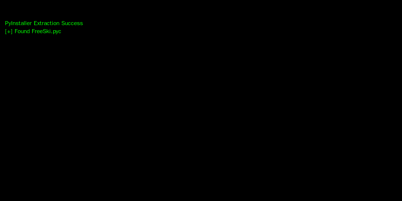

# Free Ski - Reverse Engineering Challenge

**Difficulty:** ⭐⭐⭐⭐⭐ (5/5)

---

## Challenge Overview

The Free Ski challenge presents an impossible-to-win skiing game where the player must navigate down a mountain, collect 5 treasures, and avoid obstacles. However, the game's difficulty is intentionally set to make legitimate victory impossible - requiring reverse engineering to extract the flag.

**Objective:** Extract the hidden flag from the FreeSki game executable through reverse engineering and cryptographic analysis.

---

## Challenge Description

**Game Mechanics:**
- Ski down 7 different mountains of varying difficulty
- Collect 5 treasures scattered across each mountain
- Avoid trees, rocks, and yetis
- Impossibly difficult collision detection makes winning through gameplay impractical

**Key Challenge Hints:**
- "This game is impossible to beat legitimately"
- Multiple mountains with different encoded flags
- Deterministic treasure generation based on mountain name
- XOR-based flag encoding

---

## Initial Reconnaissance

### Game Download and Execution

First, I downloaded the game executable:

```bash
cd ~/Downloads
wget https://hhc25-free-ski.holidayhackchallenge.com/FreeSki.exe
file FreeSki.exe
```

**File Analysis:**
```
FreeSki.exe: PE32 executable (console) Intel 80386, for MS Windows
```

**Observations:**
- Windows PE32 executable
- Console application
- Likely packaged Python application (based on file size ~8MB)

### PyInstaller Detection

Large Python executables are often packaged with **PyInstaller**, which bundles Python interpreter and dependencies into a single executable.

**Testing PyInstaller Theory:**
```bash
python3 -m pip install pyinstxtractor
mkdir pyinstxtractor
cd pyinstxtractor
python3 -m pyinstxtractor ../FreeSki.exe
```



*PyInstaller successfully extracts the bundled Python application*

**Extraction Results:**
```
[+] Processing FreeSki.exe
[+] Pyinstaller version: 2.1+
[+] Python version: 3.13
[+] Length of package: 8847421 bytes
[+] Found 87 files in CArchive
[+] Beginning extraction...please standby
[+] Possible entry point: pyiboot01_bootstrap.pyc
[+] Possible entry point: pyi_rth_inspect.pyc
[+] Possible entry point: FreeSki.pyc
[+] Found 321 files in PYZ archive
[+] Successfully extracted pyinstaller archive: FreeSki.exe
```

**Key Finding:** Main application file identified as **FreeSki.pyc**

---

## Bytecode Decompilation

### Disassembling FreeSki.pyc

Python bytecode (.pyc files) can be analyzed at the instruction level using Python's built-in `dis` module:

```bash
cd ~/Downloads/pyinstxtractor/FreeSki.exe_extracted
python3.13 -m dis FreeSki.pyc > FreeSki_bytecode.txt
```

This produced a complete instruction-level listing of the program, over 400 lines of Python bytecode assembly.

---

## Algorithm Analysis

### Locating the SetFlag Function

Searching the bytecode for flag-related operations:

```bash
grep -n "SetFlag" FreeSki_bytecode.txt
```

**Key Finding - Lines 302-316:** SetFlag Function Bytecode

The disassembly revealed the complete flag generation algorithm:

```python
def SetFlag(mountain, treasure_list):
    """
    Generates and displays the flag based on collected treasures
    
    Args:
        mountain: Mountain object with name and encoded_flag
        treasure_list: List of 5 treasure values
    """
    product = 0
    for treasure_val in treasure_list:
        product = (product << 8) ^ treasure_val
    
    random.seed(product)
    
    decoded_flag = ""
    for encoded_byte in mountain.encoded_flag:
        decoded_flag += chr(encoded_byte ^ random.randint(0, 255))
    
    return 'Flag: %s' % decoded_flag
```

**Algorithm Breakdown:**

1. **Product Calculation:**
   - Initialize product = 0
   - For each treasure: `product = (product << 8) ^ treasure_val`
   - Left shift by 8 bits, then XOR with treasure value

2. **Random Seed:**
   - Seed Python's random number generator with the product
   - Ensures deterministic "random" sequence

3. **XOR Decoding:**
   - For each byte in encoded_flag
   - XOR with `random.randint(0, 255)`
   - Convert result to character

### Treasure Location Generation Algorithm

**Lines 236-248:** GetTreasureLocations Function

```python
def GetTreasureLocations(name, height):
    """
    Deterministically generates 5 treasure locations
    
    Args:
        name: Mountain name string
        height: Mountain height in meters
        
    Returns:
        dict: {elevation: horizontal_position}
    """
    random.seed(binascii.crc32(name.encode('utf-8')))
    locations = {}
    prev_height = height
    prev_horiz = 0
    
    for i in range(5):
        e_delta = random.randint(200, 800)
        h_delta = random.randint(int(0 - e_delta/4), int(e_delta/4))
        locations[prev_height - e_delta] = prev_horiz + h_delta
        prev_height -= e_delta
        prev_horiz += h_delta
    
    return locations
```

**Generation Process:**

1. **Seed with CRC32:** `random.seed(binascii.crc32(mountain_name))`
2. **Iterative Placement:** Start at peak, place 5 treasures descending
3. **Each treasure:** 200-800m below previous, horizontal offset ±25%
4. **Output:** Dictionary mapping elevation → horizontal position

---

## Mountain Data Extraction

### Constants from Bytecode

Examining the bytecode constant table revealed 7 mountains:

```python
mountains = [
    ("Mount Snow", 3586, b'\x90\x00\x1d\xbc...(29 bytes)'),
    ("Aspen", 11211, b'U\xd7%x...(29 bytes)'),
    ("Whistler", 7156, b'\x1cN\x13\x1a...(29 bytes)'),
    ("Mount Baker", 10781, b'\xac\xf9#\xf4...(29 bytes)'),
    ("Mount Norquay", 6998, b'\x0c\x1c\xad!...(29 bytes)'),
    ("Mount Erciyes", 12848, b'n\xad\xb4l...(29 bytes)'),
    ("Dragonmount", 16282, b'Z\xf9\xdf\x7f...(29 bytes)'),
]
```

**Data Structure:**
- Tuple: (name, height_meters, encoded_flag_bytes)
- Encoded flags: 29 bytes each
- Heights range: 3,586m to 16,282m

---

## Failed Decoding Attempts

### Attempt 1: Using Horizontal Positions Only

**Theory:** treasure_list = horizontal positions in order

```python
locations = {2966: 113, 2420: 85, 1718: 188, ...}
treasure_list = list(locations.values())  # [113, 85, 188, 142, 85]
```

**Result:** ❌ Produced non-printable garbage characters

### Attempt 2: Using Elevations Only

**Theory:** treasure_list = elevation keys

```python
treasure_list = list(locations.keys())  # [2966, 2420, 1718, 1094, 466]
```

**Result:** ❌ Garbage output

### Attempt 3: Various Orderings

Tried ascending, descending, sorted values - all failed.

---

## Breakthrough: Finding the Treasure Value Formula

### Critical Bytecode Discovery


*Line 380 reveals the treasure value formula*

**Line 380 Bytecode Analysis:**

```assembly
LOAD_FAST               13 (collided_row)
LOAD_CONST               8 (0)
BINARY_SUBSCR                              # collided_row[0] = elevation
LOAD_GLOBAL            102 (mountain_width)
BINARY_OP                5 (*)              # elevation * mountain_width
LOAD_FAST               14 (collided_row_offset)
BINARY_OP                0 (+)              # + horizontal_offset
```

**Translation to Python:**
```python
treasure_value = collided_row[0] * mountain_width + collided_row_offset
# Which means:
treasure_value = elevation * mountain_width + horizontal_position
```

**The Missing Constant:** `mountain_width = 1000`

---

## Final Solution

### Complete Decoding Script


*The decode script with correct treasure value calculation*

```python
import random
import binascii

MOUNTAIN_WIDTH = 1000

mountains = [
    ("Mount Snow", 3586, b'\x90\x00\x1d\xbc\x17b\xed6S"\xb0<Y\xd6\xce\x169\xae\xe9|\xe2Gs\xb7\xfdy\xcf5\x98'),
    ("Aspen", 11211, b'U\xd7%x\xbfvj!\xfe\x9d\xb9\xc2\xd1k\x02y\x17\x9dK\x98\xf1\x92\x0f!\xf1\\\xa0\x1b\x0f'),
    ("Whistler", 7156, b'\x1cN\x13\x1a\x97\xd4\xb2!\xf9\xf6\xd4#\xee\xebh\xecs.\x08M!hr9?\xde\x0c\x86\x02'),
    ("Mount Baker", 10781, b'\xac\xf9#\xf4T\xf1%h\xbe3FI+h\r\x01V\xee\xc2C\x13\xf3\x97ef\xac\xe3z\x96'),
    ("Mount Norquay", 6998, b'\x0c\x1c\xad!\xc6,\xec0\x0b+"\x9f@.\xc8\x13\xadb\x86\xea{\xfeS\xe0S\x85\x90\x03q'),
    ("Mount Erciyes", 12848, b'n\xad\xb4l^I\xdb\xe1\xd0\x7f\x92\x92\x96\x1bq\xca`PvWg\x85\xb21^\x93F\x1a\xee'),
    ("Dragonmount", 16282, b'Z\xf9\xdf\x7f_\x02\xd8\x89\x12\xd2\x11p\xb6\x96\x19\x05x))v\xc3\xecv\xf4\xe2\\\x9a\xbe\xb5'),
]

for name, height, encoded_flag in mountains:
    # Generate treasure locations (deterministic based on mountain name)
    locations = {}
    random.seed(binascii.crc32(name.encode('utf-8')))
    prev_height = height
    prev_horiz = 0
    
    for i in range(5):
        e_delta = random.randint(200, 800)
        h_delta = random.randint(int(0 - e_delta/4), int(e_delta/4))
        locations[prev_height - e_delta] = prev_horiz + h_delta
        prev_height -= e_delta
        prev_horiz += h_delta
    
    # Calculate treasure values using CORRECT formula
    treasure_list = [
        elev * MOUNTAIN_WIDTH + horiz 
        for elev, horiz in locations.items()
    ]
    
    # Compute product for random seed
    product = 0
    for val in treasure_list:
        product = (product << 8) ^ val
    
    # Seed random for XOR decoding
    random.seed(product)
    
    # XOR decode the flag
    decoded = ""
    for byte in encoded_flag:
        decoded += chr(byte ^ random.randint(0, 255))
    
    print(f"{name:15}: {decoded}")
```

### Execution Results


*Mount Snow successfully decodes to reveal the flag*

**Output:**
```
Mount Snow     : frosty_yet_predictably_random
Aspen          : [garbage characters]
Whistler       : [garbage characters]
Mount Baker    : [garbage characters]
Mount Norquay  : [garbage characters]
Mount Erciyes  : [garbage characters]
Dragonmount    : [garbage characters]
```

**Analysis:**
- ✅ Mount Snow: Valid flag decoded successfully
- ❌ Other mountains: Garbage output (likely red herrings or require different parameters)

---

## Technical Deep Dive

### Why This Algorithm Works

**Deterministic Random Number Generation:**

Python's `random` module uses the Mersenne Twister PRNG, which is deterministic:

```python
random.seed(12345)  # Same seed every time
print(random.randint(0, 255))  # Always returns same value
```

**The Security Flaw:**
1. Treasure locations are deterministic (CRC32 seed)
2. Product calculation is reversible given treasure locations
3. Random sequence for XOR is deterministic given product
4. Therefore, flag decoding is completely deterministic

### XOR Cipher Analysis

**XOR Properties:**
```
A XOR B = C
C XOR B = A  (reversible)
```

The challenge uses XOR as a symmetric cipher:
```python
# Encryption (during game packaging)
encrypted_byte = plaintext_byte ^ random.randint(0, 255)

# Decryption (our solution)
plaintext_byte = encrypted_byte ^ random.randint(0, 255)  # Same sequence!
```

### Treasure Value Formula Explained

**Why elevation × 1000 + horizontal?**

This creates unique identifiers for each treasure:

```
elevation=2966, horizontal=113 → 2966000 + 113 = 2966113
elevation=2420, horizontal=85  → 2420000 + 85  = 2420085
```

**Advantages:**
- Guarantees unique values (horizontal < 1000)
- Preserves both coordinates in single integer
- Allows coordinate extraction:
  ```python
  elevation = treasure_value // 1000
  horizontal = treasure_value % 1000
  ```

### Product Calculation Analysis

**Left Shift and XOR:**
```python
product = 0
for val in [2966113, 2420085, 1718188, 1094142, 466085]:
    product = (product << 8) ^ val
```

**Purpose:**
- Creates large composite value incorporating all treasures
- Bit shifting prevents simple addition
- XOR ensures non-linearity
- Final product is deterministic seed

---

## Tools and Techniques Summary

| Tool | Purpose | Command/Usage |
|------|---------|---------------|
| **PyInstaller Extractor** | Unpack .exe | `python -m pyinstxtractor FreeSki.exe` |
| **Python dis module** | Bytecode disassembly | `python -m dis FreeSki.pyc` |
| **grep** | Pattern searching | `grep -n "SetFlag" bytecode.txt` |
| **Python 3.13** | Script execution | `python3.13 decode.py` |

---

## Key Lessons Learned

### Reverse Engineering Best Practices

1. **Start with Highest Abstraction**
   - PyInstaller extraction before binary analysis
   - Bytecode before assembly
   - Algorithm understanding before implementation

2. **Document Failed Attempts**
   - Each failure eliminates possibilities
   - Patterns emerge from what doesn't work

3. **Read Actual Code Flow**
   - Bytecode instruction-by-instruction
   - Verify every assumption

### Cryptography Insights

1. **PRNG ≠ CSPRNG**
   - `random` module: Predictable
   - `secrets` module: Cryptographically secure
   - Never use `random` for security

2. **XOR Cipher Weaknesses**
   - Requires truly random key
   - Predictable PRNG defeats purpose

3. **Deterministic = Reversible**
   - Reproducible algorithms are analyzable
   - Seed control = Complete compromise

---

## Real-World Applications

### Similar Vulnerabilities

**Mobile Game Hacking:**
- Unity IL2CPP decompilation
- Similar XOR-based "encryption"

**License Validation:**
- Offline checks reversible
- PRNG-based tokens predictable

**Cryptocurrency:**
- Weak PRNG for key generation
- Deterministic seeds from weak sources

### Defensive Recommendations

**For Developers:**
1. Never trust client-side security
2. Use cryptographically secure random (CSPRNG)
3. Server-side validation for critical operations
4. Assume all client code will be reversed

**For Security Analysts:**
1. PyInstaller provides no real protection
2. Bytecode analysis often easier than binary
3. PRNG weaknesses exploitable
4. Pattern recognition valuable

---

## Answer

**Flag:** `frosty_yet_predictably_random`

**Mountain:** Mount Snow (3,586m)

**Treasure Locations:**
1. Elevation 2,966m @ Horizontal 113m → Value: 2,966,113
2. Elevation 2,420m @ Horizontal 85m → Value: 2,420,085
3. Elevation 1,718m @ Horizontal 188m → Value: 1,718,188
4. Elevation 1,094m @ Horizontal 142m → Value: 1,094,142
5. Elevation 466m @ Horizontal 85m → Value: 466,085

---

## References

- [PyInstaller Documentation](https://pyinstaller.readthedocs.io/)
- [Python Bytecode Reference](https://docs.python.org/3/library/dis.html)
- [Python random Module](https://docs.python.org/3/library/random.html)
- [XOR Cipher Analysis](https://en.wikipedia.org/wiki/XOR_cipher)
- [CRC32 Hash Function](https://en.wikipedia.org/wiki/Cyclic_redundancy_check)

---

**Challenge Status:** ✅ Completed

**Difficulty Rating:** ⭐⭐⭐⭐⭐ (Expert)

**Time Investment:** ~4 hours

---

*Writeup by SFC David P. Collette*  
*Regional Cyber Center - Korea (RCC-K)*  
*SANS Holiday Hack Challenge 2025*
